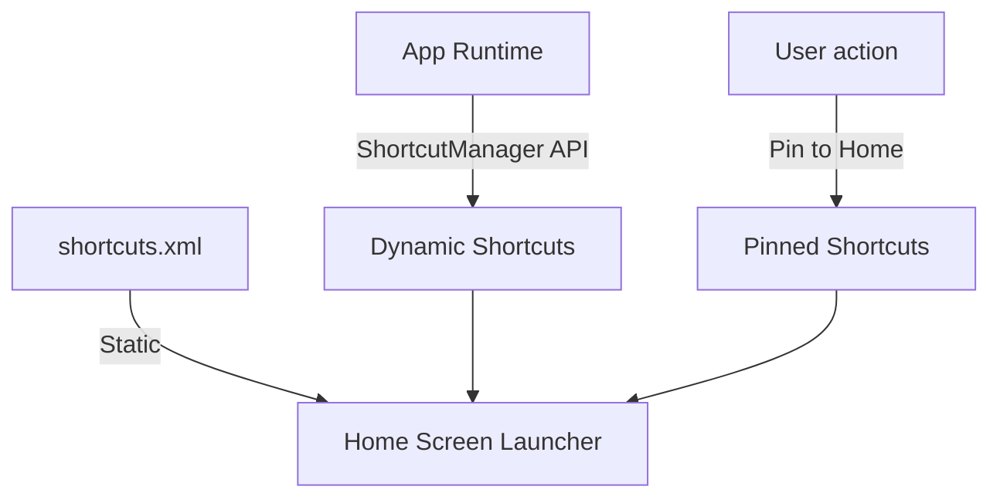

## App Shortcuts
**Purpose Statement**: 앱의 주요 기능으로 빠르게 진입하는 통로인 App Shortcuts의 유형(정적, 동적, 핀)을 구별하고, 시스템의 노출 제한 정책을 이해한다.

### 1. 이 주제를 읽기 전에
- Android Manifest와 메타데이터 선언
- Intent 필터와 딥링크 타겟팅
- 런처(Home Screen)의 역할

### 2. 전체 조망도

### 3. 하위 개념 및 원자 노트 합성

**정적, 동적, 그리고 고정(Pinned) 숏컷의 차이**
앱 배포 시 고정된 `Static` 숏컷, 사용자 상태에 따라 코드로 업데이트되는 `Dynamic` 숏컷, 그리고 사용자가 직접 바탕화면에 끌어다 놓아 런처가 소유권을 갖는 `Pinned` 숏컷은 서로 다른 관리 방식과 생명주기를 갖습니다.
- [Static, dynamic, and pinned shortcuts have different ownership and lifecycle](../../04_system_services/device-capabilities/app-shortcuts-contracts/static-dynamic-and-pinned-shortcuts-have-different-ownership-and-lifecycle.md)

**개수 제한 및 Rate Limiting**
런처가 지원할 수 있는 숏컷의 개수에는 상한선(통상 4~5개)이 있으며, 백그라운드에서 동적 숏컷을 무한정 업데이트하는 것을 방지하기 위해 시스템 차원의 엄격한 Rate Limit가 적용됩니다.
- [ShortcutManager caps dynamic shortcut count and rate limits background updates](../../04_system_services/device-capabilities/app-shortcuts-contracts/shortcutmanager-caps-dynamic-shortcut-count-and-rate-limits-background-updates.md)

### 4. 이 주제와 연결된 Worked Example
- [03 Deep Link to Correct Task and Screen State](../worked-examples/03-deep-link-to-correct-task-and-screen-state.md) (숏컷 클릭 시 인텐트 라우팅과 백스택 재구성)
- [01 App Icon Tap to First Frame](../worked-examples/01-app-icon-tap-to-first-frame.md) (앱 실행 엔트리 포인트 변화)

### 5. 이 주제와 연결된 Diagnostic Runbook
- [03 Process Death State Loss](../diagnostic-runbooks/03-process-death-state-loss.md) (숏컷 진입 후 뒤로 가기 시 상태 유실)
- [05 Background Work Delayed or Not Running](../diagnostic-runbooks/05-background-work-delayed-or-not-running.md) (Rate limit 초과로 인한 숏컷 갱신 실패)

### 6. 더 깊이 들어갈 때 (Learning Spine)
- [04 Manifest to Component Execution](../learning-spine/04-manifest-to-component-execution.md) (숏컷 정적 선언 방식)
- [05 Independent Lifetimes of Screen Process Task and State](../learning-spine/05-independent-lifetimes-of-screen-process-task-and-state.md) (숏컷 실행 시 생성되는 태스크와 백스택 관리)
