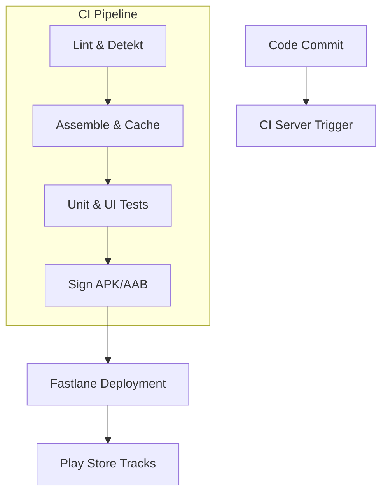

## G7 · Android CI/CD와 자동화 배포 파이프라인

> **이 문서의 목적**: Android 앱 빌드, 테스트, 배포를 자동화하는 CI/CD 파이프라인의 설계 및 실행 계약을 종합한다. Gradle 캐시, Fastlane을 통한 배포 오케스트레이션, 그리고 보안 관리가 핵심이다.

### 1. 이 주제를 읽기 전에
- **사전 지식**: 빌드 프로세스와 Gradle 의존성, Android 서명(Keystore).
- **연관 주제**: 빌드 최적화, Play Store 배포 프로세스, 테스팅 인프라.

### 2. 전체 조망도

### 3. 빌드 최적화와 배포 안정성의 계약

Android CI/CD는 단순한 빌드 스크립트 모음이 아니라, 품질과 배포 안정성을 보장하기 위한 단계별 신호 체계다. 빌드 시간 단축을 위해 원격 캐시와 매트릭스를 활용하며, Fastlane과 같은 도구로 배포를 일관성 있게 관리한다. 보안과 자격 증명은 소스 코드와 완전히 분리되어야 한다.

- [Android CI/CD 파이프라인 단계는 서로 다른 실패 신호를 가짐](../../03_packaging_deployment/build/ci-cd/android-cicd-pipeline-stages-have-different-failure-signals.md): 코드 정적 분석, 빌드, 테스트는 각각 다른 실패 책임을 가지고 파이프라인에 배치되어 피드백을 전달합니다.
- [빌드 매트릭스와 원격 캐시의 결합으로 CI 매트릭스 시간 단축](../../03_packaging_deployment/build/ci-cd/build-matrix-and-remote-cache-together-reduce-ci-matrix-time.md): 분산 빌드 환경에서 매트릭스를 통한 병렬 처리와 빌드 캐시를 사용해 효율성을 높입니다.
- [Fastlane은 Gradle을 대체하지 않고 Android 빌드를 오케스트레이션함](../../03_packaging_deployment/build/ci-cd/fastlane-orchestrates-android-builds-without-replacing-gradle.md): Fastlane은 배포 흐름을 제어하고 스크립팅하며, 실제 빌드 작업은 Gradle에 위임합니다.
- [CI 서명 및 서비스 계정 자격 증명은 소스 컨트롤 외부에 존재해야 함](../../03_packaging_deployment/build/ci-cd/ci-signing-and-service-account-credentials-must-stay-out-of-source-control.md): Keystore와 API Key 등 민감 정보는 CI 환경 변수 또는 Secret Manager를 통해 안전하게 주입해야 합니다.

### 4. 이 주제와 연결된 Worked Example
- [08 Signed Artifact Through Play Delivery to Update](../worked-examples/08-signed-artifact-through-play-delivery-to-update.md)

### 5. 이 주제와 연결된 Diagnostic Runbook
- [08 Install Update Failure](../diagnostic-runbooks/08-install-update-failure.md)

### 6. 더 깊이 들어갈 때 (Learning Spine)
- [03 Source to Installed Package](../learning-spine/03-source-to-installed-package.md)
- [11 Observation Testing and Quality Feedback](../learning-spine/11-observation-testing-and-quality-feedback.md)
