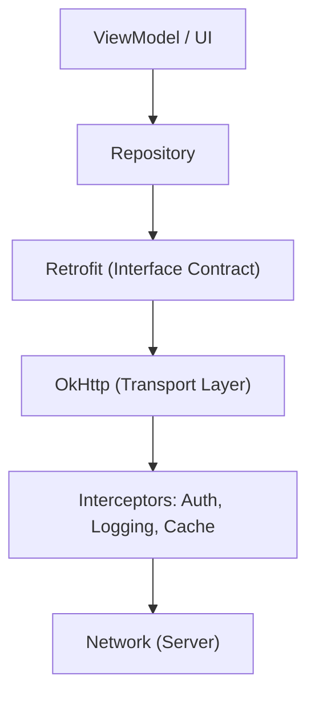

## G8 · 네트워크 클라이언트 계층과 통신 규약

> **이 문서의 목적**: Android 앱이 백엔드 서버와 통신하기 위해 구축하는 네트워크 계층의 설계 및 구현 방식을 종합한다. Retrofit의 선언적 API, OkHttp의 전송 계층 제어, 그리고 Coroutine과 연동된 취소 정책을 다룬다.

### 1. 이 주제를 읽기 전에
- **사전 지식**: HTTP/HTTPS 프로토콜, REST API, JSON 직렬화.
- **연관 주제**: Coroutine 흐름 제어, 앱 아키텍처(Data Layer), 오프라인 동기화.

### 2. 전체 조망도

### 3. API 계약과 전송 계층의 분리

앱의 네트워크 계층은 서버와의 통신 규약(Contract)을 명시적으로 선언하고, 이를 실제 전송 계층에서 신뢰성 있게 처리하는 구조를 가진다. 공통 관심사(인증, 로깅)는 파이프라인 중간에 주입되며, 호출의 생명주기는 UI 상태와 동기화된다.

- [Retrofit 인터페이스는 API 계약을 선언하고 OkHttp는 전송을 실행함](../../02_app_framework/data/networking/networking-contracts/retrofit-interface-declares-api-contract-while-okhttp-executes-transport.md): 선언형 인터페이스는 요청 명세를 담당하고, 연결 유지와 재시도 같은 세부 사항은 하위 계층에서 처리됩니다.
- [Interceptor 체인은 요청-응답 파이프라인에 공통 관심사를 삽입함](../../02_app_framework/data/networking/networking-contracts/interceptor-chain-inserts-cross-cutting-concerns-into-request-response-pipeline.md): Auth 토큰 갱신이나 로깅처럼 비즈니스 로직과 무관한 네트워크 작업을 일관되게 처리합니다.
- [Suspend API 호출 취소는 호출자의 Coroutine Scope를 따름](../../02_app_framework/data/networking/networking-contracts/suspend-api-call-cancellation-follows-the-callers-coroutine-scope.md): 네트워크 요청이 진행 중일 때 화면을 이탈하면 안전하게 통신이 중단되어 리소스 누수를 방지합니다.
- [네트워크 실패 정책은 재시도, 타임아웃, 오프라인 상태를 UI에 노출해야 함](../../02_app_framework/data/networking/networking-contracts/network-failure-policy-must-expose-retry-timeout-and-offline-state-to-ui.md): 단순 오류 전달을 넘어 시스템 상태와 재시도 전략을 사용자에게 적절히 피드백할 수 있어야 합니다.

### 4. 이 주제와 연결된 Worked Example
- [05 Process Death Recovery of Edit State and Background Work](../worked-examples/05-process-death-recovery-of-edit-state-and-background-work.md)

### 5. 이 주제와 연결된 Diagnostic Runbook
- [05 Background Work Delayed or Not Running](../diagnostic-runbooks/05-background-work-delayed-or-not-running.md)

### 6. 더 깊이 들어갈 때 (Learning Spine)
- [08 Data Storage Network and Offline Recovery](../learning-spine/08-data-storage-network-and-offline-recovery.md)
- [06 Main Thread Binder Coroutine and Durable Work Lifetime](../learning-spine/06-main-thread-binder-coroutine-and-durable-work-lifetime.md)
