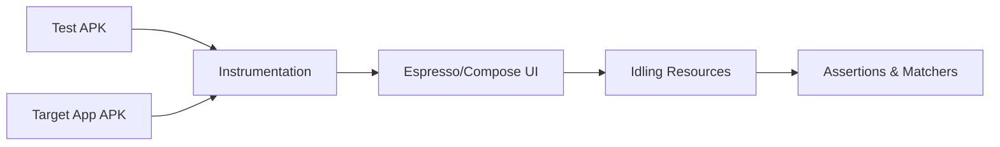

## G9 · Espresso와 기기 기반 UI 테스트 전략

> **이 문서의 목적**: Android 앱의 화면 구성과 사용자 상호작용을 실제 기기 환경에서 검증하는 UI 테스트 방법에 대해 종합한다. 비동기 작업 대기(Idling Resource)와 테스트 신뢰성, 그리고 계측 테스트 환경의 특성을 다룬다.

### 1. 이 주제를 읽기 전에
- **사전 지식**: 안드로이드 뷰 계층 구조, JUnit 4/5 테스트 작성, ADB 커맨드.
- **연관 주제**: Compose UI 테스팅, CI/CD 테스트 파이프라인, 아키텍처 모듈화.

### 2. 전체 조망도

### 3. UI 테스트의 신뢰성과 계측 환경

계측 테스트는 앱 프로세스 내에서 직접 UI를 조작하고 검증하기 때문에 강력하지만, 비동기 처리에 의한 Flaky Test 문제가 자주 발생한다. 안정적인 테스트를 위해 적절한 대기 전략과 명확한 테스트 분리가 필요하다.

- [Espresso는 동기식 View UI 테스트를 담당하며 비동기 대기를 위해 Idling Resource를 사용함](../../06_testing_performance/testing/testing-quality/espresso-owns-synchronous-view-ui-tests-with-idling-resource-for-async-waits.md): 화면 업데이트 타이밍 문제를 해결하기 위해 시스템 스레드와 동기화하는 구조적 방법을 적용합니다.
- [Compose UI 테스트는 안정적인 선택자와 시맨틱을 사용해야 함](../../06_testing_performance/testing/testing-quality/compose-ui-tests-should-use-stable-selectors-and-semantics.md): 뷰 ID 대신 접근성 노드(Semantics)를 기준으로 요소에 접근해 리팩토링에 강건한 테스트를 작성합니다.
- [Firebase Test Lab은 로컬 에뮬레이터가 아닌 클라우드 기기 매트릭스에서 CI 테스트를 실행함](../../06_testing_performance/testing/testing-quality/firebase-test-lab-runs-ci-tests-on-a-cloud-device-matrix-not-local-emulators.md): 파편화된 안드로이드 생태계에서 다양한 기기와 API 레벨의 호환성을 대규모로 검증합니다.
- [회귀(Regression)와 불안정한(Flaky) 테스트는 릴리스 게이트의 위험 요소임](../../06_testing_performance/testing/testing-quality/regression-and-flaky-tests-are-release-gate-risks.md): 신뢰성을 잃은 테스트 묶음이 배포 파이프라인을 어떻게 방해하고 품질 비용을 증가시키는지 분석합니다.
- [TalkBack과 Accessibility Scanner는 서로 다른 결함 클래스를 포착함](../../06_testing_performance/testing/testing-quality/talkback-and-accessibility-scanner-catch-different-defect-classes.md): 스크린 리더와 정적 분석 도구가 UI의 접근성 품질을 다르게 검증하는 관점을 제공합니다.

### 4. 이 주제와 연결된 Worked Example
- [01 App Icon Tap to First Frame](../worked-examples/01-app-icon-tap-to-first-frame.md)

### 5. 이 주제와 연결된 Diagnostic Runbook
- [01 App Launch Slow or Fails](../diagnostic-runbooks/01-app-launch-slow-or-fails.md)

### 6. 더 깊이 들어갈 때 (Learning Spine)
- [11 Observation Testing and Quality Feedback](../learning-spine/11-observation-testing-and-quality-feedback.md)
