## 앱 아이콘 탭에서 첫 프레임까지 (Cold Start to First Frame)

이 예시는 Learning Spine 3·4·5·6·7·11 장을 하나의 통합 실행 요청으로 연결한다. 매니페스트 컴포넌트 registry 와 identity(3·4 장), system_server 의 프로세스 상태 확인과 Zygote fork(4 장), Activity lifecycle 과 main thread 로퍼(5·6 장), UI 입력에서 SurfaceFlinger 합성까지의 렌더링 경로(7 장), 그리고 이 전체 구간을 심층 진단하는 관찰 방법(11 장)을 엔드투엔드 서사로 구성한다.

---

### 시작 상태

기기는 작동 중이며 앱 패키지는 설치되어 있으나 프로세스는 메모리에 존재하지 않는다(냉시작, Cold Start). 최근에 연 적이 없거나 OS 가 메모리 회수(Low Memory Killer, LMK)를 위해 프로세스를 강제 종료한 상태다.

> **공식 문서 정의 (Cold Start)**:
> *"A cold start refers to an app's starting from scratch. This means that until this start, the system's process creates the app's process."*

---

### 입력

사용자가 런처(홈 화면)에서 앱 아이콘을 탭한다.

---

### 다층 계층별 실행 흐름 (Multi-Layer Narrative)

```mermaid
flowchart TD
    subgraph UI["UI Layer"]
        ui1["Touch Event (InputDispatcher)"] --> ui2["Launcher Component Match"]
    end

    subgraph SYS["System Server / IPC Layer"]
        sys1["Launcher calls ATMS via [binder ipc](../../01_system_internals/binder-ipc.md)"] --> sys2["PMS Manifest Check"]
        sys2 --> sys3["AMS checks process state (Cold Start)"]
        sys3 --> sys4["AMS requests Zygote via Socket (/dev/socket/zygote)"]
    end

    subgraph KERNEL["Kernel / Hardware Layer"]
        k1["Zygote fork() Syscall"] --> k2["Copy-On-Write Page Mapping"]
        k2 --> k3["Android 15/16 16KB Page Alignment & mmap Verification"]
        k3 --> k4["Specialization (UID/GID, Cgroups, SELinux Context)"]
    end

    subgraph APP["App Framework Layer"]
        a1["ActivityThread.main()"] --> a2["Looper.prepareMainLooper()"]
        a2 --> a3["Application.onCreate()"]
        a3 --> a4["SplashScreen API Initialization"]
        a4 --> a5["Activity.onCreate()"]
        a5 --> a6["onStart()"]
        a6 --> a7["onResume()"]
        a7 --> a8["ViewRootImpl.setView()"]
        a8 --> a9["Choreographer#doFrame"]
    end

    subgraph DISPLAY["Display / Graphics Hardware"]
        d1["RenderThread"] --> d2["EGL/Vulkan Surface Swap"]
        d2 --> d3["SurfaceFlinger Composition"]
        d3 --> d4["Display Controller (HWC)"]
    end

    ui2 --> sys1
    sys4 --> k1
    k4 --> a1
    a9 --> d1
```



1. **UI / 입력 레이어**:
   - 사용자의 손가락 탭은 터치 스크린 하드웨어 인터럽트를 발생시키고, Kernel 의 Touch Driver 를 거쳐 system_server 의 `InputDispatcher` 로 전달된다.
   - 런처 앱은 입력 이벤트를 처리하여 매니페스트 `<intent-filter>`(`action=MAIN`, `category=LAUNCHER`)를 매핑한 컴포넌트(`ComponentName`)로 `startActivity()` Intent 를 생성한다.

2. **System Server 및 IPC 레이어**:
   - 런처는 Binder IPC 라인을 통해 `ActivityTaskManagerService`(ATMS)에 Activity 시작 요청을 보낸다.
   - `PackageManagerService`(PMS)는 앱의 identity(UID, 패키지 서명, 설치 상태)를 검증하고 해당 컴포넌트가 존재하며 실행 가능한지 확인한다.
   - `ActivityManagerService`(AMS)는 해당 UID 의 프로세스가 생존해 있는지 `ProcessRecord` 수신함에서 검색한다. 냉시작 상태이므로 프로세스가 존재하지 않는다.
   - AMS 는 Zygote Socket(`dev/socket/zygote`)에 연결하여 프로세스 생성을 요청한다.

3. **Kernel 및 커스텀 런타임 레이어**:
   - Zygote 는 `fork()` 시스템 콜을 호출하여 사전 로딩된 ART VM 과 공통 자바 클래스/리소스 매핑을 가진 프로세스를 복제한다(Copy-On-Write 메모리 최적화).
   - 생성된 자식 프로세스는 요청된 UID/GID, Cgroup 감금, SELinux 보안 컨텍스트로 specialization 을 거친다.
   - **Android 15/16 16KB 메모리 페이지 정렬**: Android 15 부터 도입된 16KB 페이지 사이즈 기기에서는 native 라이브러리(`.so`)의 ELF 헤더 및 메모리 매핑이 16KB 경계로 정렬되어 있어야 런타임 `mmap` 이 성공하며, 비정렬 시 즉시 프로세스 크래시가 발생한다.

4. **App Framework 레이어**:
   - Specialization 이 완료되면 프로세스는 `ActivityThread.main()`으로 진입한다.
   - Main Looper 가 준비되고, `ActivityThread.attach()`를 통해 system_server 로 Binder 연결(`IApplicationThread`)을 다시 형성한다.
   - system_server 가 Bind 된 앱으로 `bindApplication()`을 호출하면 `Application.onCreate()`가 실행된다 (DI, 원격 설정, SDK 초기화 구간).
   - 대상 Activity 인스턴스가 인스턴스화되고 `onCreate() -> onStart() -> onResume()` 콜백 순서로 Main Thread 에서 실행된다.
   - Activity 의 `Window`에 `ViewRootImpl`이 바인딩되고 View/Compose 트리가 `measure -> layout -> draw` 단계를 거친다.

5. **Graphics & Display Hardware 레이어**:
   - UI 드로잉 명령은 RenderThread 로 전달되어 Skia/HWUI 렌더러를 거쳐 EGL/Vulkan Command Buffer 로 변환된다.
   - `GraphicBuffer`가 `BufferQueue`를 통해 `SurfaceFlinger` 서비스로 전달되고, `SurfaceFlinger`는 Hardware Composer(HWC)를 이용해 샌드위치 합성 후 디스플레이 패널에 첫 프레임(First Frame)을 출력한다.

---

### Android 14 / 15 / 16 platform specific behaviors

1. **Android 15 / 16 16KB Page Size Support**:
   - Android 15 이상에서 작동하는 16KB 페이지 사이즈 커널 환경에서는 JNI `.so` 파일들이 16KB 경계로 정렬되어 빌드되어야 한다. align 처리되지 않은 고유 컴파일 코드가 수신되면 프로세스가 Zygote fork 직후 `mmap` 실패로 `SIGSEGV` 크래시를 일으켜 앱 아이콘 탭 직후 튕기게 된다.

2. **Core Splash Screen API (Android 12+ / 14 / 15 / 16)**:
   - Android 12 이상부터는 OS 차원의 SplashScreen 이 필수 적용된다. entry Activity 의 `super.onCreate()` 호출 전에 `installSplashScreen()`을 실행해야 하며, 테마가 `Theme.SplashScreen`을 올바르게 상속받지 않으면 창 진입 시 깜빡임이나 테마 불일치 크래시가 발생한다.

3. **Baseline Profiles & ART Cloud Compilation**:
   - Android 14+ 에서는 앱 시작 시 호출되는 주요 경로(`Application.onCreate`, `Activity.onCreate`, Compose 초기 렌더링 경로)를 Baseline Profile 로 묶어 AOT(Ahead-Of-Time) 사전 컴파일함으로써 냉시작 시간을 최대 30~40% 단축한다.

---

### 성공 경로 vs 실패 분기 비교

| 항목 | 성공 경로 (Success Path) | 실패 분기 (Failure Branch 1: Main Thread ANR) | 실패 분기 (Failure Branch 2: 16KB Unaligned Crash) |
| :--- | :--- | :--- | :--- |
| **진행 현상** | 탭 후 윈도우 스플래시가 뜨고 빠르게 첫 프레임(TTID) 및 데이터(TTFD) 표시 | 탭 후 스플래시 화면에서 멈추며 5초 뒤 "앱이 응답하지 않음" ANR 팝업 출현 | 탭 직후 스플래시도 띄우지 못하고 즉시 강제 종료 (App Crash) |
| **원인 메커니즘** | Non-blocking 비동기 초기화 및 메인 스레드 유휴 상태 유지 | `Application.onCreate()` 나 Activity 콜백에서 동기 DB/네트워크 I/O 수행으로 Main Looper 차단 | Android 15 16KB 커널 환경에서 NDK native `.so` 의 16KB alignment 결여로 `mmap` 실패 |
| **관측 가능 신호** | `logcat: ActivityTaskManager: Displayed ... +280ms`, `reportFullyDrawn()` 기록 | `logcat: ANR in <package>`, `traces.txt` 내 Main Thread `BLOCKED` / `WAITING` 상태 | `logcat: libc: Fatal signal 11 (SIGSEGV)` / `dlopen failed: alignment error` |

- **TTID vs TTFD 의 구별**:
  - **TTID (Time To Initial Display)**: 시스템 창이 앱의 첫 윈도우 프레임을 렌더링한 시간 (`am start -W` 의 TotalTime).
  - **TTFD (Time To Full Display)**: 앱 내부 비동기 데이터(네트워크, DB)가 모두 로드되어 사용자가 실질적으로 사용 가능한 상태. 앱에서 `reportFullyDrawn()`을 명시적으로 호출해야 시스템과 Perfetto 에 수집된다.

---

### CLI 진단 명령어 및 관찰 도구

1. **시작 시간 측정 (am start)**:
   ```bash
   adb shell am start -W -S -n com.example.app/.MainActivity
   # 출력 결과:
   # Starting: Intent { act=android.intent.action.MAIN cat=[android.intent.category.LAUNCHER] cmp=com.example.app/.MainActivity }
   # Status: ok
   # Activity: com.example.app/.MainActivity
   # ThisTime: 240
   # TotalTime: 240
   # WaitTime: 245
   # Complete
   ```

2. **Logcat 태그 관찰**:
   ```bash
   adb logcat -v time -s ActivityTaskManager:I SplashScreen:D
   # 예시 로그:
   # ActivityTaskManager: Displayed com.example.app/.MainActivity: +240ms (total +240ms)
   ```

3. **16KB 페이지 정렬 검증 (Android 15+)**:
   ```bash
   # APK 내부 .so 파일의 LOAD 파티션 alignment 확인
   readelf -l lib/arm64-v8a/libnative.so | grep LOAD
   # Alignment 가 0x4000 (16384 bytes) 이상인지 검증
   ```

4. **Perfetto Trace 수집**:
   ```bash
   # Perfetto 로 시작 트레이스 캡처
   adb shell perfetto --config :test --out /data/misc/perfetto-traces/trace.perfetto-trace
   # Trace 카테고리 분석: ActivityThread.main -> Application.onCreate -> Activity.onCreate -> Choreographer#doFrame
   ```

---

### 실전 코드 예시 (Production Code Examples)

```kotlin
// MyApplication.kt
package com.example.app

import android.app.Application
import kotlinx.coroutines.CoroutineScope
import kotlinx.coroutines.Dispatchers
import kotlinx.coroutines.SupervisorJob
import kotlinx.coroutines.launch

class MyApplication : Application() {
    private val applicationScope = CoroutineScope(SupervisorJob() + Dispatchers.Default)

    override fun onCreate() {
        super.onCreate()

        // ❌ 금지: Main Thread 를 막는 동기 네트워크/DB/SDK 초기화
        // val config = fetchRemoteConfigSync() // ANR 원인!

        // ✅ 올바른 방식: 비동기 Dispatchers.IO 로 무거운 초기화 이관
        applicationScope.launch(Dispatchers.IO) {
            initAnalyticsSdk()
            initRemoteConfig()
        }
    }

    private fun initAnalyticsSdk() { /* ... */ }
    private fun initRemoteConfig() { /* ... */ }
}
```

```kotlin
// MainActivity.kt
package com.example.app

import android.os.Bundle
import androidx.activity.ComponentActivity
import androidx.activity.compose.setContent
import androidx.core.splashscreen.SplashScreen.Companion.installSplashScreen
import androidx.lifecycle.lifecycleScope
import kotlinx.coroutines.flow.first
import kotlinx.coroutines.launch

class MainActivity : ComponentActivity() {

    override fun onCreate(savedInstanceState: Bundle?) {
        // Android 12+ SplashScreen API 필수 적용 (super.onCreate 호출 전)
        val splashScreen = installSplashScreen()
        super.onCreate(savedInstanceState)

        // 화면 렌더링 설정
        setContent {
            AppNavigationRoot()
        }

        // 비동기 데이터 로딩 완료 시 TTFD (Time To Full Display) 신호 전송
        lifecycleScope.launch {
            [viewmodel](../../02_app_framework/viewmodel.md).isDataFullyLoaded.first { it }
            // OS 에 앱의 실질적 준비 완료 신호를 전달 (Macrobenchmark / Vitals 측정 기준)
            reportFullyDrawn()
        }
    }
}
```

---

### 관련 원자 노트

- [AndroidManifest.xml은 OS에 앱의 컴포넌트를 선언한다](../../02_app_framework/navigation/intents-and-deep-links/intent-manifest-contracts/android-manifest-declares-os-visible-components-and-entry-points.md)
- [action, category, data 매칭은 서로 다른 조건이다](../../02_app_framework/navigation/intents-and-deep-links/intent-manifest-contracts/intent-filter-matches-action-category-data.md)
- [AMS는 앱 프로세스와 컴포넌트 lifecycle을 조율한다](../../01_system_internals/boot-and-runtime/system-server-contracts/ams-coordinates-app-process-and-component-lifecycle.md)
- [Zygote socket은 system_server가 앱 프로세스를 요청하는 factory interface다](../../01_system_internals/boot-and-runtime/zygote-runtime-contracts/zygote-socket-is-system-server-process-factory-interface.md)
- [앱 프로세스는 specialization 뒤 ActivityThread로 framework에 attach한다](../../01_system_internals/boot-and-runtime/zygote-runtime-contracts/app-process-specializes-before-activitythread-attaches-to-framework.md)
- [Activity 콜백은 화면 인스턴스의 visibility와 interaction 경계를 알린다](../../02_app_framework/architecture/app-components/app-component-contracts/activity-lifecycle-callbacks-describe-visibility-and-interaction-boundaries.md)
- [Android 렌더링 파이프라인은 Surface 버퍼를 합성기로 넘기는 계약이다](../../01_system_internals/graphics-and-media/graphics-media-contracts/android-rendering-pipeline-is-surface-to-bufferqueue-to-compositor.md)
- [ANR은 단일 timeout이 아니라 responsiveness 계약 위반이다](../../01_system_internals/boot-and-runtime/system-server-contracts/anr-is-responsiveness-contract-violation-not-single-timeout.md)
- [Android 시작 성능은 TTID와 TTFD로 나눈다](../../06_testing_performance/performance/performance-contracts/startup-performance-is-measured-by-ttid-and-ttfd.md)

---

### 관련 Learning Spine 장

- [4장 매니페스트에서 컴포넌트 실행까지](../learning-spine/04-manifest-to-component-execution.md)
- [5장 화면, 프로세스, task와 사용자 상태는 독립적인 lifetime을 가진다](../learning-spine/05-independent-lifetimes-of-screen-process-task-and-state.md)
- [6장 메인 스레드, Binder, coroutine과 durable scheduler는 서로 다른 실행 책임을 진다](../learning-spine/06-main-thread-binder-coroutine-and-durable-work-lifetime.md)
- [7장 입력, 리소스 선택과 화면 프레임](../learning-spine/07-input-resource-selection-and-display-frame.md)

---

### 관련 Diagnostic Runbook

- [01-app-launch-slow-or-fails.md](../diagnostic-runbooks/01-app-launch-slow-or-fails.md)
- [02-anr.md](../diagnostic-runbooks/02-anr.md)
- [07-jank-dropped-frames.md](../diagnostic-runbooks/07-jank-dropped-frames.md)

---

### 공식 근거

- [App startup time](https://developer.android.com/topic/performance/vitals/launch-time)
- [Splash screens](https://developer.android.com/develop/ui/views/launch/splash-screen)
- [Support 16 KB page sizes](https://developer.android.com/guide/practices/page-sizes)
- [Diagnose ANRs](https://developer.android.com/topic/performance/vitals/anr)
- [Macrobenchmark overview](https://developer.android.com/topic/performance/benchmarking/macrobenchmark-overview)

검증일: 2026-08-04. 냉시작/온시작 정의, `reportFullyDrawn()`, `am start -W` 출력 필드, Android 15 16KB 페이지 사이즈 정렬 규격을 공식 문서 기준으로 검증함.
