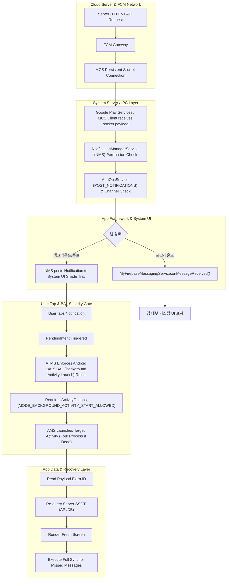

## FCM 전송에서 Notification 표시와 탭 복구까지 (FCM Delivery to Notification Display & Tap Recovery)

이 예시는 Learning Spine 4·5·6·8·9·10·11 장을 하나의 알림 처리 및 데이터 복구 이벤트로 연결한다. "FCM 전송 성공(Delivery)과 Android 시스템 알림 표시(Display)는 서로 독립된 계약이다"라는 원칙(10 장), 알림 탭 시 OS Task 와 합성 백 스택을 재구성하는 네비게이션 모델(4·5 장), Android 14/15/16 Background Activity Launch(BAL) 제약 조건, Doze/네트워크 단절 시 놓친 알림을 복구하는 서버 Source of Truth (SSOT) 데이터 동기화 파이프라인(8 장), 그리고 전달·표시·탭·복구를 관찰하는 5단계 진단 방법론(11 장)을 통합 다층 서사로 다룬다.

---

### 시작 상태

앱이 기기에 설치되어 있고 FCM 등록 토큰(Registration Token)이 서버 DB 에 등록되어 있다. 단, `POST_NOTIFICATIONS` 런타임 권한(Android 13+)의 승인 상태 및 특정 알림 채널(Notification Channel)의 활성화 여부는 아직 확정적이지 않다.

---

### 입력

서버가 FCM HTTP v1 API 를 사용하여 특정 FCM 토큰으로 Notification 과 Data 가 함께 포함된 결합(Combined) 메시지를 발송한다.

---

### 다층 계층별 실행 흐름 (Multi-Layer Narrative)



1. **클라우드 및 네트워크 레이어**:
   - 앱 서버가 FCM HTTP v1 API(`https://fcm.googleapis.com/v1/projects/{id}/messages:send`)로 JSON 페이로드를 요청한다.
   - FCM 백엔드가 성공 메시지(HTTP 200 ID)를 반환하면 클라우드 전달 단계(Delivery)가 완료된다. 기기 내부 Google Play Services 의 MCS(Message Communication Service) 소켓을 통해 패킷이 전달된다.

2. **System Server 및 표시 게이트 레이어**:
   - 패킷이 수신되면 system_server 의 `NotificationManagerService`(NMS)가 동작한다.
   - NMS 는 앱의 `POST_NOTIFICATIONS` 런타임 권한이 `GRANTED`인지 확인하고, 해당 `NotificationChannel`이 생성되어 있고 사용자가 차단(Blocked)하지 않았는지 `AppOpsService`를 통해 검증한다.
   - 이 두 조건이 충족되어야 비로소 System UI 알림 서랍(Tray) 및 Heads-Up 팝업 렌더링이 이루어진다.

3. **앱 포그라운드/백그라운드 처리 분기**:
   - **앱이 포그라운드에 있는 경우**: NMS 는 시스템 트레이 노출 대신 `FirebaseMessagingService.onMessageReceived()` 콜백을 호출하여 앱 내부에서 커스텀 UI 를 구성하도록 이관한다.
   - **앱이 백그라운드/종료 상태인 경우**: Notification 페이로드는 OS 가 직접 시스템 트레이로 보내며, 앱의 `onMessageReceived()`는 실행되지 않는다. Data 페이로드는 사용자가 알림을 탭할 때 Target Activity 의 Intent Extra 로 전달된다.

4. **사용자 탭 및 BAL (Background Activity Launch) 보안 게이트**:
   - 사용자가 알림을 탭하면 연결된 `PendingIntent`가 실행된다.
   - **Android 14 / 15 / 16 BAL 보안 제약**: Android 14 이상부터는 백그라운드 서비스/알림에서 Activity 를 시작할 때 엄격한 BAL 제한이 적용된다. `PendingIntent` 생성 시 `ActivityOptions.setPendingIntentBackgroundActivityStartMode(MODE_BACKGROUND_ACTIVITY_START_ALLOWED)` 옵션이 누락되면 알림을 탭해도 Activity 가 시작되지 않고 차단된다.
   - 프로세스가 죽어있는 경우 Zygote fork 가 실행되고 `TaskStackBuilder`에 의해 합성 백 스택(`Home -> NoticeList -> NoticeDetail`)이 구성된다.

5. **데이터 사용 및 SSOT 누락 복구 파이프라인**:
   - Intent Extra 로 수신한 `event_id`는 화면 렌더링의 최종 원천이 아니다. 서버의 최신 데이터를 API 로 재조회(Re-fetch)하여 화면을 표시한다 (알림 탭 시점과 푸시 수신 시점 사이에 리소스가 변경되었을 수 있기 때문).
   - Doze 모드나 네트워크 단절로 푸시 수신 자체가 탈락(Drop)된 경우를 대비해, 앱 시작 시 전체 서버 동기화(Full Sync)를 실행하여 잃어버린 상태를 복구한다.

---

### Android 14 / 15 / 16 platform specific behaviors

1. **Android 13+ `POST_NOTIFICATIONS` Runtime Permission**:
   - Android 13 이상에서는 `Manifest.permission.POST_NOTIFICATIONS` 런타임 권한이 필수다. 권한이 거부되면 FCM 서버 전달(200 OK)이 성공하더라도 기기 트레이에 알림이 표시되지 않는다.

2. **Android 14 / 15 / 16 Background Activity Launch (BAL) Security Restrictions**:
   - Android 14+ 환경에서 PendingIntent 를 통한 Activity 론칭 시, 백그라운드 론칭 권한 허용 옵션이 명시되어야 한다.
   - `ActivityOptions.makeBasic().setPendingIntentBackgroundActivityStartMode(ActivityOptions.MODE_BACKGROUND_ACTIVITY_START_ALLOWED)`를 Bundle 로 만들어 `PendingIntent.getActivity()` 시 전달해야 알림 클릭 시 윈도우가 정상 차단 없이 오픈된다.

3. **Data-Only Push Quota under Doze Mode**:
   - notification 키가 없는 pure data-only push 는 Doze 모드 및 App Standby Bucket 에 따라 수신이 지연되거나 FCM 하이 프라이어리티 할당량(Quota) 초과 시 삭제될 수 있다. 따라서 비즈니스 핵심 상태 갱신은 푸시에 100% 의존하지 않고 로컬 우선/서버 동기화 구조를 병행해야 한다.

---

### 성공 경로 vs 실패 분기 비교

| 항목 | 성공 경로 (Success Path) | 실패 분기 (Failure Branch 1: Notification Muted) | 실패 분기 (Failure Branch 2: Android 14+ BAL Blocked) |
| :--- | :--- | :--- | :--- |
| **진행 현상** | 알림 수신 -> 트레이 표시 -> 탭 시 BAL 통과 및 앱 오픈 -> 최신 데이터 재조회 및 표시 | 서버는 FCM 200 OK 반환했으나 기기 트레이에 아무것도 뜨지 않음 | 알림 트레이에 표시는 되나 탭해도 아무 반응이 없고 앱이 열리지 않음 |
| **원인 메커니즘** | FCM 전달, NMS 채널/권한 통과, BAL 옵션 적용 PendingIntent 정상 작동 | `POST_NOTIFICATIONS` 거부 상태이거나 해당 `NotificationChannel` 차단됨 | PendingIntent 에 Android 14+ `MODE_BACKGROUND_ACTIVITY_START_ALLOWED` 미적용 |
| **관측 가능 신호** | `dumpsys notification` 에 Posted 상태 확인, 탭 시 Target Activity 렌더링 | `dumpsys notification` 에 `Suppressed` / `Importance: NONE`, AppOps Denied | logcat: `Background activity start blocked: PendingIntentSender...`, ATMS 차단 로그 |

---

### CLI 진단 명령어 및 관찰 도구

1. **알림 상태 및 차단 채널 진단**:
   ```bash
   adb shell dumpsys notification com.example.app
   # 출력 내용 중:
   # Package: com.example.app
   # Notification List: Posted / Active Notifications
   # Channel: id=channel_event, importance=4 (HIGH), blocked=false
   ```

2. **AppOps 알림 권한 게이트 점검**:
   ```bash
   adb shell dumpsys appops com.example.app | grep -i POST_NOTIFICATION
   # MODE_ALLOWED (0) 인지 MODE_IGNORED (1) 인지 확인
   ```

3. **FCM 수신 Intent 패킷 시뮬레이션 테스트**:
   ```bash
   adb shell am broadcast -a com.google.android.c2dm.intent.RECEIVE \
       -n com.example.app/com.google.firebase.iid.FirebaseInstanceIdReceiver \
       --es "event_id" "EVT_9982"
   ```

4. **Task 및 BAL 차단 관련 Logcat 관찰**:
   ```bash
   adb logcat -v time -s NotificationService:V ActivityTaskManager:W FirebaseMessaging:D
   # BAL 차단 로그: "Background activity launch blocked" 검색
   ```

---

### 실전 코드 예시 (Production Code Examples)

```kotlin
// MyNotificationManager.kt
package com.example.app

import android.app.ActivityOptions
import android.app.NotificationChannel
import android.app.NotificationManager
import android.app.PendingIntent
import android.content.Context
import android.content.Intent
import android.os.Build
import androidx.core.app.NotificationCompat
import androidx.core.app.TaskStackBuilder

object MyNotificationManager {

    private const val CHANNEL_ID = "channel_events"
    private const val CHANNEL_NAME = "이벤트 알림"

    fun showNotification(context: Context, eventId: String, title: String, body: String) {
        val notificationManager = context.getSystemService(Context.NOTIFICATION_SERVICE) as NotificationManager

        // 1. NotificationChannel 생성 (Android 8.0+)
        if (Build.VERSION.SDK_INT >= Build.VERSION_CODES.O) {
            val channel = NotificationChannel(CHANNEL_ID, CHANNEL_NAME, NotificationManager.IMPORTANCE_HIGH).apply {
                description = "주요 이벤트 및 혜택 알림"
            }
            notificationManager.createNotificationChannel(channel)
        }

        // 2. Android 14/15/16 BAL (Background Activity Launch) 제약 대응 Bundle
        val pendingIntentOptions = if (Build.VERSION.SDK_INT >= Build.VERSION_CODES.UPSIDE_DOWN_CAKE) {
            ActivityOptions.makeBasic().apply {
                pendingIntentBackgroundActivityStartMode = ActivityOptions.MODE_BACKGROUND_ACTIVITY_START_ALLOWED
            }.toBundle()
        } else {
            null
        }

        val intent = Intent(context, EventDetailActivity::class.java).apply {
            putExtra("KEY_EVENT_ID", eventId)
        }

        // 3. TaskStackBuilder 를 활용한 합성 백 스택 구성 및 PendingIntent 작성
        val pendingIntent: PendingIntent? = TaskStackBuilder.create(context).run {
            addNextIntentWithParentStack(intent)
            getPendingIntent(
                eventId.hashCode(),
                PendingIntent.FLAG_UPDATE_CURRENT or PendingIntent.FLAG_IMMUTABLE,
                pendingIntentOptions
            )
        }

        val builder = NotificationCompat.Builder(context, CHANNEL_ID)
            .setSmallIcon(R.drawable.ic_notification)
            .setContentTitle(title)
            .setContentText(body)
            .setPriority(NotificationCompat.PRIORITY_HIGH)
            .setAutoCancel(true)
            .setContentIntent(pendingIntent)

        notificationManager.notify(eventId.hashCode(), builder.build())
    }
}
```

```kotlin
// MyFirebaseMessagingService.kt
package com.example.app

import com.google.firebase.messaging.FirebaseMessagingService
import com.google.firebase.messaging.RemoteMessage

class MyFirebaseMessagingService : FirebaseMessagingService() {

    override fun onMessageReceived(message: RemoteMessage) {
        super.onMessageReceived(message)

        val eventId = message.data["event_id"] ?: return
        val title = message.notification?.title ?: message.data["title"] ?: "새로운 알림"
        val body = message.notification?.body ?: message.data["body"] ?: "내용을 확인하세요."

        // 포그라운드 수신 시 직접 알림 구성 및 표시
        MyNotificationManager.showNotification(applicationContext, eventId, title, body)
    }

    override fun onNewToken(token: String) {
        super.onNewToken(token)
        // 토큰 갱신 시 서버에 업로드 (사용자 계정이 아닌 앱 인스턴스 식별자)
        uploadTokenToServer(token)
    }

    private fun uploadTokenToServer(token: String) { /* API Call */ }
}
```

---

### 관련 원자 노트

- [FCM은 메시지 전송 서비스이지 비즈니스 실행 보장이 아니다](../../04_system_services/background-and-notifications/notification-messaging/fcm-delivery-guarantee.md)
- [FCM notification payload와 data payload는 처리 지점이 다르다](../../04_system_services/background-and-notifications/notification-messaging/fcm-payload-handling.md)
- [Android 알림은 권한과 채널이 표시 가능성을 결정한다](../../04_system_services/background-and-notifications/notification-messaging/notification-permission-channel.md)
- [FCM 운영은 전달, 표시, 탭, 복구를 분리해 관측한다](../../04_system_services/background-and-notifications/notification-messaging/fcm-delivery-lifecycle.md)
- [알림은 PendingIntent로 딥 링크 여정을 시작한다](../../02_app_framework/navigation/intents-and-deep-links/notification-deep-link-back-stack.md)
- [FCM 등록 식별자는 사용자 계정이 아니라 앱 인스턴스를 가리킨다](../../04_system_services/background-and-notifications/notification-messaging/fcm-registration-token.md)

---

### 관련 Learning Spine 장

- [4장 매니페스트에서 컴포넌트 실행까지](../learning-spine/04-manifest-to-component-execution.md)
- [5장 화면, 프로세스, task와 사용자 상태는 독립적인 lifetime을 가진다](../learning-spine/05-independent-lifetimes-of-screen-process-task-and-state.md)
- [6장 메인 스레드, Binder, coroutine과 durable scheduler는 서로 다른 실행 책임을 진다](../learning-spine/06-main-thread-binder-coroutine-and-durable-work-lifetime.md)
- [8장 데이터, 저장소, 네트워크와 offline recovery](../learning-spine/08-data-storage-network-and-offline-recovery.md)
- [9장 Identity, 권한과 독립적인 security gate](../learning-spine/09-identity-permission-and-independent-security-gates.md)
- [10장 기기 기능 발견과 background execution](../learning-spine/10-device-capability-discovery-and-background-execution.md)
- [11장 관찰, 테스트와 품질 feedback](../learning-spine/11-observation-testing-and-quality-feedback.md)

---

### 관련 Diagnostic Runbook

- [05-background-work-delayed-or-not-running.md](../diagnostic-runbooks/05-background-work-delayed-or-not-running.md)
- [06-notification-missing.md](../diagnostic-runbooks/06-notification-missing.md)

---

### 공식 근거

- [Firebase Cloud Messaging Overview](https://firebase.google.com/docs/cloud-messaging)
- [Notification runtime permission](https://developer.android.com/develop/ui/views/notifications/notification-permission)
- [Optimize background activity launches](https://developer.android.com/guide/components/activities/background-starts)
- [Create and Manage Notification Channels](https://developer.android.com/develop/ui/views/notifications/channels)

검증일: 2026-08-04. `POST_NOTIFICATIONS` 권한 조건, Android 14/15 BAL(`MODE_BACKGROUND_ACTIVITY_START_ALLOWED`) PendingIntent 옵션, `dumpsys notification` 명령어 출력을 공식 문서를 기준으로 검증함.
