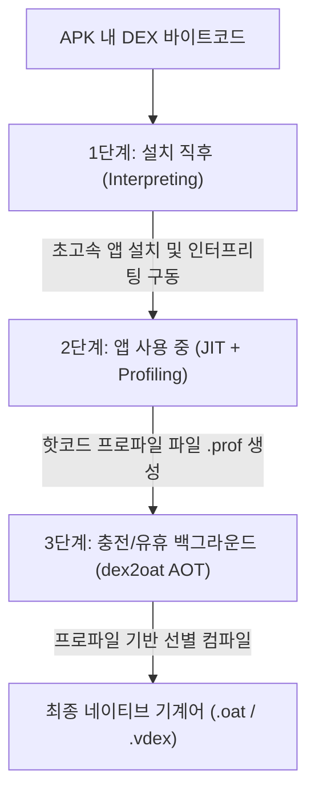

## Android Compilation Pipeline (안드로이드 컴파일 파이프라인)

### 1. 개요 (Overview)

**Android Compilation Pipeline (안드로이드 컴파일 파이프라인)** 은 Android 애플리케이션의 [DEX 바이트코드](../00_foundations/glossary/android-glossary/11-dex-dalvik-executable.md)가 [ART 런타임](art.md) 환경에서 기계어로 번역되어 실행되는 전 과정을 다루는 플랫폼 특화 컴파일 시스템이다.

범용 CS 의 [JIT Compilation](../../../computer-science/jit-compilation.md) 과 [AOT Compilation](../../../computer-science/aot-compilation.md) 기술을 결합하여, 모바일 기기의 **빠른 앱 설치 속도, 저장공간 절약, 런타임 최고 실행 성능**을 동시에 달성하도록 설계되었다.

---

### 2. Profile-Guided Hybrid Compilation 3 단계 파이프라인 (Android 7.0+)

현대 Android (Android 7.0 Nougat 이상) 의 컴파일 파이프라인은 다음과 같은 3 단계 프로세스로 진행된다.

#### 1 단계: 앱 설치 직후 (Interpreting)

- 앱 설치 시 AOT 컴파일을 수행하지 않고 [DEX 바이트코드](../00_foundations/glossary/android-glossary/11-dex-dalvik-executable.md) 를 디바이스에 그대로 복사한다.
- 설치 시간이 불과 수 초 이내로 획기적으로 단축되며, 앱 실행 시 **ART 내장 인터프리터**가 바이트코드를 즉시 해석하여 구동한다.

#### 2 단계: 앱 사용 중 (JIT & Profiling)

- 앱이 실행되는 동안 [JIT 컴파일러](../../../computer-science/jit-compilation.md) 가 자주 실행되는 핫코드(Hot Code) 영역을 감지하여 기계어로 즉석 번역한다.
- 동시에 **JIT 프로파일러**가 동작하여 사용자가 자주 사용하는 메서드 및 클래스 정보를 데이터베이스 프로파일 파일(`.prof`)에 지속적으로 기록한다.

#### 3 단계: 충전 및 유휴 상태 (Profile-Guided AOT - `dex2oat`)

- 사용자가 기기를 사용하지 않고 **배터리가 충전 중**일 때, 안드로이드 OS 의 백그라운드 서비스인 [dex2oat](dex2oat.md) 컴파일러가 트리거된다.
- 수집된 `.prof` 프로파일 파일을 참조하여, 사용자가 실제로 자주 쓰는 핫코드 영역만 선별적으로 [AOT 컴파일](../../../computer-science/aot-compilation.md) 을 수행하여 네이티브 기계어 바이너리(`.oat`)로 저장해 둔다.

---

### 3. 핵심 AOT 컴파일 도구

3 단계 백그라운드 AOT 컴파일을 전담하는 실행 도구인 `dex2oat` 의 역할, 입출력 파일 구조 및 컴파일 필터 옵션은 독립된 [dex2oat 정의 문서](dex2oat.md) 를 참고한다.

---

### 4. 연결 문서 (Related Links)

- [dex2oat](dex2oat.md) - 파이프라인의 3 단계 AOT 컴파일을 전담하는 안드로이드 컴파일러 데몬
- [ART (Android Runtime)](art.md) - 컴파일 파이프라인을 구동하는 안드로이드 백본 런타임
- [DEX (Dalvik Executable)](../00_foundations/glossary/android-glossary/11-dex-dalvik-executable.md) - 컴파일 대상이 되는 압축 바이트코드 포맷
- [JIT Compilation](../../../computer-science/jit-compilation.md) - CS 범용 JIT 동적 컴파일 이론
- [AOT Compilation](../../../computer-science/aot-compilation.md) - CS 범용 AOT 정적 컴파일 이론
- [JIT vs AOT 비교](../../../computer-science/jit-vs-aot-compilation.md) - JIT 과 AOT 컴파일 이론 종합 비교
- [Dalvik VM](dalvik-vm.md) - JIT 위주로 작동했던 안드로이드 레거시 가상 머신
