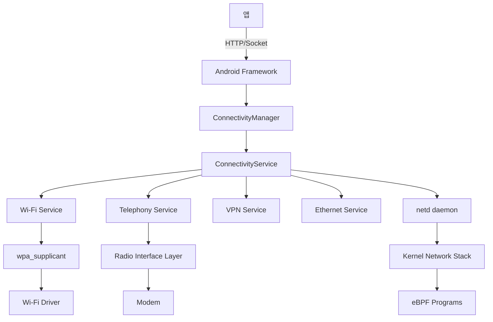

# 네트워크 아키텍처

상위 노트: [[android-connectivity-and-networking]]

```mermaid
graph TB
    App[앱] -->|HTTP/Socket| Framework[Android Framework]
    Framework --> CM[ConnectivityManager]
    
    CM --> CS[ConnectivityService]
    
    CS --> WiFi[Wi-Fi Service]
    CS --> Telephony[Telephony Service]
    CS --> VPN[VPN Service]
    CS --> Ethernet[Ethernet Service]
    
    WiFi --> WPA[wpa_supplicant]
    WPA --> WiFiDriver[Wi-Fi Driver]
    
    Telephony --> RIL[Radio Interface Layer]
    RIL --> Modem[Modem]
    
    CS --> Netd[netd daemon]
    Netd --> Kernel[Kernel Network Stack]
    Kernel --> eBPF[eBPF Programs]
```

---
