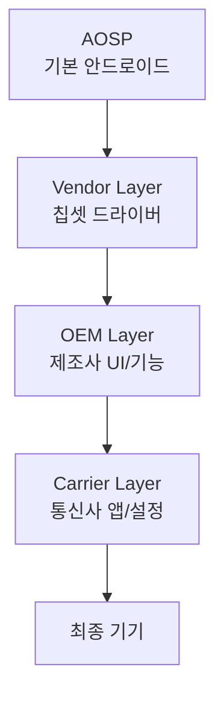

# 커스터마이징 계층

상위 노트: [[android-customization-and-oem]]



### 1. AOSP Layer

**포함**:

- Android Framework (Java/Kotlin)
- System Server
- 기본 앱 (Phone, Contacts, Settings)
- Native 라이브러리 (libc, libm 등)

**제외**:

- Google Play Services
- Gmail, Maps, YouTube 등 Google 앱
- Pixel 독점 기능

### 2. Vendor Layer (Chipset)

Qualcomm/MediaTek/Exynos 등 칩셋 벤더가 제공:

```
/vendor/
├─ lib/
│  ├─ libril-qc-hal-qmi.so       # Modem HAL
│  └─ camera.msm8998.so          # Camera HAL
├─ etc/
│  ├─ init/hw/init.qcom.rc       # Init script
│  └─ permissions/               # 기능 선언
└─ firmware/                     # 펌웨어 바이너리
```

### 3. OEM Layer

삼성, 샤오미 등이 추가:

```
/system/product/
├─ app/
│  ├─ SamsungHealth.apk
│  └─ GalaxyStore.apk
├─ overlay/                      # 리소스 오버레이
│  └─ framework-res__auto_generated_rro_product.apk
└─ etc/
   └─ sysconfig/                 # 권한 설정
```

### 4. Carrier Layer

통신사가 추가:

```
/carrier/
├─ app/
│  └─ CarrierApp.apk             # 통신사 앱
└─ etc/
   └─ apns-conf.xml              # APN 설정
```

---
