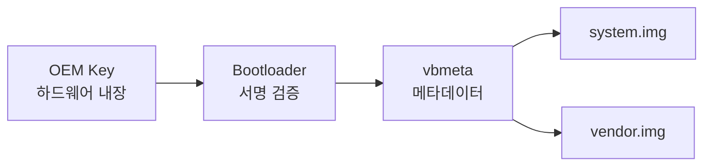

# Verified Boot (AVB)

상위 노트: [[android-customization-and-oem]]

### 서명 체인



**OEM 이 해야 할 일**:

1. OEM private key 로 vbmeta 서명
2. Public key 를 기기 eFuse 에 기록 (영구)
3. Bootloader 에 검증 로직 추가

**사용자가 bootloader unlock 시**:

```bash
fastboot flashing unlock

# 경고: 모든 데이터 삭제
# Boot 화면에 "unlocked" 표시
```

---
