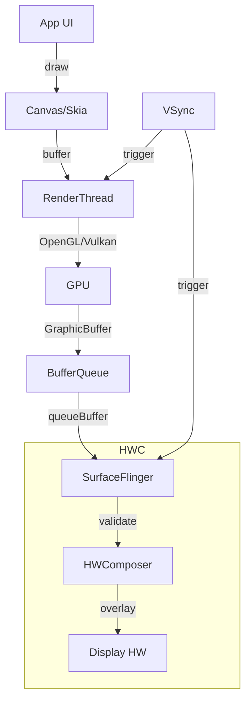

# 그래픽 아키텍처

상위 노트: [[android-graphics-and-media]]



### 핵심 컴포넌트

#### 1. Canvas / Skia

```kotlin
// Custom View
override fun onDraw(canvas: Canvas) {
    canvas.drawRect(0f, 0f, 100f, 100f, paint)
    canvas.drawText("Hello", 50f, 50f, textPaint)
}
```

**Skia**:

- 2D 그래픽 라이브러리
- GPU 가속 (OpenGL/Vulkan 백엔드)
- Chrome 도 사용하는 검증된 엔진

#### 2. RenderThread

앱의 UI 스레드와 별도로 실행:

```java
// View.java
void draw(Canvas canvas) {
    // UI 스레드: View 트리 순회
    drawBackground(canvas);
    onDraw(canvas);
    dispatchDraw(canvas);  // 자식 View
    
    // → RenderThread로 전달
}
```

**RenderThread**:

- DisplayList 구축
- GPU 명령 생성
- VSync 대기

#### 3. BufferQueue

프로듀서(앱)- 컨슈머(SurfaceFlinger) 패턴:

```cpp
// 앱 쪽 (Producer)
ANativeWindow_Buffer buffer;
ANativeWindow_lock(window, &buffer, nullptr);
// buffer에 픽셀 쓰기
ANativeWindow_unlockAndPost(window);

// SurfaceFlinger 쪽 (Consumer)
acquireBuffer(&buffer);
// buffer 합성
releaseBuffer(&buffer);
```

**트리플 버퍼링**:

```
Front Buffer:  화면에 표시 중
Back Buffer 1: GPU가 렌더링 중
Back Buffer 2: CPU가 다음 프레임 준비 중
```

#### 4. SurfaceFlinger

모든 레이어를 합성:

```
Layer Stack:
  [Status Bar]       Z-order: 100
  [Navigation Bar]            90
  [App Window]                50
  [Wallpaper]                 10
```

**합성 방법**:

1. **GPU Composition**: OpenGL 로 모든 레이어 합성
2. **HWC Overlay**: 하드웨어가 직접 합성 (전력 절약)

```cpp
// SurfaceFlinger.cpp
void SurfaceFlinger::composite() {
    for (Layer* layer : layers) {
        if (hwc->canUseOverlay(layer)) {
            hwc->setLayerBuffer(layer);  // 하드웨어 오버레이
        } else {
            gpu->compositeLayer(layer);  // GPU 합성
        }
    }
}
```

---
