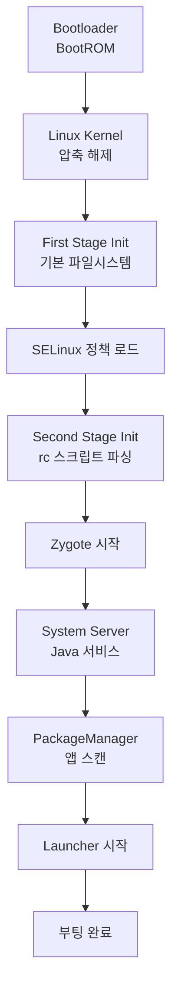

# 부팅 과정과 Init

상위 노트: [[android-init-and-services]]

### 전체 부팅 흐름



### First Stage Init

**목적**: 최소한의 파일시스템 마운트 (커널 모듈 로딩 전)

```cpp
// system/core/init/first_stage_init.cpp
int main(int argc, char** argv) {
    // 1. /dev, /proc, /sys 마운트
    mount("tmpfs", "/dev", "tmpfs", MS_NOSUID, "mode=0755");
    mount("proc", "/proc", "proc", 0, nullptr);
    mount("sysfs", "/sys", "sysfs", 0, nullptr);
    
    // 2. /dev/kmsg 열기 (로그)
    SetupKernelLogging();
    
    // 3. SELinux 초기 설정
    FirstStageMain(argc, argv);
    
    // 4. Second Stage로 전환
    execv("/system/bin/init", argv);
}
```

**마운트된 파일시스템** (First Stage 후):

```
/dev     tmpfs
/proc    procfs
/sys     sysfs
/dev/pts devpts
```

### Second Stage Init

**목적**: 본격적인 시스템 초기화

```cpp
// system/core/init/init.cpp
int SecondStageMain(int argc, char** argv) {
    // 1. Property 시스템 초기화
    property_init();
    
    // 2. SELinux 정책 로드
    selinux_initialize();
    selinux_restore_context();
    
    // 3. 기본 디렉토리 생성
    epoll_fd = epoll_create1(EPOLL_CLOEXEC);
    InstallSignalHandlers();
    
    // 4. RC 파일 파싱
    LoadBootScripts();
    
    // 5. 초기 트리거 실행
    ActionManager::GetInstance().QueueEventTrigger("early-init");
    ActionManager::GetInstance().QueueEventTrigger("init");
    
    // 6. 메인 루프
    while (true) {
        ExecuteCommands();
        RestartProcesses();
        HandlePropertySet();
    }
}
```

---
