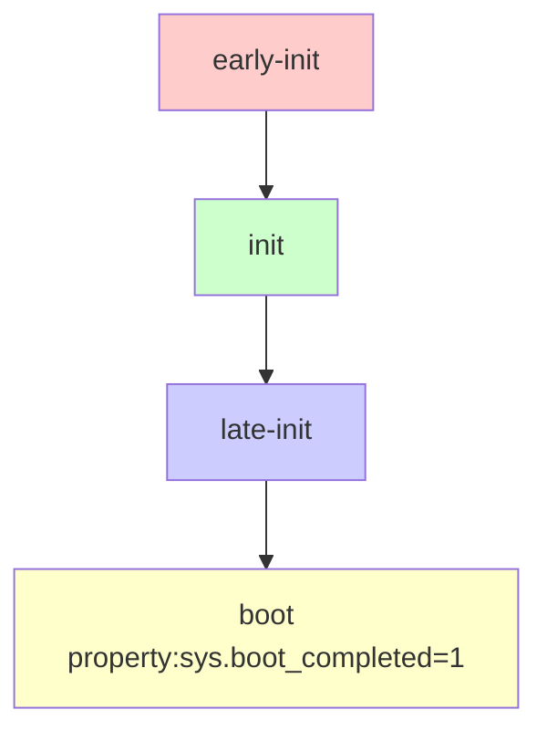

# Trigger 와 Action

상위 노트: [[android-init-and-services]]

### 부팅 트리거 순서



### 주요 트리거

#### 1. early-init

가장 먼저 실행. 파일시스템 마운트, 커널 파라미터 설정.

```bash
on early-init
    # cgroup 마운트
    mount cgroup none /dev/cpuctl cpu
    mount cgroup none /dev/cpuset cpuset
    
    # SELinux 시작
    start ueventd
    
    # 기본 디렉토리
    mkdir /dev/socket 0755 root root
    mkdir /dev/graphics 0775 root graphics
```

#### 2. init

기본 서비스 시작, 파티션 마운트.

```bash
on init
    # /data 마운트
    wait /dev/block/bootdevice/by-name/userdata
    mount_all /vendor/etc/fstab.${ro.hardware} --early
    
    # Property 초기화
    setprop ro.build.version.sdk ${ro.system.build.version.sdk}
    
    # 클래스 시작
    class_start core
```

#### 3. late-init

대부분의 서비스 시작.

```bash
on late-init
    # 모든 서비스 시작
    trigger early-fs
    trigger fs
    trigger post-fs
    trigger late-fs
    trigger post-fs-data
    
    # Boot animation 시작
    trigger load_persist_props_action
    trigger firmware_mounts_complete
    
    # Main 클래스 시작 (Zygote!)
    trigger early-boot
    trigger boot
```

#### 4. boot

앱 시작 준비 완료.

```bash
on boot
    # 서비스 클래스 시작
    class_start main
    class_start late_start
    
    # 부팅 완료 property
    setprop sys.boot_completed 1
```

### Property 트리거

Property 값 변화에 반응:

```bash
# 사용자 잠금 해제 시
on property:vold.decrypt=trigger_restart_framework
    class_start main
    class_start late_start

# USB 연결 시
on property:sys.usb.config=mtp,adb
    start adbd
```

---
