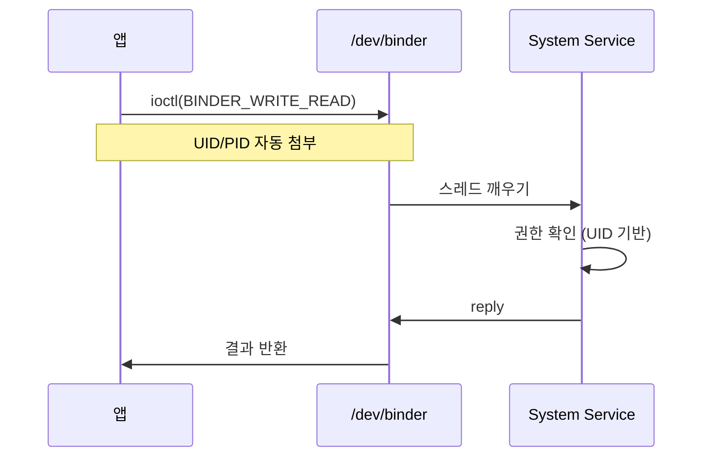

# Binder: 모바일에 최적화된 IPC

상위 노트: [[02-핵심-추가-기능과-설계-이유]]

#### 기존 IPC 의 한계

전통적인 Unix IPC(파이프, Unix 소켓, SysV 메시지 큐) 는 몇 가지 문제가 있었다:

1. **성능**: 프로세스 간 통신이 너무 자주 일어난다. 앱이 화면을 그리려면 SurfaceFlinger 와 통신하고, 위치 정보를 얻으려면 LocationService 와 통신한다. 기존 IPC 는 이런 빈번한 통신에 최적화되지 않았다.
2. **신원 확인**: 호출자의 UID/PID 를 신뢰할 수 없다. 악의적인 앱이 신원을 위조할 수 있다.
3. **객체 레퍼런스**: 복잡한 데이터 구조 (예: 파일 디스크립터, 콜백 객체) 를 전달하기 어렵다.

#### Binder 의 해결책

**Binder**는 OpenBinder 프로젝트에서 파생되어 안드로이드에 통합되었다 (2008 년). 주요 특징:

- **커널 수준의 IPC**: `/dev/binder` 캐릭터 디바이스를 통해 통신. 커널이 중재하므로 신원 위조가 불가능하다.
- **자동 신원 전달**: 커널이 호출자의 UID/PID 를 자동으로 전달. 시스템 서비스는 이를 신뢰할 수 있다.
- **객체 지향**: `IBinder` 객체를 다른 프로세스에 전달 가능. 커널이 레퍼런스 카운팅을 관리한다.
- **동기 RPC**: 함수 호출처럼 느껴진다. 호출자는 응답을 받을 때까지 block 된다 (oneway 키워드로 비동기도 가능).



#### 성능 비교

초기 벤치마크 (2008 년) 에서:

- **Unix Socket**: 라운드트립 시간 ~50μs
- **Binder**: 라운드트립 시간 ~25μs

메모리 복사를 최소화하고, 커널 스케줄링을 최적화한 결과다.

#### 보안 강화

Binder 는 [[selinux]] 정책과 통합된다. 예를 들어:

```
allow untrusted_app surfaceflinger_service:service_manager find;
allow untrusted_app surfaceflinger:binder call;
```

위 정책이 없으면, 일반 앱은 SurfaceFlinger 에 접근할 수 없다. 루트 권한을 얻어도 SELinux 가 차단한다.

---
