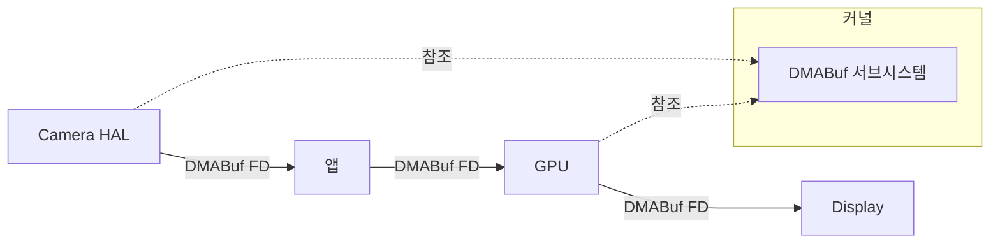

# Ashmem 과 공유 메모리의 진화

상위 노트: [[02-핵심-추가-기능과-설계-이유]]

#### 문제: 멀티미디어 [[buffer|버퍼]] 공유

카메라로 사진을 찍으면:

1. Camera HAL 이 [[buffer|버퍼]] 에 이미지 데이터를 쓴다.
2. 앱이 [[buffer|버퍼]] 를 처리한다 (회전, 필터 등).
3. MediaStore 에 JPEG 로 저장한다.
4. Gallery 앱이 썸네일을 표시한다.

각 단계마다 데이터를 복사하면 수백 MB 의 메모리와 CPU 시간이 낭비된다.

#### Ashmem(Anonymous Shared Memory)

안드로이드 초기 (Cupcake, 2009) 에 도입된 Ashmem 은 다음 기능을 제공했다:

- **공유 메모리**: 여러 프로세스가 같은 물리 메모리 영역을 매핑.
- **Pin/Unpin**: 메모리 압박 시 커널이 unpinned 영역을 회수 가능. 디스크 swap 없이 메모리 확보.
- **파일 디스크립터**: Ashmem 영역을 FD 로 표현, Binder 를 통해 전달.

```c
int fd = ashmem_create_region("my_buffer", size);
void *ptr = mmap(NULL, size, PROT_READ | PROT_WRITE, MAP_SHARED, fd, 0);
// Binder로 fd 전달
```

#### ION → DMABuf Heaps

Ashmem 은 CPU 접근용이었다. 하지만 GPU, Camera, Video Decoder 같은 하드웨어 가속기는 **물리적으로 연속된 메모리**가 필요하거나, **IOMMU(Input-Output Memory Management Unit)**를 통해 접근한다.

**ION**(2011~2019) 은 다양한 메모리 heap 을 제공했다:

- **System heap**: 일반 메모리.
- **Carveout heap**: 부팅 시 예약된 물리 연속 메모리.
- **CMA heap**: Contiguous Memory Allocator.

**DMABuf**(2012 년 리눅스 메인라인) 는 하드웨어 간 [[buffer|버퍼]] 공유를 표준화했다. 안드로이드는 ION 에서 DMABuf Heaps 으로 마이그레이션 중이다 (Android 11+).



**제로카피 (Zero-Copy)** 달성: 데이터는 한 번만 메모리에 쓰이고, 각 컴포넌트는 포인터만 전달받는다.

---
