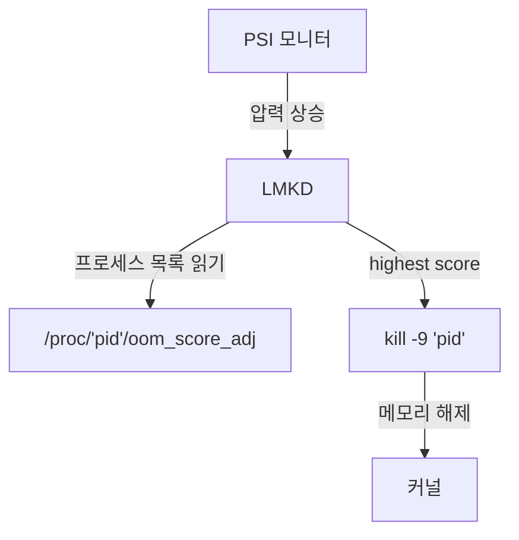

# LMKD: 선제적 프로세스 종료

상위 노트: [[02-핵심-추가-기능과-설계-이유]]

#### OOM Killer 의 한계

리눅스의 **OOM(Out of Memory) Killer**는 메모리 할당이 **실패한 후**에 반응한다. 이는 데스크톱에서는 괜찮지만, 모바일에서는 너무 늦다. 이미 시스템이 느려지고, 앱이 멈춘 후에 종료가 일어난다.

#### Low Memory Killer (커널 버전)

초기 안드로이드 (Cupcake~Oreo) 는 **커널 내 LMK(Low Memory Killer)**를 사용했다. 메모리 임계값 (`minfree`) 을 설정하고, 특정 레벨에 도달하면 `oom_adj` 점수가 높은 프로세스를 종료했다.

```
minfree:    72MB  90MB  108MB  126MB  144MB  162MB
oom_adj:      0    1     2      4      9      15
```

예: 사용 가능한 메모리가 108MB 이하로 떨어지면, oom_adj >= 2 인 프로세스를 종료.

**문제**: 하드코딩된 임계값은 기기마다 달라야 한다 (RAM 이 2GB 인 기기와 8GB 인 기기는 다르다).

#### LMKD: 유저 공간 데몬

Android 9(Pie) 부터 **lmkd**라는 유저 공간 데몬이 메모리 관리를 담당한다.

**PSI(Pressure Stall Information)**를 활용한다. 리눅스 커널 (4.20+) 은 메모리, CPU, I/O 압박 정도를 수치화해 `/proc/pressure/*` 에 노출한다.

```bash
cat /proc/pressure/memory
some avg10=0.00 avg60=0.05 avg300=0.10 total=12345
full avg10=0.00 avg60=0.00 avg300=0.00 total=0
```

**some**: 적어도 하나의 태스크가 메모리를 기다림.

**full**: 모든 태스크가 블록됨.

lmkd 는 PSI 값을 모니터링하다가, 임계값을 초과하면 `oom_score_adj` 가 높은 프로세스를 찾아 `kill` 시그널을 보낸다.

#### 프로세스 우선순위

ActivityManager 가 각 프로세스의 중요도를 평가해 `oom_score_adj` 를 설정한다:

| 상태              | oom_score_adj | 설명                                    |
| --------------- | ------------- | ------------------------------------- |
| **Foreground**  | 0             | 화면에 표시 중                              |
| **Visible**     | 100           | 보이진 않지만 영향을 줌 (예: foreground service) |
| **Perceptible** | 200           | 사용자가 인지 가능 (예: 음악 재생)                 |
| **Service**     | 500+          | 백그라운드 작업                              |
| **Cached**      | 900+          | 최근 사용했지만 현재는 안 씀                      |
|                 |               |                                       |



---
