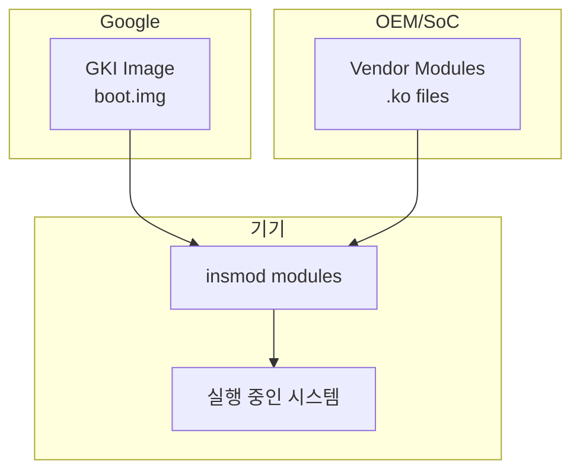

# GKI(Generic Kernel Image): 업데이트 딜레마 해결

상위 노트: [[02-핵심-추가-기능과-설계-이유]]

#### 파편화 문제

안드로이드 초기 (2008~2015), 각 OEM/SoC 업체는 커널을 마구 수정했다:

- Qualcomm 은 자사 칩셋용 드라이버를 추가.
- Samsung 은 Knox 보안 기능을 추가.
- Xiaomi 는 MIUI 최적화를 추가.

결과적으로:

1. **보안 패치 지연**: 구글이 커널 취약점을 패치해도, OEM 이 자신의 커널에 백포트하기까지 몇 달 걸림.
2. **업스트림 통합 불가**: 수정된 커널은 mainline Linux 와 너무 달라져, 새 커널로 업그레이드가 불가능.
3. **테스트 부담**: 수천 가지 기기 변형마다 별도 커널.

#### GKI 의 목표

**GKI(Generic Kernel Image)**는 Android 11 부터 강제되었다:

1. **표준 커널 이미지**: 구글이 빌드한 ACK(Android Common Kernel) 를 **모든** 기기가 사용.
2. **Vendor Module 분리**: OEM/SoC 는 기기별 드라이버를 **동적 모듈 (`.ko`)**로 빌드. 표준 커널에 로드.
3. **KMI(Kernel Module Interface)**: 커널과 모듈 간 ABI 를 안정화. 커널이 업데이트되어도 모듈은 재컴파일 불필요.



#### 구체적인 구조

- **boot.img**: GKI 커널 + 초기 램디스크.(구글 유지보수)
- **vendor_boot.img** 또는 `/vendor/lib/modules/`: OEM 드라이버 모듈.
- **KMI Symbol Whitelist**: 모듈이 사용 가능한 커널 함수/변수 목록. 이 외 심볼은 접근 불가.

```bash
# 로드된 모듈 확인
adb shell lsmod

# 모듈 정보
adb shell modinfo /vendor/lib/modules/wlan.ko
```

#### 보안 패치 속도 향상

구글은 매달 **월간 보안 패치**를 GKI 로 제공한다. OEM 은 벤더 모듈만 업데이트하면 된다. 과거 6 개월 걸리던 패치가 1 달로 단축되었다.

---
