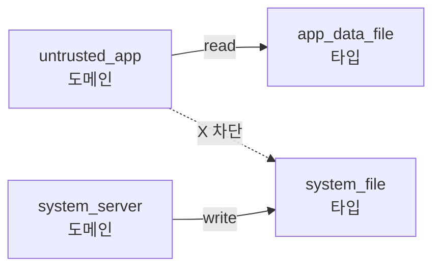

# [[selinux]]: 강제 접근 제어

상위 노트: [[02-핵심-추가-기능과-설계-이유]]

#### DAC 의 한계

전통적인 Unix 권한 (UID/GID/permission bits) 은 **DAC(Discretionary Access Control)**다. 파일 소유자가 권한을 결정한다.

문제:

- 루트 권한을 얻으면 모든 제약이 사라진다.
- setuid 바이너리 (예: `su`, `passwd`) 가 뚫리면 공격자도 루트 권한을 얻는다.

#### SELinux 의 도입

안드로이드 4.3(2013) 부터 **SELinux**가 permissive 모드로 도입되었고, 5.0(2014) 부터 enforcing 모드가 필수가 되었다.

**MAC(Mandatory Access Control)**: 시스템 관리자가 정책을 설정하고, 프로세스는 이를 우회할 수 없다.

#### 도메인과 타입

- **Domain**: 프로세스의 SELinux 레이블. 예: `untrusted_app`, `system_server`, `init`.
- **Type**: 파일/소켓/Binder 서비스의 레이블. 예: `app_data_file`, `system_file`, `surfaceflinger_service`.

정책 예:

```
# untrusted_app은 자기 데이터 파일만 읽기/쓰기 가능
allow untrusted_app app_data_file:file { read write };

# system_server는 모든 앱에 Binder 호출 가능
allow system_server appdomain:binder call;

# untrusted_app은 system_file을 절대 쓸 수 없음
neverallow untrusted_app system_file:file write;
```



#### Binder 와의 통합

Binder 호출도 SELinux 로 제어된다:

```
allow untrusted_app activity_service:service_manager find;
allow untrusted_app system_server:binder call;
```

이 정책이 없으면, 앱이 `ActivityManager` 를 찾을 수 없다.

#### 디버깅

위반 시 로그 확인:

```bash
adb shell dmesg | grep avc
# 예: avc: denied { read } for pid=1234 comm="app_process" 
#      scontext=u:r:untrusted_app:s0 tcontext=u:object_r:system_file:s0
```

`audit2allow` 도구로 규칙 생성 제안 (단, 보안 리뷰 필수):

```bash
audit2allow -i avc_log.txt
```

---
