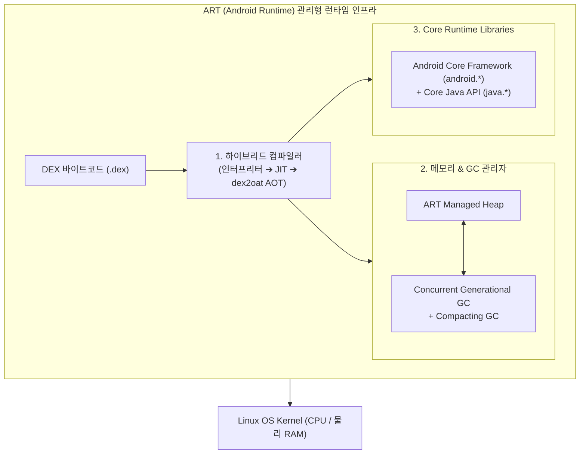

## ART (Android Runtime)

### 1. 개요 및 런타임(Runtime)의 본질

**ART (Android Runtime)** 는 Android 운영체제에서 모든 애플리케이션과 프레임워크 시스템 서비스([system_server](../04_system_services/system-server.md))를 구동하는 **모바일 전용 관리형 런타임(Managed Runtime Environment)** 이다.

기존 레거시 가상 머신이었던 **[Dalvik VM](dalvik-vm.md)** 을 완전히 대체하기 위해 Android 4.4(KitKat)에서 시험 도입된 후, **Android 5.0(Lollipop)** 부터 안드로이드의 기본 표준 런타임으로 전면 적용되었다.

>[!IMPORTANT]
>**왜 단순한 가상 머신(VM)이 아니라 '런타임(Runtime)'이라는 이름이 붙었는가?**
> - **런타임(Runtime)** 이란 프로그램이 실행(Run)되는 동안 그 생명주기와 동작을 뒷받침하는 모든 소프트웨어 환경을 통틀어 부르는 말이다.
> - ART 는 단순히 바이트코드([DEX](android-compilation-pipeline.md))를 해석하는 엔진에 머무르지 않고, **1) 3 단계 하이브리드 컴파일 파이프라인(JIT + AOT), 2) 지능형 메모리 할당 및 Concurrent GC, 3) 스레드 스케줄링 및 모니터링, 4) Android Core 프레임워크 라이브러리**를 총괄 관리하는 거대한 실행 인프라이기 때문에 'Android Runtime'이라는 이름이 붙었다.

---

### 2. ART 의 3 단계 하이브리드 컴파일 파이프라인

ART 런타임 환경에서 애플리케이션 바이트코드가 네이티브 기계어로 바뀌어 구동되는 3 단계 프로파일 기반 파이프라인(Interpreting ➔ JIT ➔ AOT `dex2oat`)과 상세 작동 원리는 독립된 [Android Compilation Pipeline 문서](android-compilation-pipeline.md) 를 참고한다.

---

### 3. ART 의 Concurrent GC (가비지 컬렉션) 최적화

Dalvik VM 시절에는 [Garbage Collection (GC)](../../../computer-science/garbage-collection.md) 이 구동될 때 전체 앱 스레드가 완전히 정지하는 "Stop-the-World" 현상으로 인해 프레임 드롭(Jank)이 빈번했다.

ART 는 이를 극복하기 위해 다음과 같은 최적화 GC 기법을 탑재했다.

- **Concurrent GC (동시 가비지 컬렉션)**: 메모리 해제 작업의 대부분을 앱 실행 스레드 정지 없이 백그라운드 스레드에서 동시에 수거하여 정지 시간을 2~3ms 이하로 단축했다.
- **Generational GC (세대별 GC)**: 단기 생존 객체와 장기 생존 객체를 분리하여 GC 수거 효율을 높였다.
- **Compacting GC (메모리 단편화 정리)**: 백그라운드 상태일 때 메모리 구멍(Fragmentation)을 정돈하여 연속 메모리를 확보한다.

---

### 4. 연결 문서 (Related Links)

- [Android Compilation Pipeline](android-compilation-pipeline.md) - ART 런타임 상에서 구동되는 3 단계 컴파일 파이프라인
- [dex2oat](dex2oat.md) - ART 에 탑재된 백그라운드 AOT 컴파일러 데몬
- [Dalvik vs ART 비교](dalvik-vs-art.md) - Dalvik 과 ART 런타임 간의 구조 및 성격 상세 비교
- [Dalvik VM](dalvik-vm.md) - ART 이전에 사용되었던 안드로이드 레거시 가상 머신
- [DEX (Dalvik Executable)](android-compilation-pipeline.md) - ART 런타임이 구동하는 안드로이드 압축 바이트코드
- [Garbage Collection (GC)](../../../computer-science/garbage-collection.md) - ART Concurrent GC 가 수거하는 메모리 관리 메커니즘
- [Zygote](zygote.md) - ART 가상 머신 인스턴스를 미리 프리워밍(Pre-warm)하여 앱을 초고속 포크하는 마스터 프로세스
- [system_server](../04_system_services/system-server.md) - ART 런타임 상에서 동작하는 안드로이드 백본 시스템 서비스
- [Linux Kernel](../../../operating-systems/linux-kernel.md) - ART 런타임 프로세스가 구동되는 하위 OS 커널
