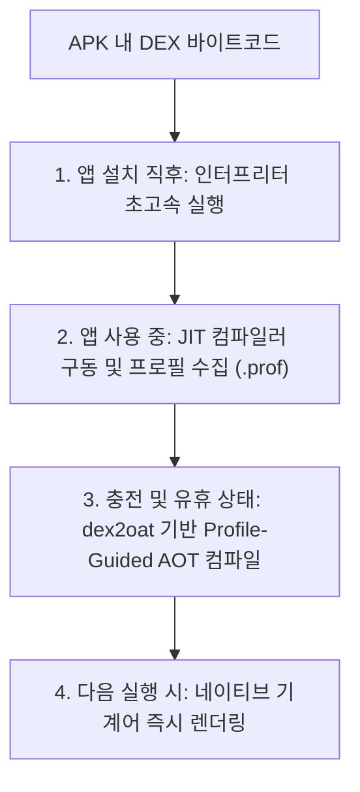

# ART (Android Runtime)

## 1. 개요 (Overview)

**ART (Android Runtime)** 는 Android 운영체제에서 모든 애플리케이션과 프레임워크 시스템 서비스를 구동하는 관리형 런타임(Managed Runtime) 환경이다.

기존 레거시 런타임이었던 **[Dalvik VM](dalvik-vm.md)** 을 완전히 대체하기 위해 Android 4.4(KitKat)에서 실험적으로 공개된 후, **Android 5.0(Lollipop)** 부터 안드로이드의 기본 런타임으로 전면 적용되었다.

ART 는 [DEX 바이트코드](../00_foundations/glossary/android-glossary/11-dex-dalvik-executable.md) 실행 속도, 메모리 관리 및 가비지 컬렉션(GC) 메커니즘을 획기적으로 개선하여 모바일 앱의 렌더링 성능과 전력 효율성을 극대화하였다.

---

## 2. 현대 ART 의 Profile-Guided 혼합 컴파일 메커니즘

현대 ART(Android 7.0+)는 [JIT & AOT 컴파일](../../../computer-science/jit-and-aot-compilation.md)의 장점만을 결합한 **프로파일 기반 혼합 컴파일(Profile-Guided Hybrid Compilation)** 파이프라인으로 구동된다.

1. **앱 설치 직후 (Interpreting)**: 설치 속도를 극대화하기 위해 [DEX 바이트코드](../00_foundations/glossary/android-glossary/11-dex-dalvik-executable.md)를 복사만 하고 설치를 마친다. 앱 실행 시 인터프리터가 즉시 구동된다.
2. **앱 사용 중 (JIT & Profiling)**: 자주 사용되는 핫코드(Hot Code) 영역을 감지하여 프로파일 파일(`.prof`)에 수집하고 [JIT 컴파일](../../../computer-science/jit-and-aot-compilation.md)을 수행한다.
3. **유휴 상태 백그라운드 (Profile-Guided AOT - `dex2oat`)**: 기기를 충전하고 사용하지 않는 동안, 수집된 프로파일 데이터를 바탕으로 자주 쓰는 코드만 [AOT 컴파일](../../../computer-science/jit-and-aot-compilation.md)하여 네이티브 기계어 파일(`oat`)로 저장해 둔다.

---

## 3. ART 의 Concurrent GC (가비지 컬렉션) 최적화

Dalvik VM 시절에는 [Garbage Collection (GC)](../../../computer-science/garbage-collection.md) 이 구동될 때 전체 앱 스레드가 완전히 정지하는 "Stop-the-World" 현상으로 인해 프레임 드롭(Jank)이 빈번했다.

ART 는 이를 극복하기 위해 다음과 같은 최적화 GC 기법을 탑재했다.

- **Concurrent GC (동시 가비지 컬렉션)**: 메모리 해제 작업의 대부분을 앱 실행 스레드 정지 없이 백그라운드 스레드에서 동시에 수거하여 정지 시간을 2~3ms 이하로 단축했다.
- **Generational GC (세대별 GC)**: 단기 생존 객체와 장기 생존 객체를 분리하여 GC 수거 효율을 높였다.
- **Compacting GC (메모리 단편화 정리)**: 백그라운드 상태일 때 메모리 구멍(Fragmentation)을 정돈하여 연속 메모리를 확보한다.

---

## 4. Dalvik 과 ART 의 상세 비교

Dalvik VM 과 ART 런타임 간의 기술 세부 비교표 및 진화 배경은 독립된 [Dalvik vs ART 비교 문서](dalvik-vs-art.md)를 참고한다.

---

## 5. 연결 문서 (Related Links)

- [Dalvik vs ART 비교](dalvik-vs-art.md) - Dalvik 과 ART 런타임 간의 구조 및 성격 상세 비교
- [Dalvik VM](dalvik-vm.md) - ART 이전에 사용되었던 안드로이드 레거시 가상 머신
- [DEX (Dalvik Executable)](../00_foundations/glossary/android-glossary/11-dex-dalvik-executable.md) - ART 런타임이 구동하는 안드로이드 압축 바이트코드
- [JIT & AOT 컴파일](../../../computer-science/jit-and-aot-compilation.md) - ART 가 채택한 JIT 및 AOT 컴파일 방식 비교
- [Garbage Collection (GC)](../../../computer-science/garbage-collection.md) - ART Concurrent GC 가 수거하는 메모리 관리 메커니즘
- [Zygote](zygote.md) - ART 가상 머신 인스턴스를 미리 프리워밍(Pre-warm)하여 앱을 초고속 포크하는 마스터 프로세스
- [system_server](../04_system_services/system-server.md) - ART 런타임 상에서 동작하는 안드로이드 백본 시스템 서비스
- [Linux Kernel](../../../operating-systems/linux-kernel.md) - ART 런타임 프로세스가 구동되는 하위 OS 커널
