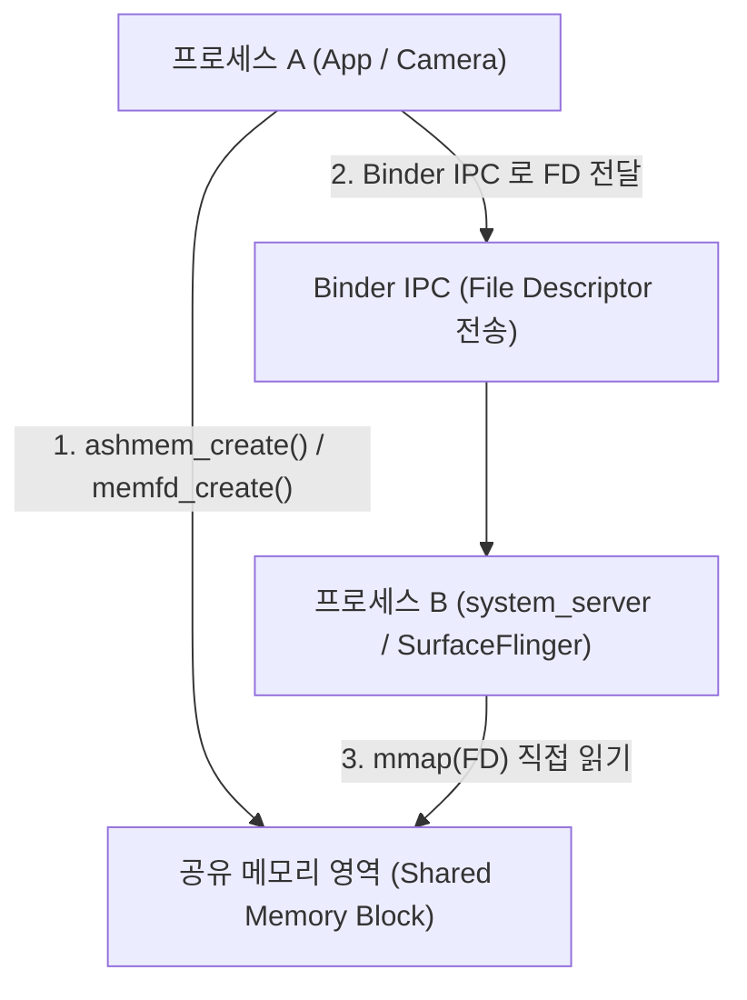

# Ashmem (Anonymous Shared Memory & memfd)

## 1. 개요 (Overview)

**Ashmem (Anonymous Shared Memory / 아쉬멤)** 은 서로 다른 안드로이드 프로세스가 대용량 데이터(Bitmap, 대용량 Parcelable, 공유 그래픽 버퍼)를 메모리 복사(Copy) 없이 **고속으로 직접 공유하기 위해 Android OS 가 Linux 커널 드라이버로 추가했던 익명 공유 메모리 메커니즘**이다.

메모리가 부족해지면 언핀(`unpin`)된 공유 메모리 블록을 커널이 자동으로 수거하는 특수 메모리 회수 시스템을 탑재하고 있으며, Android 10(Q) 이상부터는 메인라인 Linux 커널 표준인 **`memfd` (Memory File Descriptor)** 로 표준 전환되었다.

---

### 초보자를 위한 쉽게 이해하는 비유

* **Ashmem (프로세스 간 공동 거대한 메모판 칠판)**:
  - 프로세스 A 가 프로세스 B 에게 거대한 사과 그림(비트맵 10MB)을 전달할 때, 사과 복사본 10MB 를 편지통으로 일일이 전달하는 대신, **두 프로세스가 같이 바라보는 공동 유리 칠판(Ashmem / memfd)에 사과를 그려놓고 프로세스 B 에게 칠판 열쇠(File Descriptor)만 넘겨주는 초고속 공유 메모리**.



---

## 2. Ashmem 의 핵심 특수 기능: Pin & Unpin

1. **`ASHMEM_PIN`**: 프로세스가 현재 이 공유 메모리를 읽고/쓰는 중이므로 커널이 절대로 수거해서는 안 됨을 지정.
2. **`ASHMEM_UNPIN`**: 프로세스가 공유 메모리 사용을 일시 중단했으므로, 메모리가 응급으로 부족해지면 커널이 이 영역의 페이지만 자유롭게 수거(Purge)할 수 있도록 허용.

---

## 3. 관측 가능 증거 및 CLI 명령어

`adb shell` 로 현재 안드로이드 프로세스가 소유한 ashmem / memfd 공유 메모리 디스크립터를 진단할 수 있다:

```bash
# 특정 프로세스의 공유 메모리 파일 디스크립터(fd) 현황 조회
adb shell ls -l /proc/<pid>/fd | grep -E "ashmem|memfd"
```

---

## 4. 연결 문서 (Related Links)

- [Android Kernel 특화 구조](android-kernel.md) - 안드로이드 커널 메모리 아키텍처
- [Linux 커널](../../../operating-systems/linux-kernel.md) - CS 범용 Linux 커널 Shared Memory (POSIX shm)
- [Binder IPC](binder-ipc.md) - Ashmem 파일 디스크립터(FD) 전송 매개체
- [Low Memory Killer (LMK)](low-memory-killer-lmk.md) - unpin 된 ashmem 수거 엔진
