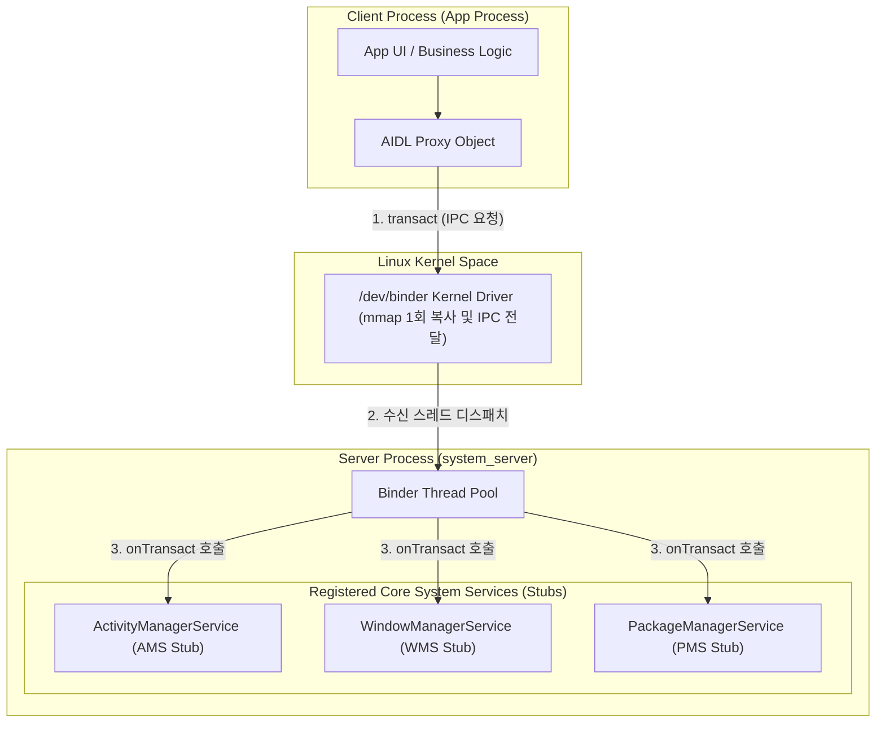

## Android Binder IPC Architecture

### 1. 개요 (Overview)

**Binder**는 Android 운영체제의 핵심 프로세스 간 통신(Inter-Process Communication, IPC) 메커니즘이다. Linux 커널의 기본 IPC(Socket, Pipe, Shared Memory 등)가 지닌 한계(데이터 복사 횟수, 보안 식별자 부재 등)를 극복하기 위해 설계된 OpenBinder 기반의 커널 드라이버 및 사용자 공간 라이브러리 집합이다.

Android 환경에서 각 애플리케이션 프로세스는 보안과 안정성을 위해 독립된 샌드박스(Zygote 에서 포크된 자체 JVM/ART 인스턴스)에서 실행되므로, 프로세스 경계를 넘어 데이터를 전달하고 다른 프로세스의 서비스를 호출하기 위해 Binder IPC 가 필수적으로 사용된다.

---

### 2. Binder IPC 아키텍처 (Architecture)

Binder 통신은 **Client-Server 모델**을 기본 구조로 갖는다.

#### 주요 구성 요소를 통한 통신 흐름

1. **Client Process (Proxy)**: 호출하려는 IPC 메서드를 표준 인터페이스 호출처럼 보이게 Wrapping 한 Proxy 객체를 통해 트랜잭션을 요청한다.
2. **ServiceManager**: Android 시스템 내 등록된 서비스(예: `ActivityManagerService`, `WindowManagerService`)의 Binder 핸들(Handle)을 관리하는 네임서버 및 시스템 디렉터리 역할을 수행한다.
3. **Binder Driver (`/dev/binder`)**: 커널 공간에서 실행되며, 프로세스 간 메모리 맵핑, 스레드 풀 관리, UID/PID 기반 보안 검증 및 IPC 데이터 전달을 담당한다.
4. **Server Process (Stub)**: Binder 드라이버로부터 신호를 전달받아 `onTransact()` 를 실행하고, 실제 요청된 서비스를 처리한 후 결과를 다시 커널을 통해 Client 에 반환한다.

---

### 3. Linux 커널 메모리 및 `/dev/binder` (Memory & Driver)

전통적인 Linux IPC(예: Socket)는 메시지 송신 시 다음과 같이 **2 회의 메모리 복사(Double Copy)** 과정이 필요하다.

- `User Space (Client) -> Kernel Space` (1 회 복사)
- `Kernel Space -> User Space (Server)` (2 회 복사)

반면 Android Binder 는 커널 모듈인 `/dev/binder`와 [mmap](../../../computer-science/mmap.md) 시스템 콜을 활용하여 **단 1 회의 메모리 복사(Single Copy)** 만으로 데이터를 전달한다.

#### [mmap](../../../computer-science/mmap.md) 기반 메모리 공유 메커니즘

- 프로세스가 시작될 때 수신자(Server) 프로세스는 `/dev/binder` 드라이버에 대해 [mmap](../../../computer-science/mmap.md) 을 호출하여 자신의 사용자 공간 메모리 영역 일부를 커널 메모리 공간에 직접 매핑한다.
- 클라이언트 프로세스가 데이터를 송신하면, 커널 드라이버는 클라이언트 메모리에서 수신 프로세스가 매핑해 둔 해당 커널 - 사용자 매핑 메모리 공간으로 데이터를 **직접 1 회 복사**한다.
- 수신 프로세스는 추후 별도의 메모리 복사 없이 커널이 작성해 둔 사용자 메모리 영역을 즉시 읽어들인다.

---

### 4. 프로세스 경계 직렬화 (Marshalling / Unmarshalling)

프로세스는 서로 분리된 가상 메모리 주소 공간을 사용하므로 포인터 주소를 직접 전달할 수 없다. 따라서 데이터를 바이트 스트림 형태로 변환하는 과정이 필요하다.

- **Marshalling (마샬링)**: 클라이언트 프로세스에서 복잡한 구조의 데이터 객체나 메서드 파라미터를 Binder 트랜잭션 전송이 가능한 연속적인 바이트 스트림(`Parcel`)으로 직렬화하는 과정이다.
- **Unmarshalling (언마샬링)**: 수신측(서버 프로세스)에서 Binder 드라이버를 통해 전달받은 바이트 스트림(`Parcel`)을 해석하여 원래의 메모리 객체 구조로 역직렬화하는 과정이다.

AIDL(Android Interface Definition Language)을 정의하면 컴파일 타임에 마샬링과 언마샬링을 수행하는 Java/C++ `Proxy` 및 `Stub` 코드가 자동으로 생성된다.

---

### 5. 트랜잭션 제한 (Transaction Buffer Limit: 1MB)

Binder 드라이버는 각 프로세스당 Binder 트랜잭션용으로 공유되는 메모리 버퍼 크기를 제한한다.

- **버퍼 크기 제한**: 프로세스 전체 Binder 트랜잭션 버퍼 공간의 합은 기본적으로 **1MB(1024KB)** 수준으로 제한된다.
- **`TransactionTooLargeException`**:
  - `Intent` 를 통해 대량의 비트맵, 대용량 배열, 길고 복잡한 객체 리스트 등을 Activity/Service 경계 간에 전송하려 할 때 발생한다.
  - 주의할 점은 1MB 한도가 단일 요청 기준이 아니라 **동시에 진행 중인 해당 프로세스의 모든 Binder 트랜잭션 합산 기준**이라는 점이다. 따라서 실제 안전 구역은 약 512KB 미만이다.
- **해결 전략**:
  - 큰 데이터(이미지, 파일 내용)는 Binder 로 직접 전달하지 않고, Disk 캐시 저장 후 파일 경로 전달 또는 `ContentProvider` / `SharedMemory` (ashmem) 이용.
  - 단일 화면의 상태 데이터 구조 단순화 및 [Single Source of Truth (단일 진실 출처)](../02_app_framework/single-source-of-truth.md) 아키텍처 준수.

---

### 6. 객체 전달을 위한 직렬화 (Parcelable & Serializable)

Android 환경에서 Binder IPC 를 통류해 직렬화된 데이터 객체를 전송하려면 직렬화 인터페이스를 지정해야 한다.

- **[Parcelable](../00_foundations/glossary/android-glossary/18-parcelable.md)**: Android SDK 에 최적화된 고속 직렬화 인터페이스로, 런타임 리플렉션 없이 명시적 마샬링 코드로 작동하여 Binder IPC 전송 시 우수한 성능을 제공한다.
- **[Serializable](../00_foundations/glossary/android-glossary/19-serializable.md)**: Java 표준 마커 인터페이스로, 런타임 리플렉션(Reflection)을 기반으로 동작하여 작성은 용이하나 IPC 전송 시 오버헤드와 임시 객체 생성이 커 Android IPC 에서는 사용을 지양한다.

각 직렬화 방식의 상세 동작 메커니즘과 구현 가이드는 [Parcelable](../00_foundations/glossary/android-glossary/18-parcelable.md) 및 [Serializable](../00_foundations/glossary/android-glossary/19-serializable.md) 연관 문서를 참고한다.

---

### 7. 연관 문서 및 참고 (Related Links)

- [mmap (메모리 맵핑)](../../../computer-science/mmap.md) - Binder IPC 의 1 회 복사(Single Copy)를 가능케 하는 메모리 매핑 시스템 콜
- [Parcelable 레퍼런스](../00_foundations/glossary/android-glossary/18-parcelable.md) - Android IPC 최적화 고속 직렬화 규약
- [Serializable 레퍼런스](../00_foundations/glossary/android-glossary/19-serializable.md) - Java 표준 리플렉션 기반 직렬화 규약
- [system_server 레퍼런스](../04_system_services/system-server.md) - Binder IPC 를 통해 핵심 시스템 서비스를 제공하는 백본 프로세스
- [Zygote 레퍼런스](zygote.md) - 독립된 샌드박스 메모리를 제공하는 마스터 프로세스
- [HAL 레퍼런스](hal.md) - Stable AIDL/HIDL 을 통해 하드웨어를 통제하는 Binder IPC 경계
- [Single Source of Truth](../02_app_framework/single-source-of-truth.md) - 트랜잭션 제한 예방을 위한 단일 진실 출처 설계 원칙

Android 내부 IPC 환경에서는 성능 최적화를 위해 무조건 `Parcelable`을 사용하거나, Kotlin `@Parcelize` 어노테이션(KOTLIN Parcelize 플러그인)을 활용해 자동 생성하는 방식을 권장한다.

---
### 연관 문서

- [system_server 레퍼런스](../04_system_services/system-server.md)
- [Zygote 레퍼런스](zygote.md)
- [HAL 레퍼런스](hal.md)
- [ART Runtime 레퍼런스](art.md)
- [Single Source of Truth](../02_app_framework/single-source-of-truth.md)
- [StateFlow & SharedFlow](../02_app_framework/stateflow-and-sharedflow.md)
