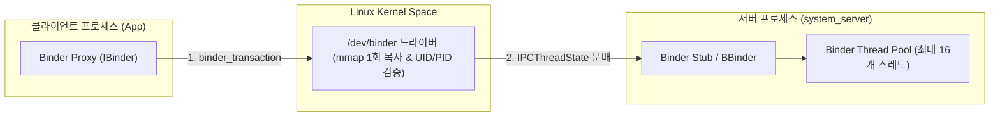

## Binder IPC (안드로이드 프로세스 간 통신 백본)

### 1. 개요 (Overview)

**Binder IPC** 는 Linux 커널 드라이버(`/dev/binder`)를 매개로 Android 의 서로 다른 프로세스 간(예: 앱 프로세스 ↔ [system_server](../04_system_services/system-server.md)) 메모리를 격리한 채 안전하고 빠르게 데이터와 명령을 주고받는 **안드로이드 OS 핵심 IPC 메커니즘**이다.

전통적인 Linux IPC (Socket, Pipe, Shared Memory)와 달리, 안드로이드 보안 요구사항에 맞춰 **호출자 검증(UID/PID 전달), 객체 기반 데이터 캡슐화(`Parcel`), 그리고 1 회 메모리 복사(`mmap`) 성능 최적화**를 결합하여 설계되었다.

---

#### 초보자를 위한 쉽게 이해하는 비유

- **Binder IPC (중앙 통제 통신 다리와 등기 우체부)**:
  - 서로 다른 아파트(독립된 프로세스 메모리 영역)에 사는 사람들은 상대방 집에 마음대로 들어갈 수 없다.
  - 경비실(리눅스 커널 `/dev/binder` 드라이버)에 신분증(UID/PID)을 제시하고 등기 우체부(Binder)를 통해서만 안전하게 소물품(`Parcel`)을 전달하고 답변을 받아오는 **보안 통제 통신 시스템**.

---

### 2. Binder IPC 4 대 세부 전문 지식 지도 (Atomic Deep-Dives)

Binder IPC 시스템은 역할에 따라 4 개의 전용 하위 원자 노드로 명확히 분리되어 관리된다:

1. **[Binder IPC](binder-ipc.md)**:
   - 커널 `/dev/binder` 드라이버 및 `mmap()` 을 활용한 사용자 공간 ➔ 커널 공간 1 회 복사(Single Copy) 메모리 최적화 원리.
2. **[Binder 트랜잭션 버퍼 & 1MB 제한](ipc-and-process/ipc-process-contracts/binder-transaction-lifetime-is-call-copy-dispatch-and-reply.md)**:
   - 프로세스당 1MB (공유 시 ~512KB)로 제한된 Binder 트랜잭션 버퍼 및 `TransactionTooLargeException` 원인과 해결책.
3. **[Binder 스레드 풀 & 교착 상태](ipc-and-process/ipc-process-contracts/binder-thread-pool-is-service-concurrency-and-deadlock-boundary.md)**:
   - 수신 서버 프로세스의 Binder Thread Pool (기본 16 개 스레드) 스케줄링 및 중첩 동기 호출 시 Deadlock 예방 메커니즘.
4. **[Oneway 비동기 바인더 통신](ipc-and-process/ipc-process-contracts/oneway-binder-removes-caller-waiting-not-server-backpressure.md)**:
   - `oneway` 키워드를 이용한 비동기 블로킹 해제 통신 및 서버 백프레셔(Backpressure) 처리.

---

### 3. Binder IPC 핵심 비교표

| 비교 항목 | 전통적 Linux Socket / Pipe | Android Binder IPC |
| :--- | :--- | :--- |
| **메모리 복사 횟수** | 2 회 복사 (User ➔ Kernel ➔ User) | **1 회 복사 (`mmap` 커널 버퍼 직접 맵핑)** |
| **호출자 보안 검증** | 패킷 데이터 내 거짓 표기 가능 | **커널이 직접 호출자의 UID/PID 를 강제 주입** |
| **통신 패러다임** | 바이트 스트림 (Raw Stream) | **객체 지향 통신 (`IBinder`, `Parcelable`, AIDL)** |
| **중앙 등록소** | DNS / Port / Socket 파일 | **[ServiceManager](../04_system_services/service-manager.md) (Handle 0)** |

---

### 4. 연결 문서 (Related Links)

- [ServiceManager](../04_system_services/service-manager.md) - Binder Handle 0 시스템 서비스 등록소
- [system_server](../04_system_services/system-server.md) - Binder 서비스들을 호스팅하는 메인 시스템 프로세스
- [Zygote](zygote.md) - fork 후 Binder 스레드 풀을 가동하는 마스터 프로세스
- [AppOps 및 권한](../05_security_privacy/appops-and-permissions.md) - Binder 호출 시 UID/PID 기반 권한 검사
