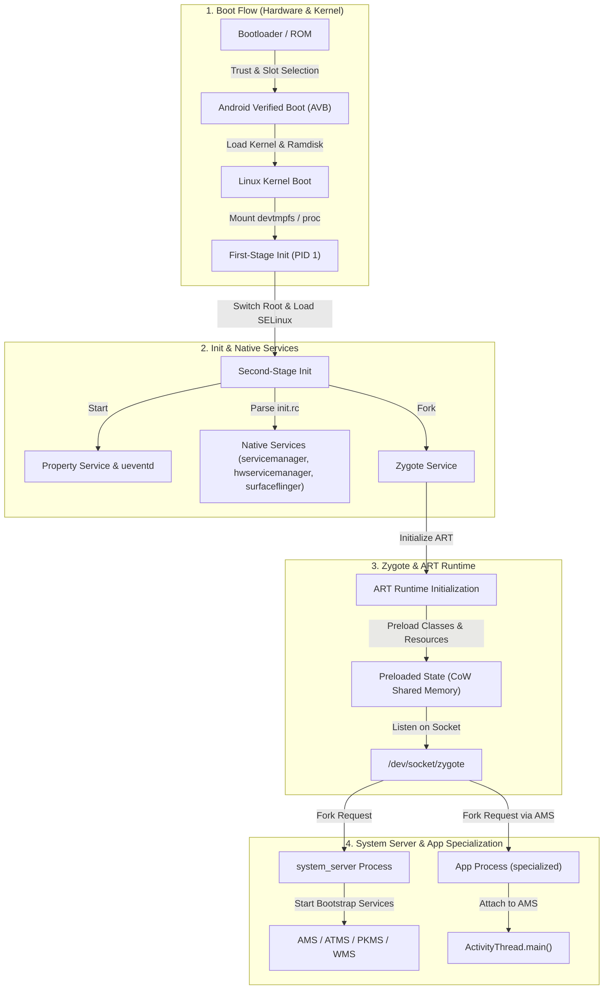

## Android 부팅과 런타임 지도

Android 부팅과 런타임은 기기 전원이 켜지는 시점부터 사용자 앱 프로세스가 구동될 때까지의 하드웨어 신뢰 검증, 네이티브 프로세스 트리 구축, 프레임워크 서브시스템 초기화, 그리고 가상 머신(ART) 실행 환경 특화까지의 전체 생애주기를 다룬다.

전체 부팅 및 런타임 체인은 4개의 명확한 계약 계층으로 구분되며, 각 계층은 상위 계층이 신뢰하고 동작할 수 있는 부팅 조건(Contract)을 보장한다.

---

## 핵심 서브시스템 계약 묶음 (Subsystem Contracts)

| 계층 | 핵심 책임 | 주요 구성요소 / 계약 | 덤프 & 디버깅 관측점 |
| :--- | :--- | :--- | :--- |
| **[부팅 흐름 계약](boot-flow-contracts/boot-flow-contracts.md)** | Root of Trust 확립, 파티션 검증, A/B 슬롯 선택 및 OTA Snapshot 관리 | Bootloader, AVB 2.0, Bootconfig, Dynamic Partitions, Virtual A/B | `/proc/bootconfig`, `dmesg`, `pstore`, `snapshotctl` |
| **[init와 네이티브 서비스 계약](init-service-contracts/init-service-contracts.md)** | PID 1 기반 userspace 부트스트랩, SELinux 보안 정책 적용, 네이티브 데몬 라이프사이클 관리 | First/Second Stage Init, `init.rc`, Property Service, `ueventd` | `getprop`, `ctl.start`, `dmesg \| grep init`, `/proc/1/` |
| **[Zygote와 ART 런타임 계약](zygote-runtime-contracts/zygote-runtime-contracts.md)** | 공통 프레임워크 클래스/자원 사전 로딩, Copy-On-Write 메모리 공유 앱 프로세스 Fork 및 JIT/AOT 컴파일 | Zygote Socket, `AppRuntime`, Preload Classes, ART Compiler, Profile-Guided Dexopt | `dumpsys meminfo`, `cmd package compile`, `smaps_rollup` |
| **[system_server와 ActivityManager 계약](system-server-contracts/system-server-contracts.md)** | 프레임워크 서비스 단일 프로세스 호스팅, Binder Endpoint 제공, 앱 라이프사이클 및 ANR/OOM-Score 조율 | `SystemServer`, AMS, ATMS, ServiceManager, Rescue Party | `dumpsys activity`, `dumpsys alarm`, `/data/anr/traces.txt` |

---

## 부팅 및 런타임 장애 탐색 가이드 (Troubleshooting Decision Matrix)

1. **기기가 부팅 루프(Bootloop)에 빠지거나 OTA 업데이트 직후 켜지지 않는 경우**
   - [부팅 흐름 계약](boot-flow-contracts/boot-flow-contracts.md)의 AVB 검증 실패, Bootconfig 매핑 오류, 또는 Virtual A/B Merge 상태를점검한다.
   - 관측 명령: `adb reboot bootloader`, `/proc/bootconfig`, Kernel `pstore` (`/sys/fs/pstore`).

2. **특정 Native Daemon(예: SurfaceFlinger, AudioFlinger)이나 HAL 서비스가 실행되지 않는 경우**
   - [init와 네이티브 서비스 계약](init-service-contracts/init-service-contracts.md)의 `init.rc` 서비스 옵션(`user`, `group`, `seclabel`, `capabilities`)과 Property Trigger 조건을 점검한다.
   - 관측 명령: `getprop init.svc.<service_name>`, `dmesg | grep auditd` (SELinux Denials).

3. **앱 프로세스 생성 속도가 지나치게 느리거나, 메모리 풋프린트가 비정상적으로 큰 경우**
   - [Zygote와 ART 런타임 계약](zygote-runtime-contracts/zygote-runtime-contracts.md)의 Preload Class 무효화, Zygote Specialization(UID/SELinux/cgroup) 전환, 그리고 ART Compile Filter 상태(`speed-profile` vs `verify`)를 점검한다.
   - 관측 명령: `dumpsys package <package_name>`, `dumpsys meminfo <pid>`, `cmd package compile -m speed-profile`.

4. **앱 API 호출 시 SecurityException 발생 또는 ANR / OOM Killer에 의해 프로세스가 강제 종료되는 경우**
   - [system_server와 ActivityManager 계약](system-server-contracts/system-server-contracts.md)의 AMS/ATMS 컴포넌트 상태, `oom_score_adj` 재계산 로직, ANR responsiveness 계약 위반 덤프를 점검한다.
   - 관측 명령: `dumpsys activity processes`, `dumpsys activity broadcasts`, `/data/anr/traces.txt`.

---

## Subsystem Contract Maps (관련 정본 지도)

- [부팅 흐름 계약](boot-flow-contracts/boot-flow-contracts.md)
- [init와 네이티브 서비스 계약](init-service-contracts/init-service-contracts.md)
- [Zygote와 ART 런타임 계약](zygote-runtime-contracts/zygote-runtime-contracts.md)
- [system_server와 ActivityManager 계약](system-server-contracts/system-server-contracts.md)
- [graphics-media-contracts](../graphics-and-media/graphics-media-contracts/graphics-media-contracts.md)
- [platform-modularity-contracts](../platform-modularity/platform-modularity-contracts/platform-modularity-contracts.md)
- [ipc-process-contracts](../ipc-and-process/ipc-process-contracts/ipc-process-contracts.md)
- [kernel-contracts](../kernel-and-hal/kernel-contracts/kernel-contracts.md)
- [hal-native-contracts](../kernel-and-hal/hal-native-contracts/hal-native-contracts.md)
