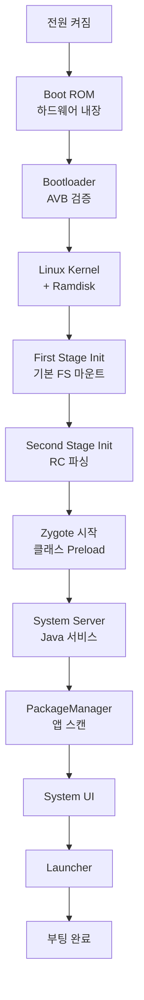

# Boot Flow - 부팅 흐름 개요

이 문서는 안드로이드 부팅 과정의 **전체 흐름**을 개괄적으로 설명한다. 각 단계의 상세 내용은 해당 문서 참고.

>[!NOTE]
>Init 프로세스 상세: [[android-init-and-services]]
>Zygote 상세: [[android-zygote-and-runtime]]
>HAL 초기화: [[android-hal-and-kernel]]

### 부팅 순서 (한눈에)

### 1. Boot ROM (하드웨어)

칩에 내장된 코딩 불가능한 코드:

- 첫 부트로더를 eMMC/UFS 에서 로드
- 서명 검증 (OEM public key)
- 실패 시 Fastboot 모드

### 2. Bootloader

Android Bootloader (ABL, 대부분 Qualcomm LK 기반):

- **Verified Boot**: vbmeta 검증 → system/vendor 무결성
- **A/B 슬롯** 선택: 활성 슬롯 부팅 (a, b)
- 커널 + ramdisk 메모리에 로드

**특수 모드**:

- **Fastboot**: `fastboot flash`, `fastboot boot`
- **Recovery**: OTA 업데이트, 공장 초기화

### 3. Linux Kernel

- 드라이버 초기화 (Binder, ION, etc)
- SELinux 정책 로드 (첫 단계)
- `/init` 실행 (PID 1)

### 4. Init Process

**First Stage**:

- `/dev`, `/proc`, `/sys` 마운트
- SELinux early init

**Second Stage**:

- RC 스크립트 파싱 (`/system/etc/init/`, `/vendor/etc/init/`)
- 트리거 실행 (`on early-init`, `on init`, `on boot`)
- 서비스 시작

**상세**: [[android-init-and-services]]

### 5. Zygote

앱 프로세스 템플릿:

- Framework 클래스 preload (~4000 개)
- 소켓 대기 (`/dev/socket/zygote`)
- System Server fork

**상세**: [[android-zygote-and-runtime]]

### 6. System Server

Java 시스템 서비스 시작:

- ActivityManagerService
- PackageManagerService
- WindowManagerService
- +100 여 개 서비스

### 7. PackageManager

- `/system/app`, `/data/app` 스캔
- 앱 메타데이터 파싱
- dexopt (필요 시)

### 8. System UI + Launcher

- Status Bar, Navigation Bar
- Launcher 앱 시작
- 사용자 interaction 가능

---
