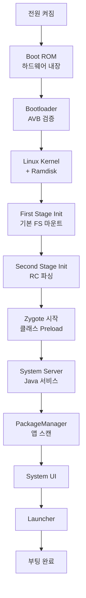

# 부팅 순서 (한눈에)

```mermaid
graph TD
    PowerOn[전원 켜짐] --> BootROM[Boot ROM<br/>하드웨어 내장]
    BootROM --> Bootloader[Bootloader<br/>AVB 검증]
    Bootloader --> Kernel[Linux Kernel<br/>+ Ramdisk]
    Kernel --> InitFirst[First Stage Init<br/>기본 FS 마운트]
    InitFirst --> InitSecond[Second Stage Init<br/>RC 파싱]
    InitSecond --> Zygote[Zygote 시작<br/>클래스 Preload]
    Zygote --> SystemServer[System Server<br/>Java 서비스]
    SystemServer --> PackageManager[PackageManager<br/>앱 스캔]
    PackageManager --> SystemUI[System UI]
    SystemUI --> Launcher[Launcher]
    Launcher --> Ready[부팅 완료]
```
