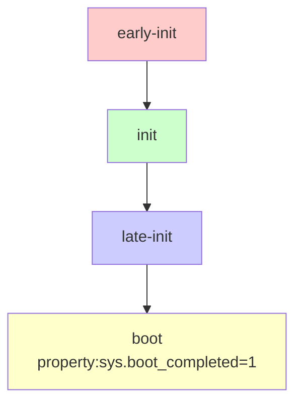

# Trigger 와 Action 개요

상위 노트: [android-init-and-services](01_inbox/mobile/android/01_system_internals/boot-and-runtime/android-init-and-services.md)

### 부팅 트리거 순서

```mermaid
graph TD
    EarlyInit[early-init] --> Init[init]
    Init --> LateInit[late-init]
    LateInit --> BootComplete[boot<br/>property:sys.boot_completed=1]
    
    style EarlyInit fill:#ffcccc
    style Init fill:#ccffcc
    style LateInit fill:#ccccff
    style BootComplete fill:#ffffcc
```

### 주요 트리거
