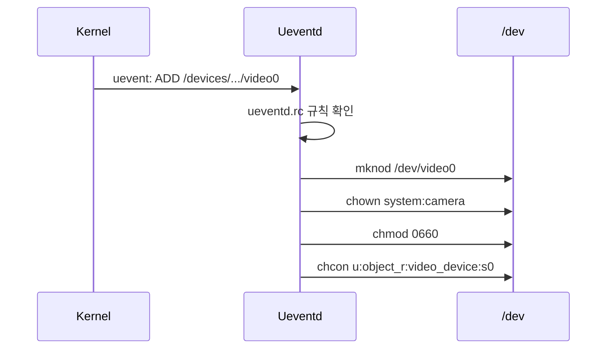

# Ueventd

상위 노트: [android-init-and-services](01_inbox/mobile/android/01_system_internals/boot-and-runtime/android-init-and-services.md)

`init` 의 특수 모드로, 커널 uevent 처리.

### 역할

커널이 `/sys/class`, `/sys/devices` 에 디바이스 추가 → uevent 전송 → ueventd 가 `/dev` 노드 생성



### Ueventd RC

```bash
# /vendor/etc/ueventd.rc
/dev/video*  0660  system  camera
/dev/binder  0666  root    root
/dev/hwbinder 0666 root    root

# SELinux 레이블
subsystem adf
    devname uevent_devname
    dirname /dev/graphics

/sys/devices/system/cpu/cpu* cpufreq/scaling_max_freq 0664 system system
```

---
