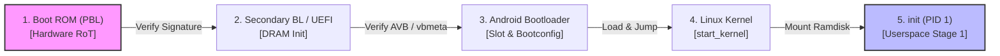

## 부팅 체인은 신뢰 상태를 확정한 뒤 kernel 과 userspace 로 넘어간다

상위 문서: [부팅 흐름 계약](boot-flow-contracts.md)
배경 지식: [일반 부팅 순서(부트로더→커널→init)](01_inbox/operating-systems/boot-sequence.md)

일반적인 **[부팅 순서](01_inbox/operating-systems/boot-sequence.md)**(부트로더 → 커널 → init)는 각 단계가 다음 단계를 그냥 실행만 시키고 넘어가지만, Android 부팅 체인(Boot Chain)은 전원 공급 직후 SoC 내부의 읽기 전용 ROM(Primary Bootloader)에서 시작하여 단계별로 상위 실행 바이너리의 cryptographic 서명을 검증에 성공한 경우에만 제어권을 넘기는 신뢰 사슬(Chain of Trust) 메커니즘이다.

### 내부 동작 메커니즘 (Internal Mechanism)

1. **ROM Bootloader (PBL)**: 칩셋 하드웨어 ROM에 고정된 코드로, SOC 제조사의 Public Key 서명을 확인하고 SBL/ABOOT을 메모리에 로드한다.
2. **Secondary Bootloader (SBL / ABOOT / UEFI)**: 하드웨어 기본 초기화(DRAM 등)를 수행하고 Android Verified Boot(AVB) 라이브러리를 통해 Boot 이미지(`boot.img`, `init_boot.img`, `vendor_boot.img`)의 VBMeta 서명을 검증한다.
3. **Kernel Hand-off**: Bootloader는 신뢰성이 검증된 Linux Kernel을 RAM으로 로드하고, DTB(Device Tree Blob)와 Bootconfig 파라미터를 넘긴 후 커널 진입점(`start_kernel`)으로 제어를 점프한다.
4. **Userspace Hand-off**: 커널 초기화 완료 후, 커널은 Ramdisk 내의 PID 1 프로세스인 `/init` (First-stage init)을 실행하며 userspace 영역으로 진입한다.



### 코드 및 구체 예시 (Concrete Snippets)

Bootloader가 커널로 전달하는 커널 파라미터 및 bootconfig 설정 형태 (`/proc/cmdline` & `/proc/bootconfig`):

```text
# Kernel command line parameters passed by bootloader
console=ttyMSM0,115200 androidboot.hardware=qcom androidboot.memcolor=0x0 androidboot.first_stage_console=1
```

### 관측 가능 증거 (Observable Evidence)

부팅 단계별 제어권 전이 증거는 커널 dmesg의 최상단 출력 로그에서 확인할 수 있다:

```bash
# 커널 초기화 및 init 핸드오프 부팅 로그 확인
adb shell dmesg | head -n 30
# 출력 예시:
# Linux version 5.15.x ...
# Kernel command line: ...
# Run /init as init process

# Bootloader에서 전달받은 하드웨어 파라미터 조회
adb shell getprop ro.boot.hardware
adb shell getprop ro.boot.serialno
```

### 관련 문서

- [AVB는 부팅 이미지의 신뢰와 rollback 방지를 검증한다](avb-verifies-boot-images-and-rollback-protection.md)
- [Bootloader는 검증된 slot을 고르고 Android에 bootconfig를 넘긴다](bootloader-selects-verified-slot-and-passes-bootconfig.md)
- [init는 PID 1이자 Android userspace의 부트스트랩 정책 엔진이다](../init-service-contracts/init-is-pid1-and-userspace-bootstrap-policy-engine.md)

공식 문서: [Bootloader Architecture](https://source.android.com/docs/core/architecture/bootloader)
