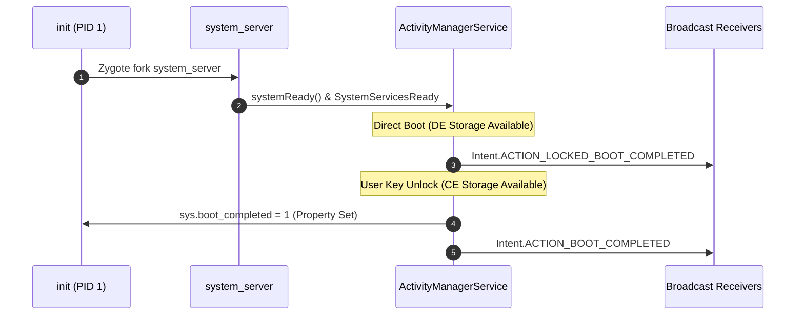

## 부팅 완료는 단일 property 가 아니라 관측 가능한 milestone 묶음이다

상위 문서: [부팅 흐름 계약](boot-flow-contracts.md)

Android의 부팅 완료는 하나의 단일한 Boolean 속성이 아니라, 커널 실행, init second-stage, Zygote 초기화, system_server 서비스 등록, Direct Boot 잠금 해제, 최종 사용자 Launcher 표시로 이어지는 여러 단계의 마일스톤(Milestones) 시퀀스다.

### 내부 동작 메커니즘 (Internal Mechanism)

1. **System Property 마일스톤**:
   - `dev.bootcomplete = 1`: init / system_server가 기본 서비스 준비 완료 시 설정.
   - `sys.boot_completed = 1`: `ActivityManagerService`가 모든 핵심 서비스(`PackageManagerService`, `WindowManagerService` 등)의 `systemReady()` 상태 및 Persistent App 준비를 확인한 직후 설정.
2. **Direct Boot 마일스톤 (`LOCKED_BOOT_COMPLETED`)**:
   - 디바이스가 켜진 후 사용자가 PIN/패턴/비밀번호를 입력하기 전 단계.
   - `CE(Credential Encrypted)` 저장소는 잠겨있고, `DE(Device Encrypted)` 저장소만 접근 가능하다.
   - 시스템은 `Intent.ACTION_LOCKED_BOOT_COMPLETED` 브로드캐스트를 전송한다.
3. **User Unlock 마일스톤 (`BOOT_COMPLETED`)**:
   - 사용자가 잠금을 해제하면 CE 키가 키마스터에 의해 복호화된다.
   - AMS가 `Intent.ACTION_BOOT_COMPLETED` 브로드캐스트를 시스템 및 서드파티 앱에 디스패치한다.



### 코드 및 구체 예시 (Concrete Snippets)

`AndroidManifest.xml`에서 Direct Boot 및 Boot Completed 브로드캐스트 수신기 선언 예시:

```xml
<receiver
    android:name=".BootCompletedReceiver"
    android:exported="true"
    android:directBootAware="true">
    <intent-filter>
        <action android:name="android.intent.action.LOCKED_BOOT_COMPLETED" />
        <action android:name="android.intent.action.BOOT_COMPLETED" />
    </intent-filter>
</receiver>
```

### 관측 가능 증거 (Observable Evidence)

`adb shell`을 통해 현재 부팅 마일스톤 단계별 속성 및 이벤트 로그를 관측할 수 있다:

```bash
# 부팅 완료 Property 확인
adb shell getprop sys.boot_completed
# 출력: 1

# SystemServer boot timeline 마일스톤 로그 확인 (logcat)
adb logcat -b events | grep -E "(boot_progress|sys_boot_completed)"
# 출력 예시:
# boot_progress_start: 1250
# boot_progress_preload_start: 2100
# boot_progress_system_run: 3400
# boot_progress_pms_ready: 5100
# boot_progress_ams_ready: 6200
# boot_progress_enable_screen: 7500
```

### 관련 문서

- [system_server는 framework service를 한 프로세스 안에서 시작한다](../system-server-contracts/system-server-starts-framework-services-in-one-process.md)
- [AMS는 앱 프로세스와 컴포넌트 lifecycle을 조율한다](../system-server-contracts/ams-coordinates-app-process-and-component-lifecycle.md)

공식 문서: [Direct Boot](https://developer.android.com/training/articles/direct-boot)
