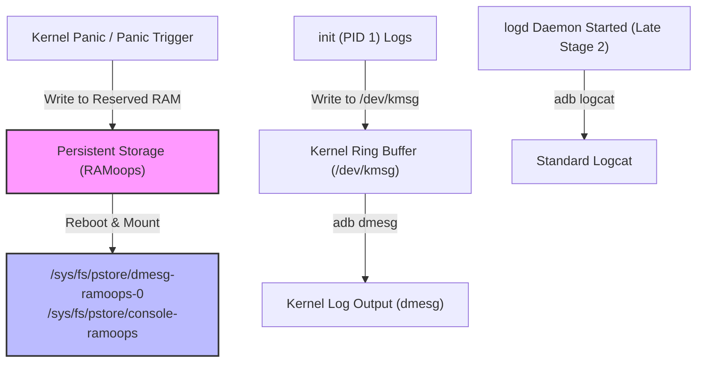

## 부팅 디버깅은 logcat 이전의 kernel, pstore, init 로그에서 시작한다

상위 문서: [부팅 흐름 계약](boot-flow-contracts.md)

부팅 초기에 일어나는 크래시나 커널 패닉(Kernel Panic)은 userspace의 `logd` 데몬이 시작되기 전에 발생하므로 표준 `adb logcat`으로는 수집할 수 없다. 이를 분석하기 위해서는 Kernel log buffer(`dmesg`), Persistent RAM Storage(`pstore/ramoops`), 그리고 init의 콘솔 출력 모드를 활용해야 한다.

### 내부 동작 메커니즘 (Internal Mechanism)

1. **Kernel Log Ring Buffer (`printk` & `/dev/kmsg`)**:
   - 커널 내부 메타데이터와 초기 드라이버 마운트 에러는 커널 메모리의 링 버퍼에 기록된다.
   - init (PID 1) 프로세스는 자체 로그를 `/dev/kmsg`에 출력하여 커널 링 버퍼와 합쳐지도록 한다.
2. **Persistent Storage (`pstore / ramoops`)**:
   - 디바이스가 커널 패닉이나 Hardware Watchdog 재부팅으로 인해 갑자기 크래시될 때, RAM의 특정 지정 영역(Reserved SRAM/DRAM)에 마지막 커널 버퍼 메시지(`console-ramoops`)와 패닉 백트레이스(`dmesg-ramoops-0`)를 보존한다.
   - 재부팅 직후 커널은 이를 Virtual File System인 `/sys/fs/pstore/` 경로에 마운트한다.
3. **Serial Console & First-stage Console**:
   - bootconfig 또는 커널 commandline에 `androidboot.first_stage_console=1` 또는 `console=ttyMSM0`을 넘겨 물리 시리얼 UART 포트로 실시간 로그를 출력시킬 수 있다.



### 코드 및 구체 예시 (Concrete Snippets)

`init.rc`에서 Early Boot 디버깅을 위해 로그 레벨을 높이고 kmsg로 메시지를 작성하는 방법:

```text
# Early boot debugging setup in init.rc
on early-init
    # Set kernel printk loglevel to KERN_DEBUG (7)
    write /proc/sys/kernel/printk "7 4 1 7"
    write /dev/kmsg "init: Early boot logging enabled with maximum verbosity"
```

### 관측 가능 증거 (Observable Evidence)

`adb` 명령을 통해 비정상 재부팅 직후 `pstore`에 남아있는 패닉 흔적을 확인할 수 있다:

```bash
# 직전 부팅의 Kernel Panic / Crash 로그 추출 (pstore 마운트 위치)
adb shell cat /sys/fs/pstore/console-ramoops
adb shell cat /sys/fs/pstore/dmesg-ramoops-0

# 커널 링 버퍼 실시간/초기 로그 확인
adb shell dmesg | grep -E "(panic|OOM|init:)"

# init의 early console 메시지 확인
adb shell getprop ro.boot.first_stage_console
```

### 관련 문서

- [init 디버깅은 로그, property, service 상태를 함께 본다](../init-service-contracts/init-debugging-uses-logs-properties-and-service-state.md)
- [부팅 체인은 신뢰 상태를 확정한 뒤 kernel 과 userspace 로 넘어간다](boot-chain-confirms-trust-before-kernel-and-userspace.md)

공식 문서: [Debugging Booting Issues](https://source.android.com/docs/core/tests/debug/evaluating-boot-time)
