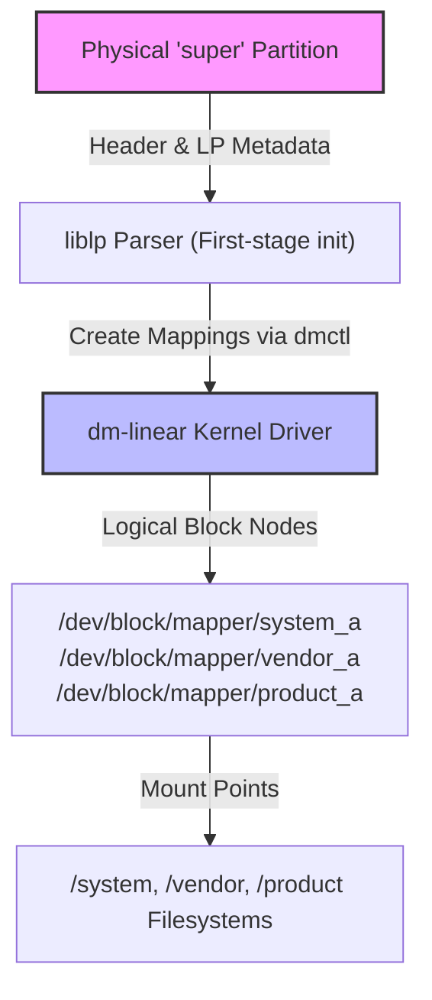

## Dynamic partition 은 super 안에서 논리 파티션 크기를 조정한다

상위 문서: [부팅 흐름 계약](boot-flow-contracts.md)

Dynamic Partitions는 물리 저장소 파티션인 `super` 내부에 논리 파티션(`/system`, `/vendor`, `/product`, `/system_ext`, `/odm`)을 생성하고 Linux Kernel의 `dm-linear` (Device Mapper Linear) 드라이버를 활용하여 OTA 업데이트 시 논리 파티션의 크기를 동적으로 유연하게 재조정(Resize)할 수 있도록 설계된 분할 메커니즘이다.

### 내부 동작 메커니즘 (Internal Mechanism)

1. **`super` 물리 파티션 메타데이터**: `super` 파티션의 헤더 영역에는 `liblp` 라이브러리로 관리되는 LP Metadata(Logical Partition Metadata)가 존재한다. 메타데이터에는 각 논리 파티션의 이름, 섹터 오프셋 범위, 엑스테인(Extent) 맵 정보가 담겨있다.
2. **First-stage init 구성**: First-stage init 시 `init` 프로세스는 `liblp`를 읽어 파티션 범위를 계산한 후 Kernel `dmctl` 인터페이스를 호출한다.
3. **`dm-linear` 매핑 테이블 생성**: 커널 Device Mapper 드라이버에 매핑 명령을 전달하여 `/dev/block/mapper/system_a`, `/dev/block/mapper/vendor_a` 와 같은 Block Device 노드를 실시간으로 매핑한다.
4. **유연한 OTA 수용**: 개별 파티션의 물리 크기를 고정(Fixed)하지 않고 `super`의 전체 용량 한도 내에서 한 파티션이 증가하면 다른 파티션의 Extent 영역을 줄여 할당할 수 있다.



### 코드 및 구체 예시 (Concrete Snippets)

`dmctl`을 이용하여 `dm-linear` 가상 장치 매핑 상태를 확인하는 CLI 예시:

```bash
# Device Mapper 장치 목록 및 타입 조회
dmctl list devices
# 출력 예시:
# system_a          : dm-linear (0-8388607)
# vendor_a          : dm-linear (0-1048575)
# product_a         : dm-linear (0-2097151)
```

### 관측 가능 증거 (Observable Evidence)

`lpdump` 커맨드를 실행하여 `super` 파티션의 엑스텐트 및 논리 파티션 할당 상태를 상세 조회할 수 있다:

```bash
# super 파티션 내의 Logical Partition Metadata 상세 출력
adb shell lpdump

# /dev/block/mapper/ 장치 생성 확인
adb shell ls -la /dev/block/mapper/

# dm-linear 장치 매핑 관련 커널 로그 확인
adb shell dmesg | grep -i "device-mapper"
```

### 관련 문서

- [Virtual A/B는 snapshot으로 OTA 공간과 offline 시간을 줄인다](virtual-ab-uses-snapshots-to-reduce-ota-space-and-downtime.md)
- [파티션 구조는 system과 vendor의 업데이트 경계를 만든다](partitions-define-system-vendor-and-update-boundaries.md)

공식 문서: [Dynamic Partitions](https://source.android.com/docs/core/architecture/partitions/dynamic-partitions)
