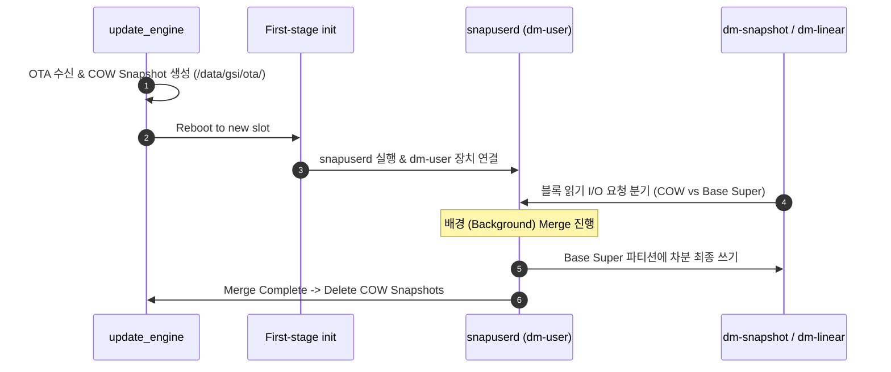

## Virtual A/B 는 snapshot 으로 OTA 공간과 offline 시간을 줄인다

상위 문서: [부팅 흐름 계약](boot-flow-contracts.md)
배경 지식: [Copy-On-Write(COW)](../../../../../../02_references/operating-systems/virtual-memory.md), [Device Mapper](../../../../../../02_references/operating-systems/device-mapper-and-dm-verity.md)

Virtual A/B(VAB)는 두 파티션 세트를 물리적으로 중복 확보해야 하는 레거시 A/B 시스템의 저장 용량 낭비를 극복하기 위해, `super` 파티션 내 단일 이미지에 **[Copy-On-Write(COW)](../../../../../../02_references/operating-systems/virtual-memory.md)**(원본 페이지를 즉시 복사하지 않고 공유하다가, 어느 한쪽이 실제로 쓰기를 시도하는 순간에만 그 페이지를 복사하는 지연 복사 기법) Snapshot 장치와 userspace 데몬(`snapuserd`)을 조합하여 저장 공간 소비와 재부팅 다운타임을 최소화하는 OTA 아키텍처다.

### 내부 동작 메커니즘 (Internal Mechanism)

1. **OTA 갱신 및 Snapshot 생성**: `update_engine`이 OTA 패키지를 수신하면, `/data/gsi/ota/` 또는 `/metadata/ota/snapshot/` 영역에 COW 파티션을 동적으로 할당하고 변경된 차분 블록만 이 COW 파일에 기록한다.
2. **Reboot 및 `dm-user` / `snapuserd` 연결**:
   - 재부팅 시 First-stage init 프로세스가 커널의 `dm-user`([Device Mapper](../../../../../../02_references/operating-systems/device-mapper-and-dm-verity.md) target 중 하나로, I/O 요청을 커널 안에서 바로 처리하지 않고 userspace 데몬에 넘겨 대신 처리하게 하는 매핑 규칙) 모듈과 연결되는 userspace 백그라운드 데몬인 `snapuserd`를 시작한다.
   - 커널 블록 읽기 요청 시, 변경되지 않은 섹터는 기존 `super` 파티션에서, 갱신된 섹터는 `snapuserd`를 거쳐 COW 파일에서 읽어온다.
3. **Background Merge**: 디바이스 부팅 완료 후 userspace에서 `snapshotctl` / `snapuserd` 데몬이 백그라운드로 COW 데이터의 차분 블록을 `super` 파티션 본체로 머지(Merge)한다.
4. **COW 제거**: 머지가 완료되면 COW Snapshot 스토리지 공간은 자동 해제되어 정상 상태로 복귀한다.



### 코드 및 구체 예시 (Concrete Snippets)

`snapshotctl` 툴을 사용한 Snapshot Merge 상태 제어 CLI 명령:

```bash
# Snapshot 머지 진행 상태 및 메타데이터 덤프
snapshotctl dump

# 백그라운드 머지 작업 수동 트리거 및 완료 대기
snapshotctl merge --wait
```

### 관측 가능 증거 (Observable Evidence)

Virtual A/B 활성화 여부 및 `snapuserd` 데몬 상태는 다음과 같이 검증할 수 있다:

```bash
# Virtual A/B 속성 확인
adb shell getprop ro.virtual_ab.enabled
# 출력: true

# Compression 지원 여부 확인 (Virtual A/B with Compression)
adb shell getprop ro.virtual_ab.compression.enabled
# 출력: true

# snapuserd 데몬 프로세스 상태 확인
adb shell ps -ef | grep snapuserd

# snapuserd 소켓 준비 여부 확인
adb shell getprop snapuserd.ready
```

### 관련 문서

- [Dynamic partition은 super 안에서 논리 파티션 크기를 조정한다](dynamic-partitions-resize-logical-images-inside-super.md)
- [A/B 업데이트는 비활성 slot을 갱신하고 실패 시 이전 slot로 돌아간다](ab-updates-write-inactive-slot-and-roll-back-on-failure.md)

공식 문서: [Virtual A/B Overview](https://source.android.com/docs/core/ota/virtual_ab)
