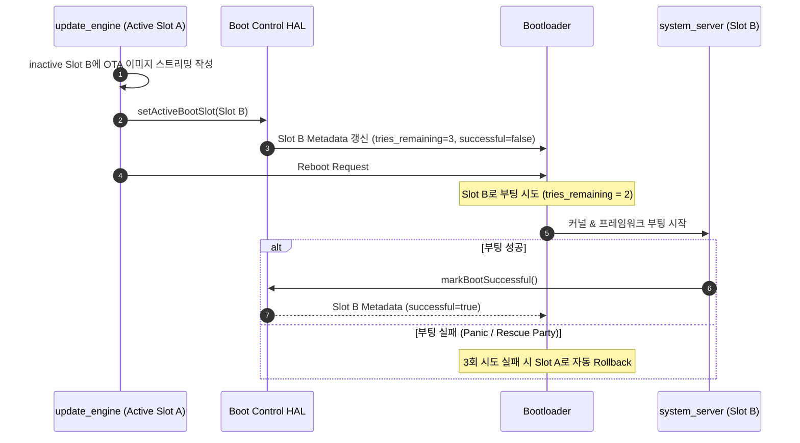

## A/B 업데이트는 비활성 slot 을 갱신하고 실패 시 이전 slot 로 돌아간다

상위 문서: [부팅 흐름 계약](boot-flow.md)

A/B(Seamless) 업데이트 시스템은 디바이스 저장소에 두 개의 독립된 시스템 파티션 세트(Slot A, Slot B)를 유지하여, 현재 작동 중인 Active Slot을 유지한 채 Inactive Slot에 배경(Background) 업데이트를 수행하고 부팅 실패 시 이전 Slot으로 자동 롤백(Rollback)하는 메커니즘이다.

### 내부 동작 메커니즘 (Internal Mechanism)

1. **업데이트 작성**: 백그라운드 데몬인 `update_engine`이 OTA 패키지를 수신하여 현재 실행 중이지 않은 비활성 Slot(예: 현재 `_a`이면 `_b`)에 파티션 블록을 작성한다.
2. **Slot 상태 변경**: 설치가 완료되면 `update_engine`은 Boot Control HAL (`IBootControl`)을 통해 비활성 Slot의 부팅 플래그를 변경한다.
   - `successful = false`
   - `tries_remaining = 3` (또는 지정된 재시도 횟수)
   - `active = true`
3. **재부팅 및 시도**: 디바이스 재부팅 시 Bootloader는 Active로 설정된 Slot으로 부팅을 시도하며, 부팅 시도마다 `tries_remaining`을 1씩 감소시킨다.
4. **부팅 성공 확정**: `system_server`의 `SystemServer.java` 및 `UpdateEngine` 컴포넌트가 완전한 부팅 완료(Framework `sys.boot_completed = 1`)를 확인하면 `IBootControl::markBootSuccessful()`을 호출하여 `successful = true`로 변경한다.
5. **롤백(Rollback) 트리거**: 만약 부팅 도중 커널 패닉, 서비스 무한 재시작(Rescue Party 트리거), 프레임워크 크래시 등으로 인해 `tries_remaining`이 0이 될 때까지 부팅 성공을 확정하지 못하면, Bootloader는 해당 Slot을 `unbootable`로 마크하고 이전의 정상 Slot으로 자동 롤백한다.



### 코드 및 구체 예시 (Concrete Snippets)

`IBootControl` AIDL 인터페이스 정의 (`hardware/interfaces/boot/aidl/android/hardware/boot/IBootControl.aidl`):

```cpp
// Boot Control HAL Native/AIDL Contract
package android.hardware.boot;

@VintfStability
interface IBootControl {
    int getActiveBootSlot();
    int getCurrentSlot();
    int getNumberSlots();
    boolean isSlotBootable(in int slot);
    boolean isSlotMarkedSuccessful(in int slot);
    void markBootSuccessful();
    void setActiveBootSlot(in int slot);
    void setSlotAsUnbootable(in int slot);
}
```

### 관측 가능 증거 (Observable Evidence)

`bootctl` CLI 툴을 사용하여 현재 Slot 상태 및 메타데이터를 직접 조회/제어할 수 있다:

```bash
# 현재 활성화된 Slot 확인
adb shell bootctl get-current-slot
# 출력: 0 (Slot A) 또는 1 (Slot B)

# Slot별 Suffix 및 부팅 가능 여부 확인
adb shell getprop ro.boot.slot_suffix
# 출력: _a

# Boot Control HAL 상태 확인
adb shell dumpsys update_engine
```

### 관련 문서

- [Bootloader는 검증된 slot을 고르고 Android에 bootconfig를 넘긴다](bootloader-and-bootconfig.md)
- [Virtual A/B는 snapshot으로 OTA 공간과 offline 시간을 줄인다](virtual-ab-snapshots.md)

공식 문서: [Boot Control HAL](https://source.android.com/docs/core/architecture/bootloader/updating), [Implement OTA updates](https://source.android.com/docs/core/architecture/bootloader/updating)
