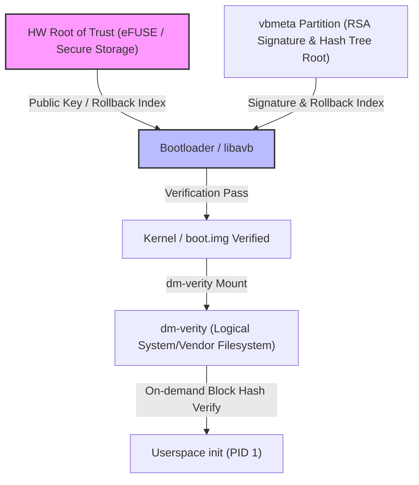

## AVB 는 부팅 이미지의 신뢰와 rollback 방지를 검증한다

상위 문서: [부팅 흐름 계약](boot-flow.md)
배경 지식: [Root of Trust/Chain of Trust](../../../../../security/fundamentals/root-of-trust-and-chain-of-trust.md), [Merkle Tree](../../../../../../02_references/computer-science/merkle-tree.md)

AVB(Android Verified Boot 2.0)는 하드웨어 **[Root of Trust](../../../../../security/fundamentals/root-of-trust-and-chain-of-trust.md)**(RoT — 더 이상 다른 무언가로 검증되지 않고 그 자체로 신뢰될 수밖에 없는 출발점. 보통 SoC 제조 시점에 물리적으로 새겨 소프트웨어로는 바꿀 수 없는 공개키/해시)로부터 시작하여 Bootloader, Kernel, System 파티션에 이르기까지 부팅 단계별 암호화 서명과 **[Hash Tree](../../../../../../02_references/computer-science/merkle-tree.md)**(Merkle Tree — 데이터를 블록 단위로 해싱한 뒤 이진 트리로 계속 묶어 올려 루트 해시 하나로 전체 무결성을 표현하는 구조)를 검증하고, 보완적으로 버전 다운그레이드 공격을 막는 Rollback Protection을 수행하는 부팅 보안 메커니즘이다.

### 내부 동작 메커니즘 (Internal Mechanism)

1. **VBMeta 구조 검증**: AVB의 핵심 검증 데이터는 `vbmeta` 파티션(또는 각 이미지 내 포함된 VBMeta header)에 존재한다. VBMeta에는 이미지의 암호화 해시, 서명, 공개 키, 그리고 **Rollback Index** 정보가 포함되어 있다.
2. **하드웨어 RoT 검증**: Bootloader는 하드웨어 퓨즈(**eFUSE** — 제조 시점에 한 번만 값을 "태울" 수 있고 이후 소프트웨어로는 되돌릴 수 없는 물리 퓨즈) 또는 Keymaster/**RPMB**(Replay Protected Memory Block — 재전송 공격을 막는 인증된 쓰기 전용 보안 저장 영역) 보안 영역에 구운 Root Public Key와 `vbmeta`의 서명을 비교 검증한다.
3. **Rollback Protection 검증**: Bootloader는 `vbmeta` 안의 Rollback Index와 HW 보안 영역에 저장된 `stored_rollback_index`를 비교한다.
   - `vbmeta.rollback_index >= stored_rollback_index` 이면 부팅 진행.
   - 더 낮은 버전(다운그레이드 시도)인 경우 부팅을 차단하고 Error 상태로 진입한다.
4. **dm-verity 연동**: `system`, `vendor` 등 대용량 파일시스템 파티션은 블록 레벨의 Merkle Tree(Hash Tree) 루트 해시를 `vbmeta`에 저장한다. 커널은 Mount 시 `dm-verity` 드라이버를 통해 I/O 읽기 요청마다 실시간 블록 해시를 검증한다.



### 코드 및 구체 예시 (Concrete Snippets)

`fstab` 파티션 마운트 시 AVB 및 dm-verity 플래그 지정 예시 (`Android.bp` / `fstab.hardware`):

```text
# system partition with AVB verification flags
system /system ext4 ro,barrier=1 wait,slotselect,avb=vbmeta,logical,first_stage_mount
vendor /vendor ext4 ro,barrier=1 wait,slotselect,avb,logical,first_stage_mount
```

`avbtool`로 `vbmeta.img` 헤더 정보 및 Rollback Index를 확인하는 명령어:

```bash
avbtool info_image --image vbmeta.img
```

### 관측 가능 증거 (Observable Evidence)

부팅 후 디바이스의 Verified Boot 검증 상태는 커널 commandline 및 시스템 속성으로 노출된다:

```bash
# Verified Boot 상태 확인 (green: 정상, yellow: 커스텀 키, orange: 락 해제, red: 검증 실패)
adb shell getprop ro.boot.verifiedbootstate
# 출력: green

# vbmeta 디바이스 Lock 상태 및 모드 확인
adb shell getprop ro.boot.vbmeta.device_state
# 출력: locked

# 커널 dmesg에서 dm-verity 및 avb 로그인 확인
adb shell dmesg | grep -i avb
```

### 관련 문서

- [부팅 체인은 신뢰 상태를 확정한 뒤 kernel 과 userspace 로 넘어간다](boot-chain-trust-flow.md)
- [fstab은 mount와 검증 플래그를 묶은 부팅 계약이다](../init-service/android-fstab.md)

공식 문서: [Android Verified Boot (AVB)](https://source.android.com/docs/security/features/verifiedboot)
