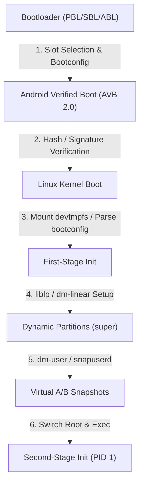

## 부팅 흐름 계약

부팅 흐름은 단순한 하드웨어 초기화 순서가 아니라 기기의 보안 신뢰(Root of Trust) 확립, OS 파티션 경계 구분, 무중단/안전 OTA 복구 가능성, 그리고 userspace 진입점까지의 불변 조건을 다루는 계약이다.

---

## 부팅 흐름 계약 영역 구성 (Contract Map)

| 정본 계약 노트 | 핵심 보장 메커니즘 | 검증 및 관측 가능 지점 |
| :--- | :--- | :--- |
| **[부팅 체인은 신뢰 상태를 확정한 뒤 kernel과 userspace로 넘어간다](boot-chain-trust-flow.md)** | Hardware Root of Trust부터 Primary/Secondary Bootloader를 거쳐 Stage별 암호화 서명 검증 | `/proc/bootconfig`, `ro.boot.verifiedbootstate` |
| **[Bootloader는 검증된 slot을 고르고 Android에 bootconfig를 넘긴다](bootloader-and-bootconfig.md)** | A/B Slot 선택 및 `init_boot`/`vendor_boot` 트레일러에 `androidboot.*` 부트컨피그 주입 | `/proc/bootconfig`, `getprop ro.boot.*` |
| **[파티션 구조는 system과 vendor의 업데이트 경계를 만든다](storage-partitions-and-boundaries.md)** | GKI/Generic System Image와 Vendor HAL/Driver 간 수명주기 및 모듈 업데이트 경계 수립 | BoardConfig.mk, `/proc/mounts` |
| **[Dynamic partition은 super 안에서 논리 파티션 크기를 조정한다](dynamic-partitions.md)** | `super` 파티션 내 `liblp` 메타데이터 및 Kernel `dm-linear` 드라이버를 활용한 동적 용량 재할당 | `lpmake`, `/dev/block/mapper/` |
| **[AVB는 부팅 이미지의 신뢰와 rollback 방지를 검증한다](android-verified-boot.md)** | VBMeta 해시 체인 검증, eFUSE/TPM 롤백 인덱스 검사, 커널 `dm-verity` 테이블 구성 | `avbtool`, `dmesg \| grep verity` |
| **[A/B 업데이트는 비활성 slot을 갱신하고 실패 시 이전 slot로 돌아간다](ab-updates-and-ota.md)** | Dual Slot 구조, `boot_control` HAL, 수락 테스트 및 실패 시 이전 정상 Slot 자동 복구 | `bootctl`, `getprop ro.boot.slot_suffix` |
| **[Virtual A/B는 snapshot으로 OTA 공간과 offline 시간을 줄인다](virtual-ab-snapshots.md)** | Copy-On-Write snapshot, Kernel `dm-user`, userspace `snapuserd` 백그라운드 머지 | `snapshotctl dump`, `getprop ro.boot.dynamic_partitions_vab` |
| **[부팅 완료는 단일 property가 아니라 관측 가능한 milestone 묶음이다](boot-completion-milestones.md)** | `sys.boot_completed`, Broadcast `ACTION_BOOT_COMPLETED`, Direct Boot `LOCKED_BOOT_COMPLETED` 단계별 해제 | `getprop sys.boot_completed`, `logcat \| grep BootReceiver` |
| **[부팅 디버깅은 logcat 이전의 kernel, pstore, init 로그에서 시작한다](boot-debugging-and-logs.md)** | Early boot crash 디버깅을 위한 Kernel `dmesg`, `pstore` (`/sys/fs/pstore`), Kmsg 콘솔로그 수집 | `/sys/fs/pstore/`, `dmesg`, `kmsg` |

---

## 경계 및 구별 규칙 (Boundary Rules)

- **보안 영역 경계**: AVB 및 Verified Boot는 하드웨어와 플랫폼 보안 신뢰 체인(Root of Trust)으로 설명하고, 앱 수준 권한 모델(App Permissions/SELinux App Domains)과 혼동하지 않는다.
- **파티션/업데이트 경계**: A/B, Virtual A/B, Dynamic Partitions는 OS 이미지 업데이트 및 파티션 매핑 경계이며, 모듈러 프레임워크 업데이트 단위인 Mainline / APEX 아키텍처와 명확히 구분한다.
- **Userspace 전이 경계**: Kernel 및 Ramdisk 초기화 이후 PID 1 프로세스의 네이티브 서비스 시작 및 정책은 [init와 네이티브 서비스 계약](../init-service/init-service.md) 정본 노트로 넘긴다.

상위 지도: [Android 부팅과 런타임 지도](../android-boot-and-runtime.md)  
관련 지도: [init와 네이티브 서비스 계약](../init-service/init-service.md), [Platform Modularity Contracts](../../platform-modularity/android-platform-modularity.md)
