## Bootloader 는 검증된 slot 을 고르고 Android 에 bootconfig 를 넘긴다

상위 문서: [부팅 흐름 계약](boot-flow.md)

Bootloader는 단순한 이미지 로더가 아니라 A/B Slot의 검증 상태와 롤백 횟수를 관리하여 실행할 Slot을 결정하고, Android 12부터 표준화된 Bootconfig 구조체를 통해 커널 및 userspace `init` 프로세스에 부팅 구성 파라미터(`androidboot.*`)를 전달하는 구성요소다.

### 내부 동작 메커니즘 (Internal Mechanism)

1. **Bootconfig Trailer 작성 및 구조**: 기존 커널 Command line(`cmdline`, 4KB 제한)의 길이 한계와 문자열 파싱 모호성을 극복하기 위해, Bootloader는 `init_boot.img` 또는 `vendor_boot.img` Ramdisk 끝부분에 부트컨피그 트레일러(Trailer) 블록을 덧붙인다.
   - 트레일러는 12바이트 메타데이터 Footor 매직 번호(`#BOOTCONFIG\n`), 4바이트 파라미터 크기, 4바이트 Csum(Checksum)으로 구성된다.
2. **Kernel bootconfig 파싱**: 커널 초기화 시 Ramdisk 엔드의 트레일러를 감지하여 파라미터를 읽고, 이를 `/proc/bootconfig` 가상 파일시스템 트리에 트리 형태로 노드화하여 노출한다.
3. **`init` Property 서비스 매핑**: Second-stage init (`system/core/init/property_service.cpp`) 초기화 과정에서 `ProcessBootconfig()`가 실행되어 `/proc/bootconfig`를 노드 단위로 이터레이션한다.
   - `androidboot.X = Y` 구문은 `ro.boot.X = Y` 형태로 1:1 자동 변환되어 System Property Store에 등록된다.

```mermaid
flowchart LR
    BL["Bootloader"] -->|"Append Trailer (#BOOTCONFIG\n)"| RD["Ramdisk (init_boot / vendor_boot)"]
    RD -->|"Kernel Boot"| KERNEL["Linux Kernel Bootconfig Engine"]
    KERNEL -->|"Expose Tree"| PROC["/proc/bootconfig"]
    PROC -->|"ProcessBootconfig()"| INIT["init (PID 1)"]
    INIT -->|"Set Read-Only Prop"| PROP["ro.boot.* Properties"]

    style BL fill:#f9f,stroke:#333,stroke-width:2px
    style PROC fill:#bbf,stroke:#333,stroke-width:2px
    style PROP fill:#bfb,stroke:#333,stroke-width:2px
```



### 코드 및 구체 예시 (Concrete Snippets)

`system/core/init/bootconfig.cpp` 내의 `ProcessBootconfig` 및 C++ 로직 파싱 구조 예시:

```cpp
// system/core/init/bootconfig.cpp (Android Bootconfig 파싱 요약)
#include <android-base/file.h>
#include <android-base/strings.h>

void ParseBootconfig(const std::string& content, const std::function<void(const std::string&, const std::string&)>& fn) {
    for (const auto& line : android::base::Split(content, "\n")) {
        auto trimmed = android::base::Trim(line);
        if (trimmed.empty() || trimmed[0] == '#') continue;

        auto parts = android::base::Split(trimmed, "=");
        if (parts.size() == 2) {
            std::string key = android::base::Trim(parts[0]);
            std::string value = android::base::Trim(parts[1]);
            // androidboot. prefix -> ro.boot. 속성으로 매핑
            if (android::base::StartsWith(key, "androidboot.")) {
                std::string prop_key = "ro.boot." + key.substr(12);
                fn(prop_key, value);
            }
        }
    }
}
```

`/proc/bootconfig` 파일에 저장되는 파라미터 구조 예시:

```text
# Vendor and system configuration passed via bootconfig
androidboot.hardware = "qcom"
androidboot.slot_suffix = "_a"
androidboot.verifiedbootstate = "green"
androidboot.bootdevice = "1d84000.ufshc"
androidboot.dtbo_idx = "0"
```

### 관측 가능 증거 (Observable Evidence)

`adb shell`을 통해 부트로더가 커널로 전달한 Bootconfig 파라미터와 이것이 변환된 속성을 비교 검증할 수 있다:

```bash
# Bootloader가 전달한 부트컨피그 원문 확인
adb shell cat /proc/bootconfig

# init에 의해 ro.boot.* 속성으로 매핑된 값 조회
adb shell getprop | grep "\[ro.boot\."
# 출력 예시:
# [ro.boot.hardware]: [qcom]
# [ro.boot.slot_suffix]: [_a]
# [ro.boot.verifiedbootstate]: [green]
```

### 관련 문서

- [A/B 업데이트는 비활성 slot을 갱신하고 실패 시 이전 slot로 돌아간다](ab-updates-write-inactive-slot-and-roll-back-on-failure.md)
- [AVB는 부팅 이미지의 신뢰와 rollback 방지를 검증한다](avb-verifies-boot-images-and-rollback-protection.md)

공식 문서: [Android Bootconfig](https://source.android.com/docs/core/architecture/bootloader/bootconfig)
