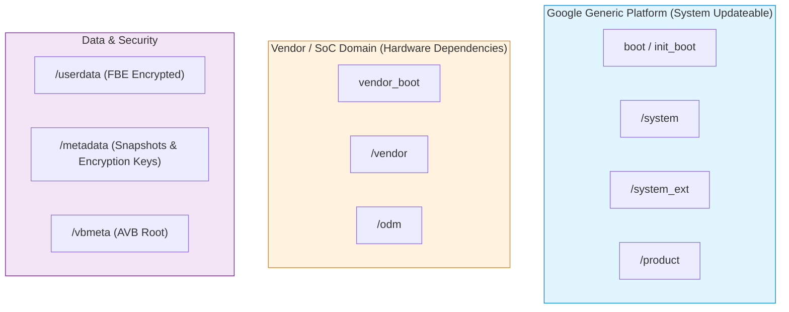

## 파티션 구조는 system 과 vendor 의 업데이트 경계를 만든다

상위 문서: [부팅 흐름 계약](boot-flow.md)

Android 파티션 아키텍처는 단순한 디스크 분할이 아닌, Google OS 플랫폼과 SoC/OEM Vendor 코드 간의 모듈화된 개별 업데이트 경계이자 라이프사이클 및 보안 검증(Security & AVB) 영역의 분리를 의미한다.

### 내부 동작 메커니즘 (Internal Mechanism)

1. **System 계열 (Google Domain)**:
   - `/boot`, `/init_boot`: Generic Kernel Image (GKI) 및 First-stage init ramdisk.
   - `/system`, `/system_ext`: Android 공통 프레임워크 및 프레임워크 확장 라이브러리.
   - `/product`: OEM 브랜드 및 시스템 기본 앱 구성.
2. **Vendor 계열 (SoC / OEM Domain)**:
   - `/vendor_boot`: Vendor 전용 ramdisk (드라이버 모듈 `.ko`, `fstab` 포함).
   - `/vendor`: SoC 제어 HAL 서비스, Vendor 모듈 및 그래픽 드라이버.
   - `/odm`: 특정 하드웨어 기판/센서 커스텀 사양.
3. **Data 및 Runtime 계열**:
   - `/userdata`: 사용자 데이터 및 앱 데이터 (FBE/FDE 암호화 적용).
   - `/metadata`: 파티션 암호화 키, Snapshot Merge 상태 메타데이터 보관.
   - `/vbmeta`: 전체 파티션 부팅 서명 트리.



### 코드 및 구체 예시 (Concrete Snippets)

`BoardConfig.mk` 파티션 구성 선언 예시:

```make
# Enable Dynamic Partitions and Super Partition Groups
BOARD_SUPER_PARTITION_SIZE := 6442450944
BOARD_SUPER_PARTITION_GROUPS := qti_dynamic_partitions
BOARD_QTI_DYNAMIC_PARTITIONS_SIZE := 6438256640
BOARD_QTI_DYNAMIC_PARTITIONS_PARTITION_LIST := system system_ext product vendor odm
```

### 관측 가능 증거 (Observable Evidence)

`adb shell`을 활용해 실제 마운트된 파티션 목록 및 블록 디바이스 맵을 점검할 수 있다:

```bash
# 전체 마운트 디바이스 및 파티션 용량/타입 조회
adb shell df -h

# 블록 심볼릭 링크 및 파티션 네임 매핑 조회
adb shell ls -la /dev/block/by-name/

# 커널 파티션 테이블 확인
adb shell cat /proc/partitions
```

### 관련 문서

- [Dynamic partition은 super 안에서 논리 파티션 크기를 조정한다](dynamic-partitions-resize-logical-images-inside-super.md)
- [fstab은 mount와 검증 플래그를 묶은 부팅 계약이다](../init-service/fstab-is-boot-time-mount-and-verification.md)

공식 문서: [Partitions Overview](https://source.android.com/docs/core/architecture/partitions)
