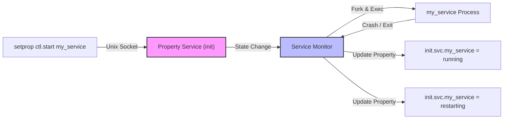

## init 디버깅은 로그, property, service 상태를 함께 본다

상위 문서: [init 서비스 계약](init-service-contracts.md)

init 디버깅은 단일 로그 관측에 의존할 경우 서비스 재시작 원인이나 Trigger 미발동 이슈를 놓치기 쉽다. init 내부 상태는 디바이스 로그(`logcat` / `dmesg`), System Property(`init.svc.<name>`), 그리고 `ctl.start` / `ctl.stop` 제어 플레인을 결합하여 교차 검증해야 한다.

### 내부 동작 메커니즘 (Internal Mechanism)

1. **서비스 상태 추적 (`init.svc.<name>`)**:
   - init 프로세스는 관리 대상 서비스의 상태 변화(running, stopped, restarting)를 감지할 때마다 이를 `init.svc.<servicename>` 속성에 반영한다.
2. **Crash & Restart Loop 진단 (Crash Control)**:
   - 서비스가 연속해서 크래시되면 init은 `Service '<name>' is respawning too quickly` 로그를 남기고 지정된 쿨다운 시간 동안 재시작을 유예하거나 `reboot_on_failure` 옵션에 따라 기기를 강제 재부팅한다.
3. **Control Message 트랩 (`ctl.*`)**:
   - 속성 변경 명령 `setprop ctl.start <service>` 또는 `setprop ctl.stop <service>`가 호출되면 Property Service가 메시지를 수신하여 해당 서비스 상태 전환 작업을 큐(Action Queue)에 추가한다.



### 코드 및 구체 예시 (Concrete Snippets)

서비스 상태 제어 및 로그 트래킹 CLI 명령 예시:

```bash
# 특정 init 서비스 상태 제어 (ctl.start / ctl.stop)
adb shell setprop ctl.start surfaceflinger

# 서비스 크래시 시 init 재시작 정책 설정 예시 (init.rc)
service my_daemon /vendor/bin/my_daemon
    class main
    user system
    group system
    onrestart restart surfaceflinger
```

### 관측 가능 증거 (Observable Evidence)

`init` 서비스의 현재 실행 상태와 PID, 재시작 횟수는 다음 커맨드로 조회할 수 있다:

```bash
# 실행 중인 모든 init 서비스의 현재 상태 확인
adb shell getprop | grep "\[init.svc\."
# 출력 예시:
# [init.svc.surfaceflinger]: [running]
# [init.svc.zygote]: [running]

# init 서비스의 PID 및 추적 정보 조회
adb logcat -s init

# init의 Action 수행 시간 및 소요 시간 확인
adb shell getprop ro.boottime.init
```

### 관련 문서

- [init service는 재시작 정책을 가진 supervised process다](init-service-is-supervised-process-with-explicit-lifecycle.md)
- [property service는 전역 상태 저장소이자 제한된 제어 plane이다](property-service-is-global-state-store-and-restricted-control-plane.md)

공식 문서: [Debugging init](https://source.android.com/docs/core/architecture/bootloader/debugging-init)
