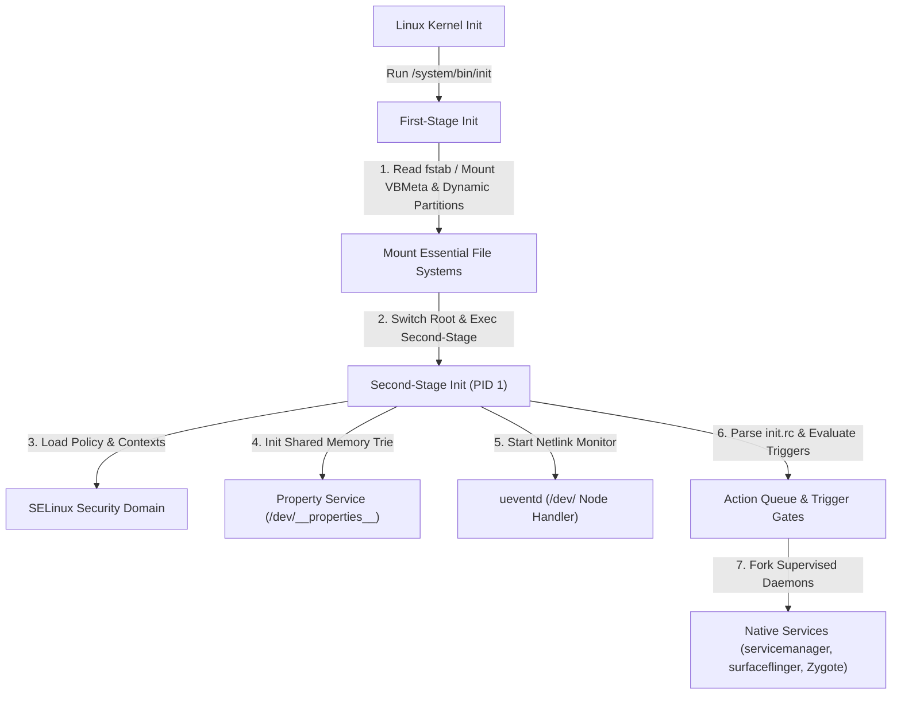

## init 와 네이티브 서비스 계약

`init`은 Android userspace의 첫 프로세스(PID 1)이자 부트스트랩 정책 엔진으로, `/etc/init/` 및 `/vendor/etc/init/`의 `.rc` 선언을 해석하여 파일시스템 마운트, SELinux Policy 로드, System Property 저장소, 그리고 네이티브 데몬 서비스의 수명주기를 총괄 관리한다.

---

## init 서비스 계약 영역 구성 (Contract Map)

| 정본 계약 노트 | 핵심 보장 메커니즘 | 검증 및 관측 가능 지점 |
| :--- | :--- | :--- |
| **[init는 PID 1이자 Android userspace의 부트스트랩 정책 엔진이다](init-is-pid1-and-userspace-bootstrap-policy-engine.md)** | PID 1 수명주기, 메인 이벤트 루프, Epoll 기반 Signal/Socket/Property 처리 | `ps -ef \| grep init`, `dmesg \| grep init` |
| **[First stage init은 second stage가 읽을 최소 파일시스템을 만든다](first-stage-init-builds-minimal-filesystem-for-second-stage.md)** | Ramdisk 기반 최소 boot environment, `devtmpfs` 마운트, `switch_root` 수행 | `dmesg \| grep "first stage"` |
| **[fstab은 mount와 검증 플래그를 묶은 부팅 계약이다](fstab-is-boot-time-mount-and-verification-contract.md)** | `first_stage_mount`, `latemount`, `avb`, `fileencryption` 등 `fs_mgr` 파티션 제어 | `/vendor/etc/fstab.*`, `mount` |
| **[init rc 언어는 actions, services, options, imports를 선언한다](init-rc-language-declares-actions-services-options-and-imports.md)** | `on <trigger>`, `service <name> <path>`, `import` 구문 파싱 및 빌드 타임 검증 | `/system/etc/init/hw/init.rc` |
| **[init trigger는 event와 property 조건을 결합하는 실행 gate다](init-triggers-are-event-and-property-gates.md)** | Early boot 이벤트(`early-init`, `boot`) 및 Property 조건 트리거(`on property:foo=bar`) | `getprop sys.boot_completed` |
| **[init service는 재시작 정책을 가진 supervised process다](init-service-is-supervised-process-with-explicit-lifecycle.md)** | `oneshot`, `disabled`, Crash restart limit, `SIGCHLD` 처리 및 PID 추적 | `getprop init.svc.<name>`, `ctl.start` |
| **[service option은 identity, resource, class, socket 계약을 고정한다](service-options-fix-identity-resource-class-and-socket-contracts.md)** | `user`, `group`, `capabilities`, `seclabel`, `socket`, `rlimit` 옵션 고정 | `/proc/<pid>/status`, `ls -la /dev/socket` |
| **[property service는 전역 상태 저장소이자 제한된 제어 plane이다](property-service-is-global-state-store-and-restricted-control-plane.md)** | `/dev/__properties__` Lock-free 공유 메모리 읽기, UNIX Socket 쓰기 검증, `ctl.*` 제어 | `getprop`, `setprop`, `property_contexts` |
| **[ueventd는 kernel uevent를 dev node 권한으로 변환한다](ueventd-turns-kernel-uevents-into-dev-node-permissions.md)** | Kernel Netlink `KOBJECT_UEVENT` 수신, Coldboot, `/dev/` 노드 생성 및 `ueventd.rc` 적용 | `ps -ef \| grep ueventd`, `ls -la /dev/` |
| **[init 보안은 SELinux domain과 capability 경계로 정의된다](init-security-is-selinux-domain-and-capability-boundary.md)** | SELinux Domain Transition(`u:r:init:s0` -> Target), Ambient Capability Drop | `ps -AZ`, `dmesg \| grep audit` |
| **[init 디버깅은 로그, property, service 상태를 함께 본다](init-debugging-uses-logs-properties-and-service-state.md)** | `init.svc.*` 속성, `ctl.start`/`ctl.stop` 제어, `logcat -b kernel` / `dmesg` 진단 | `ctl.start <service>`, `dmesg \| grep init` |

---

## 경계 및 구별 규칙 (Boundary Rules)

- **언어와 조건의 분리**: `init rc 언어` 노트는 선언 구조 및 문법 정본이며, `init trigger` 노트는 액션이 수행되는 조건 Gate만 별도로 다룬다.
- **서비스 상태와 옵션 분리**: `init service` 노트는 프로세스 라이프사이클(Supervised Restart)을 다루고, `service option` 노트는 권한/소켓/자원 제한 옵션 정본으로 분리 유지한다.
- **SELinux 및 보안 경계**: `init 보안`은 PID 1 및 네이티브 서비스 도메인 전이와 Capability Drop을 다루며, 앱 샌드박스의 UID/Permission 모델은 Security 정본으로 넘긴다.
- **프레임워크 전이 경계**: Zygote 및 `system_server` 시작 이후의 Java/ART 런타임 및 앱 컴포넌트 관리는 [Zygote와 ART 런타임 계약](../zygote-runtime-contracts/zygote-runtime-contracts.md) 정본으로 이관한다.

상위 지도: [Android 부팅과 런타임 지도](../android-boot-and-runtime.md)  
관련 지도: [부팅 흐름 계약](../boot-flow-contracts/boot-flow-contracts.md), [Zygote와 ART 런타임 계약](../zygote-runtime-contracts/zygote-runtime-contracts.md)
