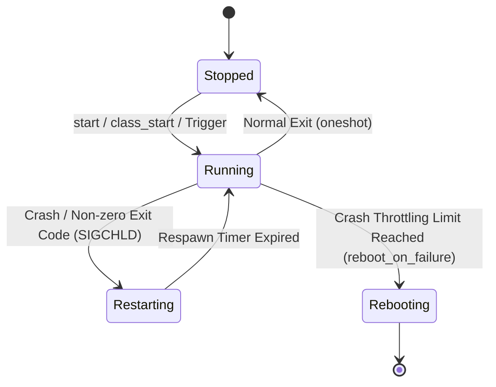

## init service 는 재시작 정책을 가진 supervised process 다

상위 문서: [init 서비스 계약](init-service-contracts.md)
배경 지식: [프로세스 상태/좀비 프로세스](01_inbox/operating-systems/process-states-lifecycle.md), [시그널(SIGCHLD)](01_inbox/operating-systems/signals.md)

`init service`는 `init` (PID 1) 프로세스에 의해 부모-자식 관계 형태로 실행/감독(Supervised)되는 프로세스로, 크래시 시 자식 회수(**[Reaping](01_inbox/operating-systems/process-states-lifecycle.md)** — 자식이 종료해 커널 프로세스 테이블에 좀비로 남아있는 상태를, 부모가 `wait()`/`waitpid()`를 호출해 종료 코드를 읽고 자원을 완전히 해제하는 절차), 재시작 카운팅 및 쿨다운 정책, 의존 서비스 트리거 연쇄 반응 등 명시적 수명주기(Lifecycle) 규칙을 따른다.

### 내부 동작 메커니즘 (Internal Mechanism)

1. **서비스 상태 머신 (Service State Machine)**:
   - **Stopped**: 실행되지 않았거나 명시적으로 중지된 상태.
   - **Running**: fork/execv 되어 정상 구동 중인 상태.
   - **Restarting**: 비정상 종료(Crash)되어 `init`이 쿨다운 타이머 대기 후 재시작을 준비하는 상태.
2. **Reaping & Respawn Throttling**:
   - 자식 프로세스가 비정상 종료 시 커널의 **[`SIGCHLD`](01_inbox/operating-systems/signals.md)**(자식 프로세스의 종료를 부모에게 비동기로 알리는 시그널) 핸들러가 발생하면 `init`은 종료 코드를 수집한다.
   - 서비스가 4분 내 4회 이상 연속 크래시되면 `respawning too quickly` 구문에 걸려 쿨다운 유예 시간이 부여되거나, `reboot_on_failure` 옵션 설정 시 시스템 복구를 위해 리부트가 트리거된다.
3. **`onrestart` Action Exec**:
   - 서비스 재시작 시 `onrestart`에 등록된 커맨드가 실행된다. 예를 들어 Zygote가 크래시되면 `onrestart restart audioserver`, `onrestart restart surfaceflinger`가 연쇄 발동하여 의존 종속 서비스를 동시에 동기화 재시작한다.



### 코드 및 구체 예시 (Concrete Snippets)

`init.rc` 내 수명주기 및 의존 연쇄 재시작 설정 예시:

```text
# Zygote service definition with supervised restart dependencies
service zygote /system/bin/app_process64 -Xzygote /system/bin --zygote --start-system-server
    class main
    user root
    group root readproc reserved_disk
    onrestart restart audioserver
    onrestart restart cameraserver
    onrestart restart media
    onrestart restart netd
    onrestart restart surfaceflinger
    reboot_on_failure reboot,bootloader
```

### 관측 가능 증거 (Observable Evidence)

`adb shell` 및 로그를 통해 서비스 재시작 이력과 현재 가동 상태를 조회할 수 있다:

```bash
# 특정 init 서비스의 현재 상태 확인
adb shell getprop init.svc.zygote
# 출력: running

# init 로그에서 서비스 크래시 및 재시작 쿨다운 로그 관측
adb logcat -s init | grep -E "(Service|respawning)"
# 출력 예시:
# init: Service 'my_daemon' (pid 1234) exited with status 1
# init: Service 'my_daemon' is respawning too quickly
```

### 관련 문서

- [init 디버깅은 로그, property, service 상태를 함께 본다](init-debugging-uses-logs-properties-and-service-state.md)
- [service option은 identity, resource, class, socket 계약을 고정한다](service-options-fix-identity-resource-class-and-socket-contracts.md)

공식 문서: [Android Init Service Options](https://android.googlesource.com/platform/system/core/+/main/init/README.md#services)
