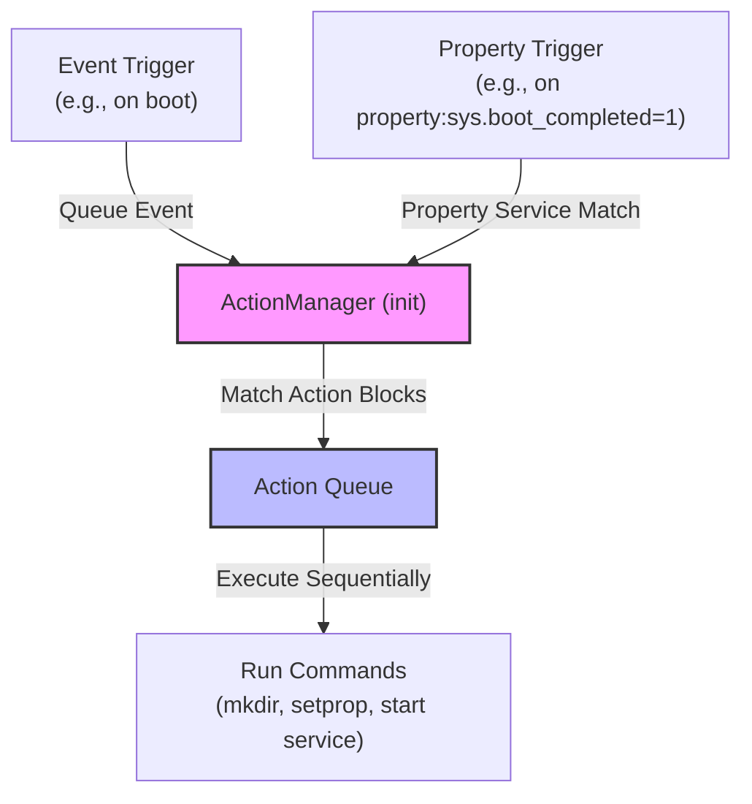

## init trigger 는 event 와 property 조건을 결합하는 실행 gate 다

상위 문서: [init 서비스 계약](init-service-contracts.md)

`init trigger`는 `init.rc` 액션(Action) 블록의 순차 실행을 제어하는 조건문 게이트(Gate)로, 부팅 마일스톤 이벤트(Event Trigger) 및 System Property 변경 조건(Property Trigger)을 조합하여 특정 시점에만 명령이 실행되도록 제한한다.

### 내부 동작 메커니즘 (Internal Mechanism)

1. **Event Triggers (순차적 부팅 파이프라인)**:
   - `init` 메인 루프에 의해 순차적으로 Action Queue에 큐잉되는 부팅 마일스톤 이벤트다:
     a. `early-init`: cgroup 마운트, ueventd 시작, 기본 커널 디바이스 노드 생성.
     b. `init`: fstab 마운트 준비, 기본 property 설정, `core` 클래스 서비스 구동.
     c. `late-init`: 본격적인 하위 트리거 파이프라인 서브시퀀스를 유발:
        - `early-fs` $\rightarrow$ `fs` $\rightarrow$ `post-fs` $\rightarrow$ `late-fs` (주요 시스템 및 벤더 파일시스템 마운트)
        - `post-fs-data` (FBE 암호 해제 및 데이터 파티션 액세스 가능 시점, 데이터 디렉토리 생성 및 keystore/vold 준비)
        - `load_persist_props_action` (`/data/property` 저장 속성 로드)
        - `zygote-start` (Zygote 프로세스 기동)
        - `early-boot` $\rightarrow$ `boot` (`main` 및 `late_start` 클래스 서비스 기동)
2. **Property Triggers (동적 상태 반응 게이트)**:
   - `on property:<name>=<value>` 구문 형태로, Property Service를 통해 특정 속성이 지정된 값으로 변경되는 즉시 큐에 추가된다.
   - 복합 조건 예: `on property:ro.debuggable=1 && property:sys.usb.config=adb`
3. **Queue Evaluation & Execution**:
   - `ActionManager`는 이벤트 큐에 새로 삽입된 Trigger를 확인하여 해당 Trigger를 만족하는 모든 `Action`을 Action Queue 끝에 추가하고 하나씩 명령을 디스패치한다.



### 코드 및 구체 예시 (Concrete Snippets)

`init.rc` 내 다양한 Trigger 구문 선언 예시:

```text
# Event trigger example
on boot
    ifup lo
    hostname localhost
    domainname localdomain

# Property change trigger example
on property:sys.boot_completed=1
    # Trigger late action when system boot finishes
    exec - system system -- /system/bin/vdc cryptfs finishboot

# Complex conditional property trigger
on property:ro.debuggable=1 && property:persist.sys.adb.engine=1
    start adbd
```

### 관측 가능 증거 (Observable Evidence)

`adb shell` 로그를 통해 어떤 Trigger가 발동되었고 액션이 큐잉되었는지 관측할 수 있다:

```bash
# Trigger 실행 관련 init 로그 점검
adb logcat -s init | grep -E "processing action"
# 출력 예시:
# init: processing action (boot) from (/system/etc/init/hw/init.rc:120)
# init: processing action (property:sys.boot_completed=1) from (/system/etc/init/hw/init.rc:250)

# 현재 속성이 트리거 조건에 부합하는지 조회
adb shell getprop sys.boot_completed
```

### 관련 문서

- [init rc 언어는 actions, services, options, imports를 선언한다](init-rc-language-declares-actions-services-options-and-imports.md)
- [property service는 전역 상태 저장소이자 제한된 제어 plane이다](property-service-is-global-state-store-and-restricted-control-plane.md)

공식 문서: [Android Init Triggers](https://android.googlesource.com/platform/system/core/+/main/init/README.md#actions)
