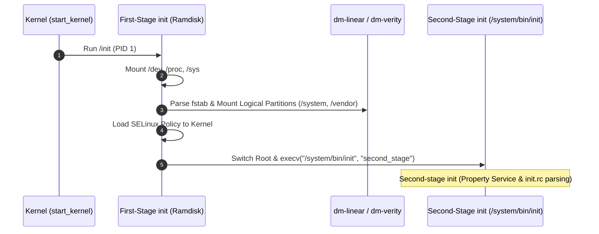

## First stage init 은 second stage 가 읽을 최소 파일시스템을 만든다

상위 문서: [init 서비스 계약](init-service.md)

First-stage init은 커널 실행 직후 Ramdisk 환경에서 구동되는 PID 1 바이너리로, 시스템 파티션을 마운트하고 SELinux 정책을 마운트한 뒤 온전한 환경의 Second-stage init으로 `execv` 체인지 전이를 수행하는 최소 파일시스템 부트스트랩 단계다.

### 내부 동작 메커니즘 (Internal Mechanism)

1. **최소 가상 파일시스템 마운트**: `devtmpfs` (`/dev`), `proc` (`/proc`), `sysfs` (`/sys`), `mnt/tmpfs` (`/mnt`) 등 커널과의 통신 노드를 즉시 마운트한다.
2. **Dynamic Partition & dm-verity 마운트**: `fstab` 파일과 `liblp`를 파싱하여 `dm-linear` 디바이스 바인딩을 형성하고, `/system`, `/vendor`, `/product` 등의 파티션을 `first_stage_mount` 플래그에 따라 마운트한다.
3. **SELinux 초기화 (`LoadPolicy`)**: `/system/etc/selinux/plat_sepolicy.cil`을 읽어 SELinux 정책을 커널에 로드한다.
4. **Second-stage Transition (`execv`)**: 루트 디렉터리를 `/system` 파티션으로 전환(Pivot Root 또는 Mount Overlay)한 후, `/system/bin/init` 바이너리를 `execv`하여 Second-stage init으로 실행 이미지를 완전히 대체한다.



### 코드 및 구체 예시 (Concrete Snippets)

C++ First-stage init 메인 함수 전이 예시 (`system/core/init/first_stage_init.cpp`):

```cpp
// system/core/init/first_stage_init.cpp
int FirstStageMain(int argc, char** argv) {
    // 1. Mount essential virtual filesystems
    mount("tmpfs", "/dev", "tmpfs", MS_NOSUID, "mode=0755");
    mkdir("/dev/pts", 0755);
    mount("devpts", "/dev/pts", "devpts", 0, NULL);
    mount("proc", "/proc", "proc", 0, NULL);
    mount("sysfs", "/sys", "sysfs", 0, NULL);

    # First-stage mounts (system, vendor, etc.)
    DoFirstStageMount();

    // 2. Execv into Second-stage init
    const char* path = "/system/bin/init";
    char* args[] = { const_cast<char*>(path), const_cast<char*>("second_stage"), nullptr };
    execv(path, args);
    return 1;
}
```

### 관측 가능 증거 (Observable Evidence)

`dmesg` 및 부팅 속성 조회를 통해 First-stage 마운트와 Second-stage 전이 상태를 관측할 수 있다:

```bash
# dmesg에서 first stage init 마운트 로그 확인
adb shell dmesg | grep -i "init: [first stage]"

# init 부팅 스테이지 타임라인 확인
adb shell getprop ro.boottime.init.first_stage
# 출력: 245 (밀리초 단위 부팅 소요 시간)

# 현재 마운트된 루트 파일시스템 확인
adb shell cat /proc/mounts | grep " / "
```

### 관련 문서

- [fstab은 mount와 검증 플래그를 묶은 부팅 계약이다](fstab-is-boot-time-mount-and-verification.md)
- [init는 PID 1이자 Android userspace의 부트스트랩 정책 엔진이다](init-is-pid1-and-userspace-bootstrap-policy-engine.md)

공식 문서: [Android Init Stage Overview](https://source.android.com/docs/core/architecture/bootloader/partitions)
