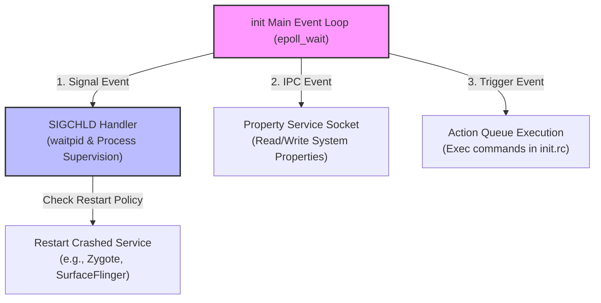

## init 는 PID 1 이자 Android userspace 의 부트스트랩 정책 엔진이다

상위 문서: [init 서비스 계약](init-service.md)
배경 지식: [일반 init 시스템(PID 1)](../../../../../operating-systems/init-systems.md), [시그널(SIGCHLD)](../../../../../operating-systems/signals.md), [좀비 프로세스/waitpid](../../../../../operating-systems/process-states-lifecycle.md), [epoll/I·O 멀티플렉싱](../../../../../../02_references/operating-systems/epoll-and-io-multiplexing.md)

`init`은 Linux Kernel이 실행하는 **[최초의 userspace 프로세스(PID 1)](../../../../../operating-systems/init-systems.md)**로, 모든 userspace 프로세스의 부모가 되며, `init.rc` 스크립트를 파싱하여 시스템 서비스 부트스트랩, 이벤트 기반 Trigger 처리, Property Service 관리, 자식 프로세스 고사(**[Zombie](../../../../../operating-systems/process-states-lifecycle.md)** — 자식이 종료했지만 부모가 아직 종료 상태를 회수(`wait`)하지 않아 프로세스 테이블에 남아있는 상태) 방지 및 Process Supervision을 총괄하는 정책 엔진이다.

### 내부 동작 메커니즘 (Internal Mechanism)

1. **Main Event Loop (`epoll`)**:
   - `init`의 메인 루프는 **[`epoll_wait`](../../../../../../02_references/operating-systems/epoll-and-io-multiplexing.md)**(스레드 하나가 여러 file descriptor 중 지금 이벤트가 준비된 것만 커널에게서 통보받아 처리하는 I/O 멀티플렉싱 기법) 기반의 이벤트 루프로 동작한다.
   - `epoll` 루프는 (1) Signal Handler 소켓(SIGCHLD 자식 종료 감지), (2) Property Service IPC 소켓, (3) Keychord/Ueventd 소켓 이벤트를 대기한다.
2. **Subprocess Reaper (SIGCHLD Handling)**:
   - 데몬 또는 자식 서비스 프로세스가 크래시되어 종료되면 커널은 PID 1인 `init`에 **[`SIGCHLD`](../../../../../operating-systems/signals.md)**(자식 프로세스의 상태가 바뀌었음—대개 종료됨—을 부모에게 비동기로 알리는 시그널) 신호를 전달한다.
   - `init`은 `waitpid`를 호출해 덤프를 수집하고 고사(Zombie) 프로세스를 회수한 뒤 `init.rc`에 지정된 재시작 정책(`restart`, `oneshot`, `reboot_on_failure`)에 따라 해당 서비스를 재구동한다.
3. **Action Queue 및 Trigger Processing**:
   - `init.rc` 이벤트 Trigger(예: `early-init`, `init`, `late-init`, `boot`)가 발생하면 조건에 맞는 Action 들을 Action Queue에 추가하고 순차적으로 실행한다.



### 코드 및 구체 예시 (Concrete Snippets)

C++ `init` 메인 이벤트 루프 구조 (`system/core/init/init.cpp`):

```cpp
// system/core/init/init.cpp
int SecondStageMain(int argc, char** argv) {
    // 1. Initialize Property Service & Signal Handler
    PropertyInit();
    InstallSignalFdHandler(&epoll);

    // 2. Load init.rc scripts
    ActionManager& am = ActionManager::GetInstance();
    ServiceList& sm = ServiceList::GetInstance();
    LoadBootScripts(am, sm);

    // 3. Trigger early boot events
    am.QueueEventTrigger("early-init");
    am.QueueEventTrigger("init");
    am.QueueEventTrigger("late-init");

    // 4. Main Event Loop
    while (true) {
        am.ExecuteOneCommand();
        epoll.Wait(std::nullopt); // Sleep until socket/signal event occurs
    }
}
```

### 관측 가능 증거 (Observable Evidence)

`adb shell`을 통해 PID 1인 `init` 프로세스의 상태와 리소스 정보를 점검할 수 있다:

```bash
# PID 1 확인 및 SELinux 도메인 조회
adb shell ps -Z -p 1
# 출력 예시:
# LABEL                           USER     PID   PPID  VSZ    RSS   WCHAN    ADDR S NAME
# u:r:init:s0                     root       1      0 12456   3200  epoll_w     0 S init

# init 프로세스 내부 파일 디스크립터 및 epoll 통신 노드 확인
adb shell ls -la /proc/1/fd/
```

### 관련 문서

- [First stage init은 second stage가 읽을 최소 파일시스템을 만든다](first-stage-init-builds-minimal-filesystem-for-second-stage.md)
- [init service는 재시작 정책을 가진 supervised process다](init-service-is-supervised-process-with-explicit-lifecycle.md)

공식 문서: [Android Init Language](https://android.googlesource.com/platform/system/core/+/main/init/README.md)
