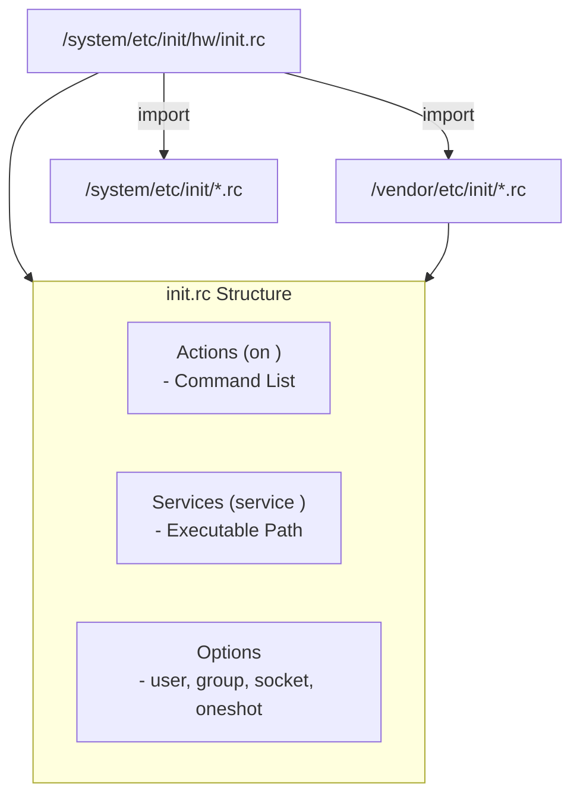

## init rc 언어는 actions, services, options, imports 를 선언한다

상위 문서: [init 서비스 계약](init-service.md)

Android `init.rc` 언어는 init 프로세스에 의해 파싱되는 선언형 DSL(Domain Specific Language)로, 4가지 핵심 구문 요소인 **Actions**, **Services**, **Options**, 그리고 외부 스크립트를 포함하는 **Imports**로 구성된다.

### 내부 동작 메커니즘 (Internal Mechanism)

1. **Actions (`on <trigger>`)**:
   - 지정된 Trigger 조건(예: `on boot`, `on property:ro.debuggable=1`)이 성립될 때 순차적으로 실행할 명령어(Command)의 집합이다. (`mkdir`, `mount`, `chown`, `setprop` 등)
2. **Services (`service <name> <path> [args]`)**:
   - init이 파생(fork/exec)시켜 백그라운드에서 상주시키거나 일회성으로 실행할 Supervised 데몬 또는 바이너리 구성을 정의한다.
3. **Options**:
   - `service` 블록 내부에서 해당 서비스의 사용자 계정(`user`), 그룹 권한(`group`), 재시작 정책(`oneshot`, `restart`), SELinux 도메인(`seclabel`), 소켓 계약(`socket`) 등을 고정하는 설정이다.
4. **Imports (`import <path>`)**:
   - `/system/etc/init/`, `/vendor/etc/init/`, `/odm/etc/init/` 디렉터리에 위치한 서브 `init.rc` 스크립트를 분할 파싱하여 런타임에 단일 구체화 트리에 동적으로 통합한다.



### 코드 및 구체 예시 (Concrete Snippets)

대표적인 `zygote.rc` 스크립트 선언 예시 (`system/core/rootdir/init.zygote64.rc`):

```text
# Service definition with options
service zygote /system/bin/app_process64 -Xzygote /system/bin --zygote --start-system-server
    class main
    user root
    group root readproc reserved_disk
    socket zygote stream 660 root system
    socket zygote_secondary stream 660 root system
    onrestart restart audioserver
    onrestart restart cameraserver
    onrestart restart media
    onrestart restart netd
    writepid /dev/cpuset/foreground/tasks

# Action triggered on specific event
on property:sys.boot_completed=1
    write /dev/kmsg "Zygote: Boot completed successfully"
```

### 관측 가능 증거 (Observable Evidence)

`adb shell`을 통해 파싱된 `init.rc` 구문 오류나 서비스 등록 여부를 조회할 수 있다:

```bash
# init.rc 파싱 에러 로그 점검 (dmesg / logcat)
adb logcat -s init | grep -i "parse"

# 덤프된 init 서비스 등록 리스트 점검
adb shell getprop | grep "\[init.svc\."
```

### 관련 문서

- [service option은 identity, resource, class, socket 계약을 고정한다](service-options-fix-identity-resource-class-and-socket.md)
- [init trigger는 event와 property 조건을 결합하는 실행 gate다](init-triggers-are-event-and-property-gates.md)

공식 문서: [Android Init Language Spec](https://android.googlesource.com/platform/system/core/+/main/init/README.md)
