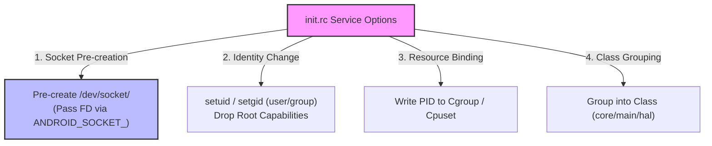

## service option 은 identity, resource, class, socket 계약을 고정한다

상위 문서: [init 서비스 계약](init-service.md)
배경 지식: [cgroups](../../../../../linux/container-basics.md), [유닉스 소켓 IPC](../../../../../operating-systems/ipc-mechanisms.md)

`service option`은 `init.rc` 스크립트에서 데몬 프로세스의 신원(Identity), 리소스 제한(Resource Limits), 그룹 분류(Class), 그리고 소켓 생성(Socket Contract) 등의 실행 조건을 명시적으로 고정하여 프로세스의 안전한 sandbox 격리와 런타임 수명주기를 설정하는 선언 파라미터다.

### 내부 동작 메커니즘 (Internal Mechanism)

1. **Identity & Sandbox (`user`, `group`, `seclabel`, `capabilities`)**:
   - `user <name>` & `group <name>`: 프로세스 실행 시 Linux `setuid`/`setgid`를 통해 샌드박스 유저 권한으로 강등한다.
   - `seclabel <context>`: 표적 SELinux 보안 도메인을 강제 지정한다.
2. **Resource Constraints (`rlimit`, `writepid`, `onrestart`)**:
   - `rlimit memlock <soft> <hard>`: **[Cgroup](../../../../../linux/container-basics.md)**(프로세스 그룹 단위로 CPU/메모리 등 자원 사용량 상한을 커널이 강제하는 계층적 제한 메커니즘) 리소스 및 메모리 락 제한을 설정한다.
   - `writepid /dev/cpuset/.../tasks`: 생성된 프로세스 PID를 CPU/Cgroup 노드에 자동 등록한다.
3. **Class Grouping (`class <name>`)**:
   - 서비스를 `core`, `main`, `late_start`, `hal` 등의 클래스로 묶어 `class_start main` 과 같은 액션 명령으로 일괄 부팅시킬 수 있다.
4. **Socket Pre-creation (`socket <name> <type> <perm> <user> <group>`)**:
   - `init` 프로세스가 root 권한으로 미리 **[Unix Domain Socket](../../../../../operating-systems/ipc-mechanisms.md)**(같은 머신 안의 프로세스끼리 파일시스템 경로를 주소로 통신하는 IPC 메커니즘) 파일디스크립터(FD)를 `/dev/socket/<name>` 위치에 생성한 후, 소켓 FD를 자식 프로세스에 환경 변수(`ANDROID_SOCKET_<name>`)로 바인딩 넘겨준다.



### 코드 및 구체 예시 (Concrete Snippets)

복합 서비스 옵션이 적용된 `init.rc` 서비스 선언 예시:

```text
# Service option declaration example
service installd /system/bin/installd
    class main
    user root
    group system
    code_in_memory
    socket installd stream 660 system system
    capabilities CHOWN SETUID SETGID
    seclabel u:r:installd:s0
```

### 관측 가능 증거 (Observable Evidence)

`adb shell`을 이용하여 `init`이 사전 생성한 소켓 파일 노드 및 Cgroup task 바인딩을 확인할 수 있다:

```bash
# init이 생성한 /dev/socket/ 소켓 파일 노드 조회
adb shell ls -la /dev/socket/
# 출력 예시:
# srw-rw---- 1 root system 0 Zygote
# srw-rw---- 1 system system 0 installd

# 특정 프로세스의 cpuset cgroup 할당 상태 확인
adb shell cat /dev/cpuset/foreground/tasks | grep $(adb shell pidof surfaceflinger)
```

### 관련 문서

- [init-security-is-selinux-domain-and-capability-boundary](init-security-is-selinux-domain-and-capability-boundary.md)
- [init-service-is-supervised-process-with-explicit-lifecycle](init-service-is-supervised-process-with-explicit-lifecycle.md)

공식 문서: [Android Init Service Options](https://android.googlesource.com/platform/system/core/+/main/init/README.md#services)
