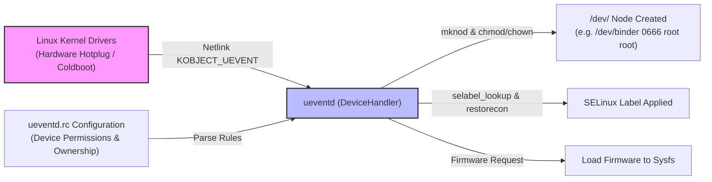

## ueventd 는 kernel uevent 를 dev node 권한으로 변환한다

상위 문서: [init 서비스 계약](init-service.md)

`ueventd`는 리눅스 커널의 디바이스 드라이버가 하드웨어 감지 또는 핫플러그(Hotplug) 시 발행하는 Netlink uevent 메시지를 수신하여 `/dev/` 디렉터리에 해당하는 Character/Block Device 노드를 실시간 생성하고, 사전 정의된 유저 계정, 그룹, POSIX Permissions, SELinux Context 보안 라벨을 적용하는 데몬이다.

### 내부 동작 메커니즘 (Internal Mechanism)

1. **Netlink Uevent Socket Monitoring**:
   - `ueventd`는 커널의 Netlink `KOBJECT_UEVENT` 소켓을 수신 대기한다.
   - 드라이버가 로드되거나 USB/카메라/센서 장치가 연결(add) 또는 해제(remove)되면 커널이 Netlink 패킷으로 uevent 메시지를 송출한다.
2. **Coldboot (부팅 시 장치 스캔)**:
   - 부팅 초기 이미 존재하던 하드웨어 장치를 인식하기 위해 `/sys/` 디렉터리를 재귀적으로 순회하며 가짜 uevent를 강제 트래거(`trigger` 파일에 `add` 쓰기)하는 Coldboot 과정(`DoColdboot()`)을 수행한다.
3. **Device Node Creation & Permissions (`DeviceHandler`)**:
   - `DeviceHandler::HandleDeviceUevent()`가 uevent를 파싱하여 `ueventd.rc` 스크립트 규칙과 비교한다.
   - 매칭되는 디바이스 경로(예: `/dev/binder`, `/dev/mali0`)에 대해 지정된 UID, GID, Mode(permissions)로 `mknod` 및 `chmod`/`chown`과 SELinux `selabel_lookup()`을 호출한다.
4. **Firmware Loading**:
   - 커널 모듈에서 펌웨어 파일 요청(Subsystem `firmware`)이 올라오면, `/vendor/firmware` 또는 `/firmware/image`에서 펌웨어를 찾아 커널 sysfs 파이프로 전송한다.



### 코드 및 구체 예시 (Concrete Snippets)

`system/core/init/devices.cpp` C++ Device Node 처리 로직 구현부:

```cpp
// system/core/init/devices.cpp (Device Node Creation & Permission Logic)
void DeviceHandler::HandleDeviceUevent(const Uevent& uevent) {
    if (uevent.action == "add") {
        MakeDevice(uevent.subsystem, uevent.devname, uevent.major, uevent.minor, uevent.path);
    } else if (uevent.action == "remove") {
        std::string devpath = "/dev/" + uevent.devname;
        unlink(devpath.c_str());
    }
}

void DeviceHandler::MakeDevice(const std::string& subsystem, const std::string& devname,
                                int major, int minor, const std::string& path) {
    mode_t mode = 0600;
    uid_t uid = 0;
    gid_t gid = 0;

    // ueventd.rc 파싱 규칙 매칭 (Permissions, User, Group)
    GetSymlinkPathAndPermissions(path, &mode, &uid, &gid);

    std::string devpath = "/dev/" + devname;
    mode_t dev_type = (subsystem == "block") ? S_IFBLK : S_IFCHR;

    // 1. Device Node 생성
    mknod(devpath.c_str(), mode | dev_type, makedev(major, minor));
    // 2. Owner & Permissions 설정
    chown(devpath.c_str(), uid, gid);
    chmod(devpath.c_str(), mode);
    // 3. SELinux Security Label 복원
    selinux_android_restorecon(devpath.c_str(), 0);
}
```

`ueventd.rc` 규칙 선언 예시 (`system/core/rootdir/ueventd.rc`):

```text
# Device node permissions definition in ueventd.rc
/dev/null                 0666   root       root
/dev/graphics/*           0660   root       graphics
/dev/dri/*                0666   root       graphics
/dev/binder               0666   root       root
/dev/vndbinder            0666   root       root
/dev/hwbinder             0666   root       root
```

### 관측 가능 증거 (Observable Evidence)

`adb shell`을 통해 생성된 `/dev/` 노드의 권한 상태 및 `ueventd` 로그를 점검할 수 있다:

```bash
# ueventd 데몬 프로세스 확인
adb shell ps -ef | grep ueventd

# 생성된 주요 디바이스 노드의 POSIX 권한 및 소유자 조회
adb shell ls -la /dev/binder /dev/mali* /dev/graphics/

# ueventd의 Coldboot 수행 시간 및 로그 관측
adb shell dmesg | grep -i ueventd
```

### 관련 문서

- [First stage init은 second stage가 읽을 최소 파일시스템을 만든다](first-stage-init.md)
- [init security는 SELinux domain과 capability 경계로 정의된다](init-security-and-selinux.md)

공식 문서: [Device Node Configuration](https://android.googlesource.com/platform/system/core/+/main/init/README.md)
