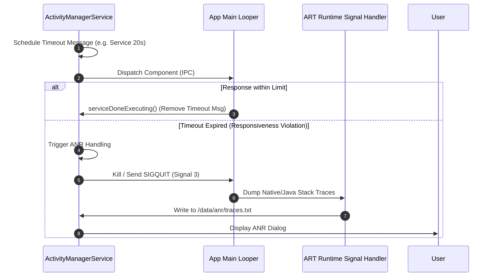

## ANR 은 단일 timeout 숫자가 아니라 responsiveness 계약 위반이다

상위 문서: [system_server 계약](system-server-contracts.md)

배경 지식: [시그널(SIGQUIT)](../../../../../operating-systems/signals.md)

ANR(Application Not Responding)은 메인 스레드(UI Thread)가 특정 시간 내에 이벤트를 처리하지 못해 발생하는 반응성 계약 위반으로, 컴포넌트 유형별로 정해진 타임아웃 윈도우(Input: 5 초, Foreground Broadcast: 10 초, Service: 20 초)를 초과할 경우 `AnrHelper` / `AnrConsumer` 가 트리거하는 시스템 제어 신호다.

### 내부 동작 메커니즘 (Internal Mechanism)

1. **ANR Timeout Window 타임라인**:
   - **InputDispatchingTimeout**: 5 초 (`InputDispatcher` 에서 입력 이벤트에 대한 ACK 수신 실패).
   - **BroadcastQueue Timeout**: Foreground 10 초, Background 60 초.
   - **ServiceTimeout**: Foreground Service `onCreate`/`onStartCommand` 20 초, Background Service 200 초.
   - **ContentProviderTimeout**: 10 초.
2. **Watchdog & Handler Message Queue Schedule**:
   - 컴포넌트 시작 시 AMS 는 핸들러 메세지로 `SERVICE_TIMEOUT_MSG` 등을 스케줄링한다.
   - 정상 처리 시 앱은 `serviceDoneExecuting` 을 호출해 타임아웃 메세지를 제거한다. 실패 시 타임아웃 메세지가 발동한다.
3. **Trace Collection (`/data/anr/traces.txt` / Perfetto)**:
   - ANR 발생 시 `system_server` 는 해당 프로세스 및 관련 시스템 서비스, 주요 앱에 **[`SIGQUIT`](../../../../../operating-systems/signals.md)**(Signal 3 — 프로세스를 즉시 죽이는 대신, 종료 전에 현재 상태(스택트레이스 등)를 덤프할 기회를 주는 시그널)를 보낸다.
   - ART 런타임은 Signal 3 수신 시 메인 스레드 스택트레이스 및 Mutex Lock 획득 상태를 `/data/anr/` 트레이스 파일로 덤프한다.



### 코드 및 구체 예시 (Concrete Snippets)

`AnrConsumer` 및 Service Timeout 상수 정의 (`frameworks/base/services/core/java/com/android/server/am/ActiveServices.java`):

```java
// ActiveServices.java Timeout Thresholds
static final int SERVICE_TIMEOUT = 20 * 1000; // 20 Seconds for Foreground Service
static final int SERVICE_BACKGROUND_TIMEOUT = 200 * 1000; // 200 Seconds

void serviceTimeoutLocked(ProcessRecord proc) {
    if (proc.executingServices.size() == 0) return;
    // Trigger ANR trace collection & dialog
    mAm.mAnrHelper.appNotResponding(proc, "Exec service timeout");
}
```

### 관측 가능 증거 (Observable Evidence)

ANR 발생 시 추출되는 스택트레이스 및 로그캣 항목:

```bash
# ANR 덤프 파일 추출 (최신 traces)
adb shell ls -la /data/anr/
adb pull /data/anr/traces.txt .

# Logcat에서 ANR 원인 문구 및 프로세스 확인
adb logcat -b main -b system | grep -E "(ANR in|Reason:)"
# 출력 예시:
# ANR in com.example.app (com.example.app/.MainActivity)
# PID: 1234
# Reason: Input dispatching timed out (Waiting to send non-key input event...)

# dumpsys로 최근 ANR 목록 조회
adb shell dumpsys activity processes | grep -A 5 "Last ANR"
```

### 관련 문서

- [AMS는 앱 프로세스와 컴포넌트 lifecycle을 조율한다](ams-coordinates-app-process-and-component-lifecycle.md)
- [process-priority-is-memory-reclaim-policy-input-not-app-state-truth](process-priority-is-memory-reclaim-policy-input-not-app-state-truth.md)

공식 문서: [ANR Overview](https://developer.android.com/topic/performance/vitals/anr)
