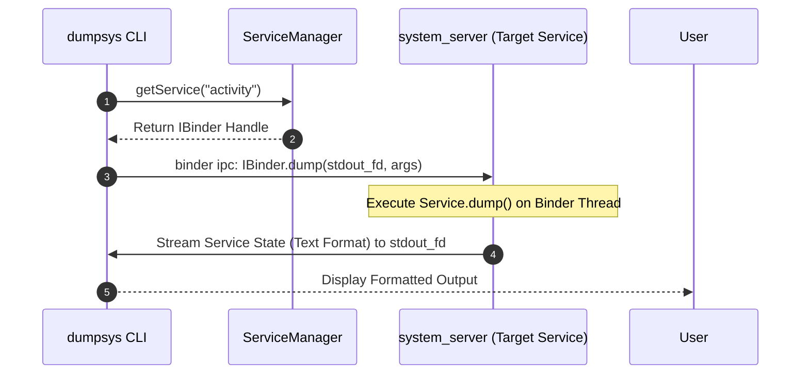

## dumpsys 는 system service 의 현재 상태를 보는 inspection interface 다

상위 문서: [system_server 계약](system-server-contracts.md)

`dumpsys`는 `ServiceManager`에 등록된 모든 `system_server` Binder 서비스들의 런타임 진단 인터페이스로, `IBinder::dump()` 메서드를 실행하여 각 서브시스템(Memory, Battery, Activity, WindowManager 등)의 영속 메모리 상태, 캐시, 스케줄링 큐, IPC 통신 통계를 디버깅 가능한 텍스트 덤프 형태로 출력하는 관측 툴이다.

### 내부 동작 메커니즘 (Internal Mechanism)

1. **ServiceManager Lookup**:
   - `dumpsys` CLI 실행 시 `ServiceManager.checkService(serviceName)`을 호출하여 대상 Binder 서비스의 `IBinder` 참조를 획득한다.
2. **`IBinder::dump(fd, args)` IPC Call**:
   - 타겟 Binder 핸들에 대해 Synchronous Binder IPC로 `dump()` 메서드를 호출하며, 이때 표준 출력 File Descriptor(stdout FD 또는 ParcelFileDescriptor)를 넘긴다.
3. **Binder Thread Pool Execution**:
   - `system_server` 내부의 Binder 스레드가 해당 요청을 받아 서비스별 `dump()` 구현체(예: `ActivityManagerService.dump()`)를 실행하여 서비스의 내부 멤버 변수 및 상태 테이블을 텍스트로 시리얼라이즈하여 출력 스트림에 작성한다.



### 코드 및 구체 예시 (Concrete Snippets)

커스텀 시스템 서비스에서 `dump()` 메서드 구현 예시 (`Binder` 서브클래스):

```java
// Custom System Service dump implementation
@Override
protected void dump(FileDescriptor fd, PrintWriter pw, String[] args) {
    if (!DumpUtils.checkDumpPermission(mContext, TAG, pw)) return;

    pw.println("=== MY CUSTOM SERVICE DUMP ===");
    pw.println("Current Active Connections: " + mActiveConnections.size());
    pw.println("Cache Hit Ratio: " + mCacheHitRatio);
    for (String client : mActiveConnections) {
        pw.println("  Client: " + client);
    }
}
```

### 관측 가능 증거 (Observable Evidence)

`dumpsys` 명령어를 사용하여 주요 시스템 서비스의 상태 덤프를 조회하는 대표 예시:

```bash
# dumpsys로 이용 가능한 전체 서비스 이름 조회
adb shell dumpsys -l

# 특정 서비스의 덤프 텍스트 확인
adb shell dumpsys activity
adb shell dumpsys meminfo com.example.app
adb shell dumpsys gfxinfo com.example.app

# dumpsys 처리 속도 및 타임아웃 지연 서비스 진단
adb shell dumpsys --timeout 2
```

### 관련 문서

- [system-service-is-binder-endpoint-and-platform-policy-enforcer](system-service-is-binder-endpoint-and-platform-policy-enforcer.md)
- [system_server는 framework service를 한 프로세스 안에서 시작한다](system-server-startup.md)

공식 문서: [dumpsys Tutorial](https://developer.android.com/studio/command-line/dumpsys)
