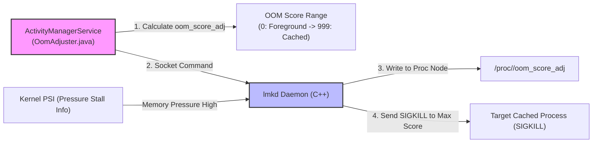

## 프로세스 우선순위는 메모리 회수 정책 입력이지 앱 상태의 진실이 아니다

상위 문서: [system_server 계약](system-server-contracts.md)
배경 지식: [OOM Killer / 메모리 압박 / PSI](../../../../../../02_references/operating-systems/oom-killer-and-memory-pressure.md)

프로세스 우선순위(`oom_score_adj`)는 앱 개발자가 직접 제어하거나 프로세스 내부에서 주관적으로 지정하는 상태가 아니며, `AMS`가 컴포넌트 실행 상태(Foreground Activity, Visible, Service, Broadcast 등) 및 시스템 메모리 압박 상태를 종합 판단하여 커널 **[Low Memory Killer Daemon(LMKD)](../../../../../../02_references/operating-systems/oom-killer-and-memory-pressure.md)**(리눅스 표준 OOM Killer가 "메모리 할당이 완전히 실패한 뒤"에야 개입하는 것과 달리, 메모리 압박 초기 신호(PSI)를 보고 선제적으로 프로세스를 죽이는 Android userspace 데몬)의 수거 우선순위 입력값으로 지속 계산·전송하는 수치 정책이다.

### 내부 동작 메커니즘 (Internal Mechanism)

1. **OOM Adjustment Scored Spectrum (`oom_score_adj`)**:
   - `-1000` (`NATIVE_ADJ`): init 등 핵심 네이티브 프로세스용. 리눅스 커널 수준에서 OOM 킬 대상에서 완전히 제외(면제)되는 특수 값이다.
   - `-900` (`SYSTEM_ADJ`): `system_server`에 사용하는 조정치. 일반적인 시스템 환경에서 lmkd가 죽이지 않는 가장 안전한 우선순위다.
   - `0` (`FOREGROUND_APP_ADJ`): 현재 화면 전면에 활성화된 앱 Activity.
   - `100` (`VISIBLE_APP_ADJ`): 화면 일부에 보이지만 포커스는 없는 앱(Dialog, Split-Screen).
   - `200` (`PERCEPTIBLE_APP_ADJ`): 음악 재생, 포그라운드 서비스(Foreground Service).
   - `500` (`SERVICE_ADJ`): 백그라운드 구동 중인 서비스.
   - `900~999` (`CACHED_APP_MIN_ADJ`~`CACHED_APP_MAX_ADJ`): 캐시된 프로세스 범위. 구체적인 순서는 현재 상태와 platform 구현에 따라 달라진다.

낮은 조정치는 회수 가능성이 낮다는 뜻이지 생존 보장이 아니다. AOSP `lmkd`의 critical 설정은 `oom_score_adj >= 0`까지 후보로 삼을 수 있고, kernel OOM, crash, watchdog, 사용자의 force stop 같은 다른 종료 경로도 존재한다. 앱은 foreground process조차 영구히 산다고 가정해서는 안 된다.
2. **`applyOomAdjLSP()` Execution**:
   - 액티비티 전환, 서비스 생성/파괴, 바인딩 연결 시 [AMS](../../../04_system_services/activity-manager-service.md)는 `OomAdjuster.java`를 실행하여 프로세스 트리의 `oom_score_adj` 값을 동적 재계산한다.
3. **Userspace `lmkd` interface**:
   - framework는 process 중요도 변화를 `lmkd`에 알리고 `lmkd`는 `/proc/<pid>/oom_score_adj`와 process metadata를 관리한다. Android 10+의 일반적인 구성은 kernel **[PSI](../../../../../../02_references/operating-systems/oom-killer-and-memory-pressure.md)** event, thrashing, swap과 device tuning을 함께 보고 kill 대상과 시점을 정한다. 점수가 가장 큰 process를 언제나 기계적으로 하나 고르는 단순 정렬은 아니다.



### 코드 및 구체 예시 (Concrete Snippets)

release마다 `OomAdjuster` 내부 type과 method 이름이 달라지므로 다음은 개념적 흐름만 나타낸다. 실제 상수와 구현은 대상 branch의 `ProcessList.java`, `OomAdjuster` 계열 source, `lmkd` source에서 확인한다.

```java
adj = computeFromActiveComponentsBindingsAndCapabilities(process)
if (adj != process.lastAppliedAdj) {
    notifyLmkdOfProcessPriority(process.pid, process.uid, adj)
    process.lastAppliedAdj = adj
}
```

### 관측 가능 증거 (Observable Evidence)

`adb shell`을 활용하여 특정 프로세스의 현재 `oom_score_adj` 수치와 LMKD 로그를 점검할 수 있다:

```bash
# 특정 프로세스의 oom_score_adj 조회
adb shell cat /proc/$(adb shell pidof com.example.app)/oom_score_adj
# 출력 예시:
# 0 (Foreground 상태인 경우)
# 905 (Background Cached 상태로 전환된 경우)

# AMS oom_score_adj 덤프 확인
adb shell dumpsys activity oom

# LMKD 프로세스 킬 로그 관측 (logcat)
adb logcat -s lmkd
```

### 관련 문서

- [AMS는 앱 프로세스와 컴포넌트 lifecycle을 조율한다](ams-coordinates-app-process-and-component-lifecycle.md)
- [ANR은 단일 timeout 숫자가 아니라 responsiveness 계약 위반이다](anr-responsiveness-contract.md)

공식 문서: [Processes and App Lifecycle](https://developer.android.com/guide/components/activities/process-lifecycle), [Low memory killer daemon](https://source.android.com/docs/core/perf/lmkd), [AOSP ProcessList constants](https://android.googlesource.com/platform/frameworks/base/+/master/services/core/java/com/android/server/am/ProcessList.java)
